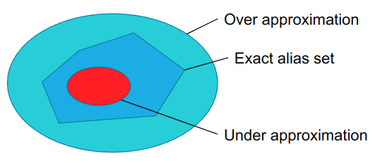
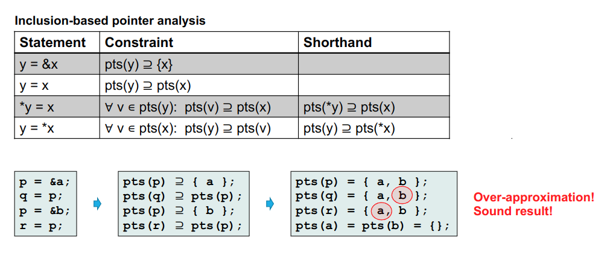
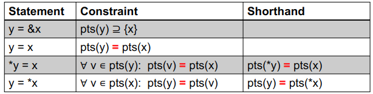
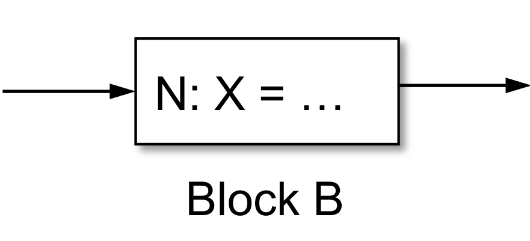
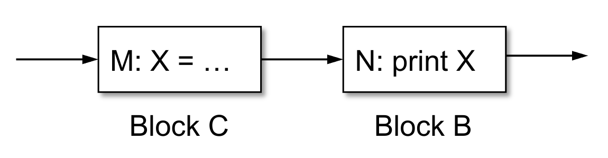
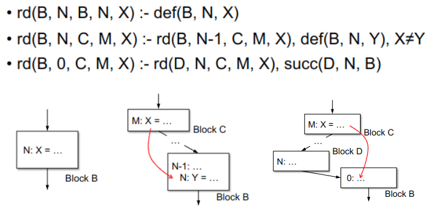
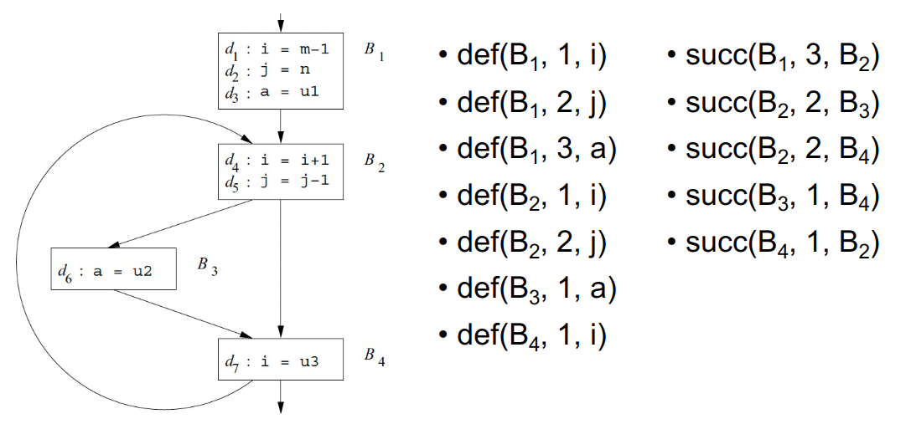

+++
date = '2025-06-05T16:47:32+08:00'
draft = true
title = '中端优化：指针分析'
summary = "编译原理笔记"
tags = ["笔记", "编译原理"]
categories = ["StudyBase"]
seriesOpened = true
series = ["笔记-编译原理"]
series_order = -1
+++

 

## Intro

### 为什么需要指针别名分析？

1. 提升编译器优化的精度：编译器在做优化时，需要知道哪些变量被修改或引用。指针别名分析可以帮助判断这一点，从而让优化更精确。

   - **常量传播（Constant Propagation）**  

     ```c
     x = 3;
     *p = 4;
     y = x; // can constant 3 propagate here
     ```

     如果不知道 `p` 是否指向 `x`，就无法确定 `x` 的值是否仍然是3，也就无法安全地把3传播到 `y`。只有通过别名分析，才能判断这种优化是否安全。

   - **可用表达式（Available Expression）**  

     ```c
     t = a + b;
     *p = t;
     y = a + b; // is a + b available?
     ```

     如果 `p` 可能指向 `a` 或 `b`，那么 `a + b` 的值可能已经被改变，不能认为 `a + b` 仍然可用。别名分析可以帮助判断表达式是否真的可用。

2. **错误检测（Error detection）**  

   ```c
   x.lock();
   ...
   y.unlock(); // same object as x?
   ```

   如果 `x` 和 `y` 可能指向同一个对象，那么 `unlock` 是安全的；否则可能会导致死锁或其他错误。别名分析可以帮助检测这类潜在的程序错误。

### May/Must/Must-Not

1. `May- / Must-` 分析的含义  
   - `May analysis`：判断两个表达式**可能**指向同一内存位置。
   - `Must analysis`：判断两个表达式**一定**指向同一内存位置。

2. `May analysis` 与 `Must-not analysis`  
   - 如果`may-analysis`的结果是“否”，就说明这两个表达式**绝不**指向同一内存位置`must-not alias`。
   - 这种信息对于编译器优化非常有用，因为可以更大胆地做优化（比如常量传播、表达式复用等）。

3. 代码示例说明  
   - 常量传播（Constant Propagation）  

     ```c
     x = 3;
     *p = 4;
     y = x; // can constant 3 propagate here
     ```

     如果may-analysis能确定`p`和`x`不会别名（may-analysis为“否”），那么可以安全地把3传播到`y`。

   - 可用表达式（Available Expression）  

     ```c
     t = a + b;
     *p = t;
     y = a + b; // a + b is available?
     ```

     如果may-analysis能确定`p`不会指向`a`或`b`，那么`a + b`的值是可用的，可以做优化。


May分析通常会给出一个“保守的”或“过近似（over-approximation）”的别名集合。  

- 过近似（over-approximation）：分析结果包含了所有可能的别名关系，可能包含一些实际上不会发生的别名（即“宁可多报，不可漏报”）。
- 精确别名集合（exact alias set）：理想情况下，分析结果只包含真实存在的别名关系。
- 欠近似（under-approximation）：分析结果只包含一部分真实别名，可能漏掉一些实际存在的别名。

最简单的sound（保守）别名分析就是对所有may-alias查询都返回true，这样绝不会漏报，但精度很低。实际分析中需要在soundness（不漏报）和precision（精度/完整性）之间做权衡。



### 流敏感的指针分析

Flow-sensitive pointer analysis会在程序的每一个点上，计算指针表达式可能指向哪些内存位置。也就是说，它不仅考虑指针的定义，还会追踪指针在程序执行过程中的变化，精确到每个程序点。

这种分析方式非常精细，但传统上对整个程序做flow-sensitive分析的计算代价非常高，资源消耗大，不容易在大规模程序上应用。

近年来，已经有一些研究尝试实现flow-sensitive甚至path-sensitive（路径敏感）分析，提升分析的精度和实用性。

### 流不敏感的指针分析

有两个，是这一章的重点。

1. `Andersen's Algorithm`: 1994， 差不多n^2复杂度
2. `Steensgaard's Algorithm`: 1996， 差不多线性复杂度

## 一个简单的指针语言

1. `y = &x` 表示取变量x的地址赋值给y，y现在是一个指针。  
2. `y = x` 是赋值语句，把x的值（可能是指针）赋给y。  
3. `*y = x` 是存储语句，把x的值写到y指向的内存位置。  
4. `y =*x` 是加载语句，把x指向的内存位置的值读到y里。
5. `pts(x)` 表示x的points-to集合，也就是x可能指向的所有变量的集合。例如，`pts(x) = {y, z}` 表示x可能指向y，也可能指向z。

## Andersen's Algorithm

这个表格描述了包含式（Inclusion-based）指针分析的基本约束规则。它通过对每种指针相关语句建立集合包含关系，推导出每个指针变量可能指向的对象集合（points-to set）。

- 对于 `y = \\&x`：  
  约束是 \\( \\text{pts}(y) \\supseteq \\{x\\} \\)，即y的points-to集合至少包含x。

- 对于 `y = x`：  
  约束是 \\( \\text{pts}(y) \\supseteq \\text{pts}(x) \\)，即y的points-to集合至少包含x的points-to集合。

- 对于 `*y = x`：  
  约束是对y的points-to集合中的每个v，都有 \\( \\text{pts}(v) \\supseteq \\text{pts}(x) \\)。  
  换句话说，y可能指向的每个变量v，都要把x的points-to集合加到v的points-to集合里。  
  简写为 \\( \\text{pts}(*y) \\supseteq \\text{pts}(x) \\)。

- 对于 `y = *x`：  
  约束是对x的points-to集合中的每个v，都有 \\( \\text{pts}(y) \\supseteq \\text{pts}(v) \\)。  
  即y的points-to集合要包含x可能指向的每个变量v的points-to集合。  
  简写为 \\( \\text{pts}(y) \\supseteq \\text{pts}(*x) \\)。

通过不断应用这些包含关系，可以迭代地推导出所有指针变量的points-to集合。

实际例子：如图，会产生sound的结果。

## Steensgaard's Algorithm

Unification-based pointer analysis（统一式指针分析）是一种静态指针分析方法，其代表是**Steensgaard’s analysis**。

它的核心思想是：  
对于每条指针相关的赋值语句，不是建立包含关系，而是把相关指针的points-to集合**合并（unify）**成一个集合。也就是说，分析过程中一旦发现两个指针有可能指向同一个对象，就把它们的points-to集合合并，今后这两个指针的指向关系就完全一样。

例如，遇到 `y = x`，就会让 `pts(y)` 和 `pts(x)` 这两个集合合并成一个。

**特点：**

- 速度非常快，复杂度接近线性（比inclusion-based快很多）。
- 但精度较低，容易把本来不相关的指针混在一起，导致points-to集合过大。

**适用场景：**
适合大规模程序的快速分析，对精度要求不高时使用。

**对比：**

- Inclusion-based（如Andersen）：用包含关系，精度高但慢。
- Unification-based（如Steensgaard）：用合并关系，速度快但精度低。

### 具体



- `y = &x`：pts(y) ⊇ {x}，y的points-to集合至少包含x。
- `y = x`：pts(y) = pts(x)，y和x的points-to集合合并成完全一样的集合。
- `*y = x`：对于y可能指向的每个v，都有pts(v) = pts(x)，即y指向的每个变量v的points-to集合都和x的points-to集合合并。
- `y = *x`：对于x可能指向的每个v，都有pts(y) = pts(v)，即y的points-to集合和x指向的每个变量v的points-to集合合并。

和包含式分析不同，这里所有的等号（=）表示集合的合并（unification），一旦合并，今后这些变量的points-to集合就完全一致。这种做法速度快，但精度较低。

## Datalog-Based DFA

### 逻辑编程

Logic programming（逻辑编程）是一种以数学逻辑为基础的编程范式。广义上说，就是用逻辑公式和推理规则来描述和实现程序。

Prolog 是1972年提出的一种典型的逻辑编程语言。它用逻辑规则来描述数学关系的计算方式。一个Prolog程序本质上就是一组逻辑规则的数据库，程序的执行过程就是根据这些规则进行自动推理和查询。

一般组成元素有Facts, Rules, Queries。

- Facts: 事实，是程序中已知的、不变的陈述。

- Rules: 规则，是逻辑推理的依据。

- Queries: 查询，是用户向程序提出的问题。

Datalog 是 Prolog 的一个子集。它有以下特点：

- 所有 Datalog 程序都会终止（不会陷入无限循环）。
- 规则的书写顺序无关紧要，结果不会受影响。
- Datalog 不是图灵完备的（不能表达所有可计算的问题），但这也保证了它的可终止性和高效性。

### 谓词和原子

谓词（Predicate）是N元关系，可以用来描述对象之间的某种关系或属性。  
比如 predicate(x, y, z) 表示x、y、z三者之间的某种关系。

例子：

- rainy("Nanjing") 表示南京下雨。
- rainy("Beijing") 表示北京下雨。
- cold("Beijing") 表示北京很冷。
- brother(x, y) 表示x是y的兄弟。
- speaks(x, a) 表示x会说语言a。

这些具体的谓词实例（如 rainy("Nanjing")）也叫原子（atom），是逻辑程序中的基本事实。

### Datalog Programming Model

Datalog 程序本质上是由一组霍恩子句（Horn clauses）组成的数据库。  
每个规则的形式是：  
h :- l₁ l₂ ... lₙ  
意思是：如果 l₁, l₂, ..., lₙ 同时为真，那么 h 也为真。这里的如果只是“充分条件”，不是“必要条件”。

例子：  

- rainy("Nanjing") 是一个事实，表示南京下雨。
- snowy(c) :- rainy(c), cold(c) 表示：如果某地 c 下雨且很冷，那么 c 就下雪。


所有规则对变量的任意实例化都成立，比如 snowy(c) :- rainy(c), cold(c) 这条规则对所有城市（如南京、北京等）都适用。

只有显式声明为真的事实才是真的，未声明的都视为假。

规则的书写顺序不会影响Datalog程序的结果（与Prolog不同，Prolog顺序会影响执行）。

规则可以是递归的，比如：

- reachable(a, b) :- edge(a, b) 表示如果a到b有边，则a能到b。
- reachable(a, c) :- edge(a, b), reachable(b, c) 表示如果a到b有边且b能到c，则a能到c。

Datalog 规则的前提（assumptions）中可以使用否定（negation），比如  
more_than_one_hop(a, b) :- reachable(a, b), ¬edge(a, b)  
表示a到b可达但没有直接边，则a到b需要多跳。

所有规则必须是“良构well-formed”的。比如  
more_than_one_hop(a, b) :- ¬edge(a, b)  
就是不合法的，因为左边的a、b没有在右边的正谓词中出现。  
这样做的目的是保证推理过程一定会终止，防止出现无限递归或不确定的推理。

### Datalog 的可达定义

这部分内容用Datalog的形式描述了“可达定义（Reaching Definitions）”分析的基本关系。

- def(B, N, X)：表示在基本块B的第N条语句可能定义了变量X。例如，Block B 的第N条语句是 X = ...。

- succ(B, N, C)：表示基本块C是基本块B的后继，且B有N条语句。也就是B执行完后可能跳转到C。

- rd(B, N, C, M, X)：表示变量X在基本块C的第M条语句处的定义，可以到达基本块B的第N条语句。例如，Block C 的第M条语句是 X = ...，而Block B 的第N条语句用到了X，这个定义从C流到了B。





在Datalog数据流分析中，`def `和 `succ` 这两类关系通常是**由前端程序自动生成的“事实”**，不是Datalog规则自动推导出来的。

- def(B, N, X)：这些是根据源程序的每条赋值语句自动提取出来的。例如，遇到 `i = m-1` 就生成 `def(B1, 1, i)`。
- succ(B, N, C)：这些是根据程序的控制流图（CFG）自动提取出来的。例如，B1的第3条语句后跳到B2，就生成 `succ(B1, 3, B2)`。

这些事实会作为Datalog程序的输入，Datalog规则会在这些事实的基础上自动推导出更复杂的关系（比如rd等数据流信息。作为query）。
