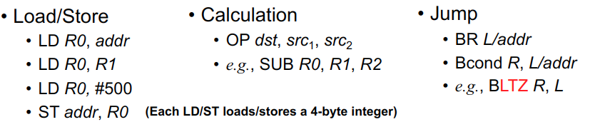
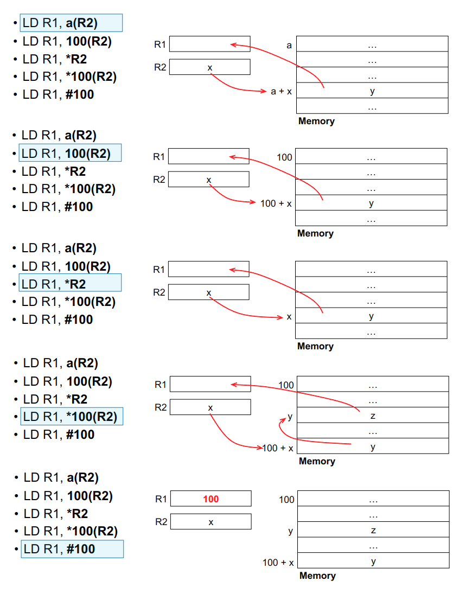
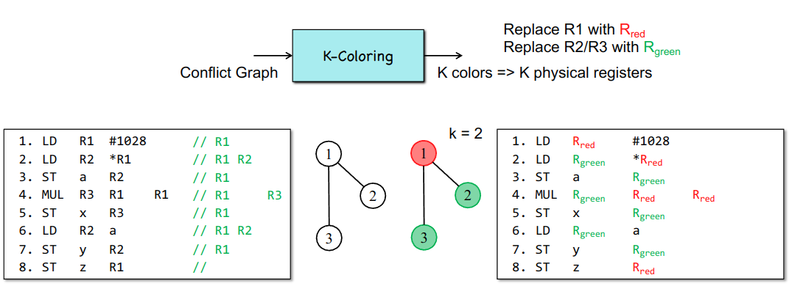
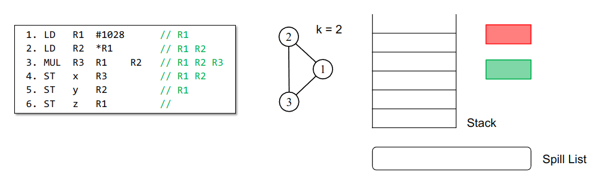
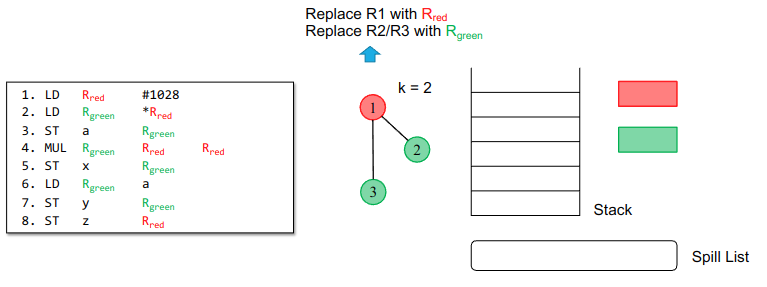
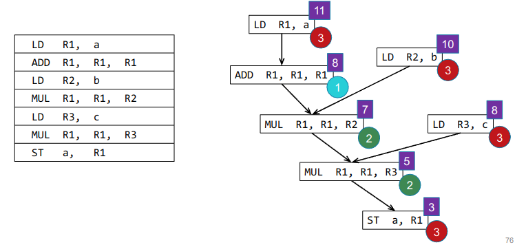

+++
date = '2025-06-06T10:02:29+08:00'
draft = true
title = '后端'
summary = "编译原理笔记"
tags = ["笔记", "编译原理"]
categories = ["StudyBase"]
seriesOpened = true
series = ["笔记-编译原理"]
series_order = -1
+++

 

## Part1 指令选择（目标代码生成）

### 常见指令



### 寻址模式

以下的五个指令都是把一个数据加载到寄存器R1中，但是寻址模式各不相同，注意比较和区分！

`LD R1, a(R2)`  
基址变址寻址（Base plus displacement addressing）：以R2的内容为基址，加上符号a的偏移量，访问内存地址a+R2，把该地址的内容加载到R1。

`LD R1, 100(R2)`  
基址加常数偏移寻址：以R2的内容为基址，加上常数100的偏移量，访问内存地址R2+100，把该地址的内容加载到R1。

`LD R1, *R2`  
间接寻址（Indirect addressing）：R2中存放的是一个地址，先取出R2的内容作为地址，再访问该地址指向的内存，把内容加载到R1。

`LD R1, *100(R2)`  
基址加偏移再间接寻址：先用R2+100得到一个地址，再把这个地址中的内容当作新的地址，最后访问这个新地址，把内容加载到R1。

`LD R1, #100`  
立即寻址（Immediate addressing）：直接把常数100加载到R1，不访问内存。



#### 例题

如何翻译变量名x, y等或者跳转标签M, L等？
答：这些标签都代表一个内存地址，在写汇编时直接当作地址使用。

1. 翻译：

  ```c
  y = *q
  q = q + 4
  *p = y
  p = p + 4
  ```

## Part2 寄存器分配

k一般指的是物理寄存器数量，比如x86-64有16个寄存器，所以k=16。

### 为什么要寄存器分配？

1. 物理寄存器不够
2. 为什么寄存器？因为够快

### spilling

1. 如果寄存器不够，需要把一些变量存到内存中
2. 为什么？为了让出寄存器

### local

1. 计算 MAXLIVE
2. 如果 k < MAXLIVE，则需要spilling
3. 如果 k > MAXLIVE，则需要重新调度：对于所有\\(R_j （j > k）\\)，找到一个没有被使用的寄存器\\(R_i (i < k)\\)，把\\(R_j\\)的值存到\\(R_i\\)中，然后更新\\(R_j\\)的值为\\(R_i\\)

### global

全局寄存器分配的核心思想是：将整个程序的变量分配到有限数量的寄存器中，尽量减少变量存放在内存（溢出）的次数。常用的方法有冲突图（Conflict Graph）和K-着色（K-coloring），以及Chaitin算法。

冲突图（Conflict Graph）：  

- 首先分析程序的活跃变量信息，确定哪些变量在同一时间段内都“活跃”。
- 构建一个无向图，图的每个节点代表一个变量。如果两个变量在某个程序点（say, 某条指令）同时活跃，就在它们之间连一条边，表示它们不能分配到同一个寄存器，这两个就是相邻的。
- 这个图叫做冲突图（或干涉图，Interference Graph）。

K-着色（K-coloring）：  

- 给定K个寄存器，把冲突图的每个节点染成K种颜色之一，要求相邻节点颜色不同。
- 每种颜色代表一个寄存器。着色成功就说明所有变量都能分配到寄存器，否则需要溢出（spill）到内存。



#### Chaitin算法 

- Chaitin算法是最经典的全局寄存器分配算法，基于图着色思想。
- 主要步骤如下：
  1. 构建冲突图。
  
  2. 简化（Simplify）：反复从图中删除度小于K的节点，并把它们压入栈中。
  3. 溢出（Spill）：如果没有度小于K的节点，选择一个节点标记为溢出（即将来要放到内存），并从图中删除，然后重新构建冲突图，直到图中所有节点度都小于K
  
  4. 选择（Select）：当图为空时，从栈顶依次弹出节点，尝试为每个节点分配一个未被相邻节点占用的颜色（寄存器）。
  5. 如果某个节点无法分配颜色，则必须溢出到内存。


## Part3 指令调度

### 为什么需要指令调度？

硬件角度：可以更好利用处理器的并行性
软件角度：重排指令，让更高并行度的指令放在靠近的位置，方便硬件执行

- The potential parallelism in the program  
  程序本身潜在的并行性（即程序中哪些操作可以同时执行）
- The available parallelism on the processor  
  处理器硬件实际能支持的并行度（比如有多少执行单元）
- Our ability to extract parallelism from the code  
  编译器或分析工具能否从代码中识别出并行性
- Our ability to find the best scheduling  
  编译器能否找到最优的指令调度方案，把并行性最大化利用起来

程序实际能跑多快，既取决于程序本身的并行性，也取决于硬件支持、编译器分析能力和调度算法的好坏。

### dependence

1. truedependence（真依赖，也叫数据依赖、flow dependence）：  
  指令B需要用到指令A产生的数据，也就是A写某个变量，B读这个变量。  
  例如：  

  ```
  A: x = 1
  B: y = x + 2
  ```

  B依赖于A，因为B要用A写入的x的值。

2. storage dependence（存储依赖）包括两种：antidependence（反依赖）和output dependence（输出依赖）。

  - antidependence（反依赖）：  
    指令A读某个变量，指令B随后写这个变量。  
    例如：  

    ```
    A: y = x + 1
    B: x = 2
    ```

    A先读x，B后写x，B不能提前到A前面，否则A读到的x就不是原来的值。

  - output dependence（输出依赖）：  
    指令A和指令B都写同一个变量。  
    例如：  

    ```
    A: x = 1
    B: x = 2
    ```

    A和B都写x，不能随意交换顺序，否则最终x的值会变。

  
独立的指令可以被并行调度，也就是说没有依赖关系的指令可以同时执行，提高指令级并行性。

通过寄存器重命名，可以消除“假依赖”（即反依赖和输出依赖）。假依赖是因为多个指令使用了同一个寄存器名，但实际上它们之间没有真实的数据传递关系。只要给它们分配不同的寄存器名，这种依赖就不存在了。

然而，物理寄存器的数量是有限的。寄存器分配时必须考虑这个限制，不能无限制地为每个变量分配新的寄存器，否则会超出硬件资源。

寄存器分配的目标是尽量减少寄存器的使用数量，而指令调度则希望有更多寄存器可用以实现更好的并行度。两者之间存在矛盾，实际编译器中往往需要反复权衡和多次迭代。到底先做哪一个，没有统一答案，要根据具体应用场景和优化目标来决定。

### 基本块内的指令调度： List Scheduling

#### 创建依赖图

节点是基本块中的指令，边是**真**依赖关系。

构建方法：

1. 把每一条指令（或操作）作为图中的一个节点。

2. 对于每一对指令A和B，判断它们之间是否存在依赖关系（包括数据依赖、反依赖、输出依赖）：
   - 如果A写入某个变量，B读取这个变量，并且A在B之前，则A到B画一条有向边（真依赖）。
   - 如果A读取某个变量，B随后写这个变量，则A到B画一条虚线（反依赖）。
   - 如果A和B都写同一个变量，则A到B画一条虚线（输出依赖）。

3. 删除所有**假**依赖关系的虚线，重命名寄存器

3. 重复上述过程，直到所有指令对都检查完毕。




圆形是每条指令需要用的始终周期数，方框是“depth深度”,也就是从这条指令开始执行到基本块结束需要多少个周期

#### 指令调度

每个时钟周期都要检查哪些指令可以执行。只有当指令的所有依赖都已满足（即前驱指令已完成），这些指令才可以被调度执行。

如果有多条指令同时可以调度，需要根据优先级来决定先调度哪一条。常见的优先级策略包括：

- 优先调度处于最长延迟路径（最大深度）上的指令，这样可以尽量缩短整个程序的执行时间。
- 优先调度最消耗资源的指令，避免资源冲突。
