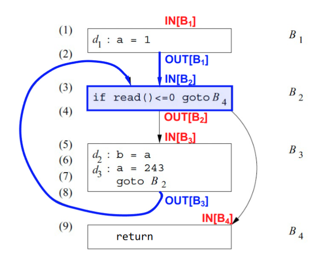
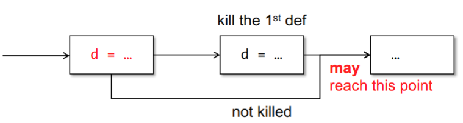
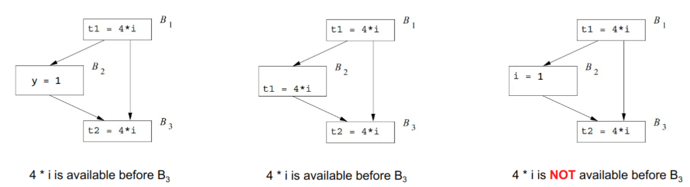
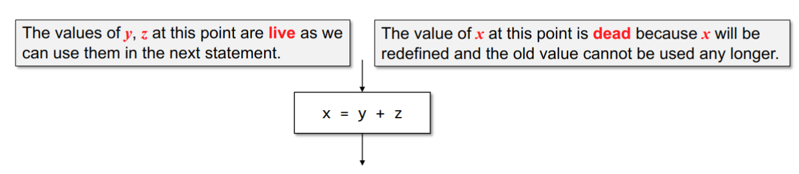

+++
date = '2025-06-04T14:25:31+08:00'
draft = true
title = '中端优化：数据流分析'
summary = "编译原理笔记。"
tags = ["笔记", "编译原理"]
categories = ["StudyBase"]
seriesOpened = true
series = ["笔记-编译原理"]
series_order = -1
+++



## intro

静态程序分析指的是在不运行程序的情况下，仅通过分析程序的源代码或中间表示，来推断程序的各种性质。数据流分析，Data Flow Analysis，是静态程序分析的一种。

数据流分析的目的是：

1. 发现软件的错误(error)和漏洞(vulnerability)
2. 提供与机器无关的编译器优化

### ir中的哪些东西可以被优化？

1. **Local common subexpression（局部公共子表达式消除）**  
   在同一个基本块内，消除重复计算的表达式。
2. **Global common subexpression（全局公共子表达式消除）**  
   在多个基本块之间，消除重复计算的表达式。
3. **Copy propagation（复制传播）**  
   用变量的实际值替换对其的引用，简化表达式。
4. **Strength reduction（强度削弱）**  
   用更简单、更高效的运算替换复杂的运算，比如用加法代替乘法。
5. **Induction-variable elimination（归纳变量消除）**  
   优化循环中的归纳变量，减少不必要的变量和计算。

## DFA Scheme

### 基本概念

#### DFA

数据流分析描述了“数据流事实”（data flow facts）在程序中的传递方式。由于程序的执行路径可能有无穷多种，数据流分析需要在所有可能路径上推断变量的状态或属性。

#### Data Flow Facts

数据流事实（或称为数据流值）是对所有可能具体程序行为的抽象。例如，一个变量 \\( v \\) 可能有具体的取值集合 \\( \\{1, 2, 4, 5, 6, \\ldots\\} \\)。由于所有可能的取值情况太多，无法一一枚举，所以需要用抽象的方式来表示：用 \\( v = NAC \\) 来表示变量 \\( v \\) 可能有很多不同的值（NAC = Not A Constant，表示“不是常量”）。NAC 是 \\( \\{1, 2, 4, 5, 6, \\ldots\\} \\) 这些具体值的一个抽象表示。

### 流程

#### 数据流方程



上图是一个简单程序的控制流图（CFG），每个方框代表一个基本块\\(B_1\\), \\(B_2\\), \\(B_3\\), \\(B_4\\)，箭头表示基本块之间的跳转关系。每个基本块的入口和出口都标记了 \\(IN[B]\\) 和 \\(OUT[B]\\).

- \\(IN[B]\\) 和 \\(OUT[B]\\) 表示在基本块 B 之前和之后的数据流事实的集合。
- 约束条件（Constraints）如下：
  - \\(OUT[B] = f_B(IN[B])\\)，即基本块 B 的出口数据流信息由其入口信息通过传递函数 \\(f_B\\) 计算得到。\\(f_B\\)是每个语句的传递函数的复合，即\\(f_B = f_n \\circ f_{n-1} \\circ \\cdots \\circ f_1\\)
  - \\(IN[B] = \\bigcap_{P \\in preds(B)} OUT[P]\\)，即基本块 B 的入口数据流信息是所有前驱基本块出口信息的交集。如图中蓝色部分，\\(B_2\\)的前驱是\\(B_1\\)和\\(B_3\\)，\\(IN[B_2] = OUT[B_1] \\cap OUT[B_3]\\)

这些约束条件共同构成了数据流方程（Data Flow Equations），通过迭代求解这些方程，可以得到每个基本块在程序执行过程中可能的数据流信息。

#### 分析组成与输出

首先，为了进行数据流分析，需要定义以下内容：

- `transfer`: 对每个语句或基本块，定义传递函数 \\( f \\)，用于描述数据流信息如何在该块内变化。
- `meet`: 在多条路径汇合的地方，定义合并函数 \\( \wedge \\)，用于将不同路径上的数据流信息合并起来（如取并集或交集）。
- `initial`: 为每个基本块设定初始的数据流信息集合（initial set），作为分析的起点。

通过这些定义，数据流分析可以计算出每个基本块入口（\\(IN[B]\\)）和出口（\\(OUT[B]\\)）处的数据流信息。这些信息反映了在程序执行过程中，在特定点上始终成立的数据流事实。换句话说，分析的结果是对程序所有可能执行路径都成立的静态属性。

#### `worklist`算法

```c
// 初始化每个基本块的IN和OUT
for (each basic block B) {                  
    IN[B] = initial_value;                   // 初始化IN[B]
    OUT[B] = initial_value;                  // 初始化OUT[B]
}

worklist = set_of_all_basic_blocks;          // 初始化工作列表，包含所有基本块

while (!worklist.empty()) {                 
    B = worklist.pop();                      // 取出一个基本块B

    // 计算B的入口信息：合并所有前驱的OUT
    IN[B] = merge_function(OUT[P] for all P in preds(B)); 

    // 计算B的出口信息：应用传递函数
    new_OUT = transfer_function_B(IN[B]);   

    if (new_OUT != OUT[B]) {                 // 如果OUT[B]发生变化
        OUT[B] = new_OUT;                    // 更新OUT[B]
        worklist.push(all_successors_of(B)); // 将B的所有后继加入工作列表
    }
}
```

后面会介绍几种常见的数据流分析，每种分析的约束条件和传递函数 \\( f \\) 不同，但分析的流程是相同的。

### 可达定义, Reaching Definitions



> A definition \\( d \\) may reach a program point, if there is a path from \\( d \\) to the program point such that \\( d \\) is not killed along the path.

如果有一条路径从定义 \\( d \\) 到某个程序点，并且在这条路径上 \\( d \\) 没有被覆盖（kill），那么 \\( d \\) 就可以到达这个程序点。

- 数据流方程如下：
  - \\( \text{OUT}[B] = f_B(\text{IN}[B]) = \text{gen}_B \cup (\text{IN}[B] - \text{kill}_B) \\)
    也就是说，基本块 \\( B \\) 的出口可达定义集合等于：
    1. 在 \\( B \\) 内新生成的定义（gen），和
    2. 入口处的定义，去掉在 \\( B \\) 内被覆盖（kill）的那些定义。
  - \\( \text{IN}[B] = \bigcup_{P \in \text{preds}(B)} \text{OUT}[P] \\)  
    即，\\( B \\) 的入口可达定义集合是所有前驱块出口可达定义的并集。

通过上述的数据流方程，可以套用`worklist`算法迭代地计算出每个基本块入口和出口的可达定义集合，从而分析出程序中每个变量的定义在何处可能被使用。


### 可用表达式, Available Expressions



表达式 \\(x ~ op ~ y\\) 在某点 \\( p \\) 可用，当且仅当：

1. 从入口到 \\( p \\) 的每一条路径都计算了 \\( x ~ op ~ y \\)；
2. 在到达 \\( p \\) 之前，最后一次计算 \\( x ~ op ~ y \\) 之后，没有对 \\( x \\) 或 \\( y \\) 进行过赋值。

#### 数据流方程
  
- \\( \text{OUT}[B] = e\\_gen_B \cup (\text{IN}[B] - e\\_kill_B) \\)  
   表示基本块 \\( B \\) 出口处的可用表达式集合等于：在 \\( B \\) 内新生成的表达式，加上入口处可用但未被杀死（即未被相关变量赋值覆盖）的表达式。
- \\( \text{IN}[B] = \bigcap_{P \text{ is a predecessor of } B} \text{OUT}[P] \\)  
   表示 \\( B \\) 入口处的可用表达式集合是所有前驱块出口可用表达式的交集。只有所有路径都可用的表达式，才算可用。


### 活跃变量分析, Live Variable Analysis



如果p点定义的一个变量在到达exit之前被使用，且被使用之前没有被重新定义，那这个变量就认为是活的。如下图，判断每个变量在每个块的出口是不是活的：

#### 应用场景

寄存器分配。编译器需要决定哪些变量放在寄存器里，哪些放在内存里。

- dead value（死值）：  
  当一个变量被重新赋值后，它之前在寄存器中的值就“死了”，不再有用。如果之后还需要用到这个变量的旧值，就必须从内存重新加载到寄存器。

- live value（活值）：  
  如果一个变量还没有被重新赋值（即还“活着”），那么它在寄存器中的值就是有效的。只要已经加载到寄存器，就可以直接使用，无需再从内存加载。

#### 数据流方程

活跃变量分析的目标是：判断在程序的某个点 \\( p \\)，变量 \\( x \\) 的值是否会在从 \\( p \\) 出发的某条路径上被使用。如果会被使用，说明 \\( x \\) 在该点是“活跃的”。

活跃变量分析是反向的，也就是说，信息的传播方向是从程序的出口向入口传播，而不是像可达定义那样从入口向出口传播。这是因为我们关心的是“将来”某个变量是否会被用到，而不是“过去”它是否被定义。如果变量在后续路径上会被用到，那么它现在就是活跃的；如果不会被用到，就是死的。

- \\( \text{IN}[B] = \text{use}_B \cup (\text{OUT}[B] - \text{def}_B) \\)  
   表示基本块 \\( B \\) 入口处活跃的变量集合等于：在 \\( B \\) 内被使用的变量，加上出口处活跃但在 \\( B \\) 内没有被重新定义的变量。
- \\( \text{OUT}[B] = \bigcup_{S \text{ is a successor of } B} \text{IN}[S] \\)  
   表示 \\( B \\) 出口处活跃的变量集合是所有后继块入口处活跃变量的并集。


### 总结

