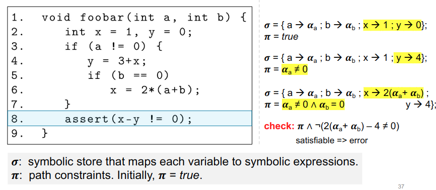
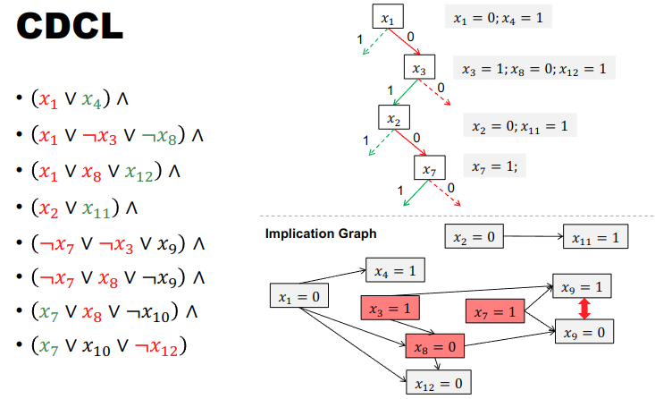
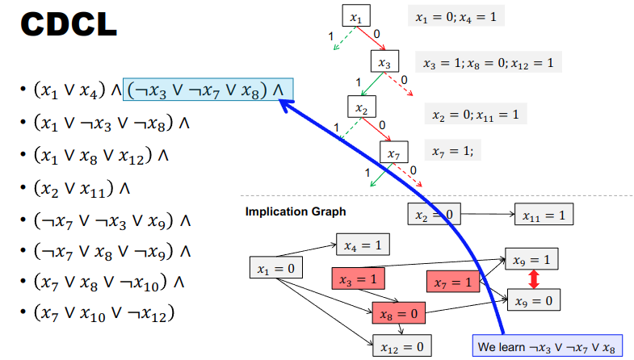

+++
date = '2025-06-05T09:23:07+08:00'
draft = true
title = '中端优化：符号执行'
summary = "编译原理笔记"
tags = ["笔记", "编译原理"]
categories = ["StudyBase"]
seriesOpened = true
series = ["笔记-编译原理"]
series_order = -1
+++

 

## Intro

### 简介

符号执行是一种经典的**路径敏感（path-sensitive）分析**方法。它的核心思想是：用符号变量（而不是具体的数值）来代表输入，枚举并分析程序的每一条可能执行路径。主要用途包括：

- 查找程序中的bug（如除零、越界等错误）
- 软件测试（自动生成测试用例，覆盖不同路径）
- 其他静态分析相关任务

### 基本原理



1. 每个输入变量都会被关联为一个符号。  
   比如，`int i` 这个输入变量会被用符号 \\( \alpha_i \\) 来表示。这样，后续所有对 `i` 的操作都用 \\( \alpha_i \\) 代替。

2. 程序中的每条语句都会基于这些符号变量生成公式。  
   例如，`i * 2 + 5` 经过符号化后变成 \\( 2 \times \alpha_i + 5 \\)。这样，程序的计算就变成了对符号表达式的操作。

3. 程序的每一条执行路径都会对应一个路径约束（path constraint）。  
   比如，遇到 `if (i < 10)` 这样的分支时，符号执行会把路径分成两条：
   - 路径1：\\( \alpha_i < 10 \\)
   - 路径2：\\( \alpha_i \geq 10 \\)

每条路径上的条件都会被记录下来，形成路径约束。后续可以用这些约束来分析程序的行为、生成测试用例或发现潜在的bug。

- 沿着程序的某条路径（这里是每个if都为true的路径），用符号表达式和路径约束来跟踪变量的值和条件。
- 在断言处，检查是否存在输入能导致断言失败。
- 如果存在这样的输入（satisfiable），就说明程序有bug（error）。


#### 局限性（Scalability）

1. Path Explosion（路径爆炸）：  
   程序中的分支和循环会导致路径数量呈指数级增长，分析所有路径变得非常困难。
2. External Calls（外部调用）：  
   程序调用外部库或系统函数时，符号执行难以准确建模这些外部行为，影响分析的完整性。
3. Constraint Solving（约束求解）：  
   路径约束可能非常复杂，导致约束求解器难以在合理时间内给出答案。

#### 优化手段（Optimizations）

1. Path/State Merging（路径/状态合并）：  
   将具有相似状态的路径合并，减少需要单独分析的路径数量。
2. Induction for Loops（循环归纳）：  
   对循环结构进行归纳总结，避免对每一次循环迭代都单独分析。
3. Concolic Execution（混合符号执行）：  
   结合具体执行和符号执行，提升分析效率和可扩展性。
4. Speculative Execution（推测执行）：  
   对某些路径进行推测性分析，提前发现潜在问题。
5. ……  

## 求解 Path Constraint

### PL

这张图介绍了命题逻辑（Propositional Logic, PL）的基本语法构成。

1. 命题逻辑的语法（Syntax of PL）  
   也就是命题逻辑中哪些是合法的表达式。

2. 主要成分：
   - (1) 真值符号（Truth Symbols, \\(\top\\)）：  
     \\(\top\\) 表示“真”（true），\\(\bot\\) 表示“假”（false）。  
     这两者是最基本的原子命题（Atoms）。
   - (2) 命题变量（Propositional Variables, \\(v\\)）：  
     如 \\(p, q, r, \ldots\\)，每个变量可以为真或假，也是原子命题。
   - (3) 字面量（Literals, \\(l\\)）：  
     指原子命题或其否定（如 \\(p\\) 或 \\(\neg p\\)）。
   - (4) 公式（Formulas, \\(F\\)）：  
     可以是字面量，也可以通过逻辑运算符递归构造更复杂的公式，包括：
     - \\(\neg F\\)：否定
     - \\(F_1 \lor F_2\\)：或
     - \\(F_1 \land F_2\\)：与
     - \\(F_1 \Rightarrow F_2\\)：蕴含
     - \\(F_1 \Leftrightarrow F_2\\)：等价

### NNF

这张图介绍了**否定范式（Negation Normal Form, NNF）**的概念。

1. 否定范式的定义  
   - 否定范式要求公式中**不能有蕴含（⇒）**等符号。
   - 否定（¬）只能直接作用于命题变量，不能出现在更复杂的表达式外面。

2. 例题：哪些公式是NNF？  
   - \\((p \land q) \Rightarrow (p \lor \neg q)\\)：不是NNF，因为有蕴含符号。
   - \\(\neg p \lor \neg q \lor p \lor \neg q\\)：是NNF，否定只出现在变量前面，没有蕴含。
   - \\(\neg(p \land q) \lor p \lor \neg q\\)：不是NNF，因为有\\(\neg\\)作用于括号里的合取，需要用德摩根律展开。

3. 结论（定理）  
   - 命题逻辑中的任意公式都可以转换为等价的NNF。

### 可满足性与有效

1. solution（解）  
   一个公式 \\( F \\) 的解，就是给每个命题变量分配真（\\(\top\\)）或假（\\(\bot\\)）的取值方式（记作 \\( I \\)），使得公式 \\( F \\) 在这种取值下成立。

2. 可满足（satisfiable）  
   如果存在某种取值方式 \\( I \\)，使得 \\( F \\) 成立（\\( I \models F \\)），那么 \\( F \\) 是可满足的。  
   换句话说，只要有一种情况让公式为真，它就是可满足的。

3. 有效（valid）  
   如果对所有可能的取值方式 \\( I \\)，公式 \\( F \\) 都成立（\\( I \models F \\)），那么 \\( F \\) 是有效的。  
   也就是说，不管变量怎么取值，公式始终为真。

4. 定理（可满足性与有效性的对偶性）  
   对于任意公式 \\( F \\)，\\( F \\) 有效，当且仅当 \\( \neg F \\) 不可满足。  
   也就是说，\\( F \\) 总为真，等价于 \\( \neg F \\) 没有任何解。

### DNF

这张图介绍了析取范式（Disjunctive Normal Form, DNF）的概念。

1. 定义  
   DNF是一种逻辑公式的标准形式，要求公式是**合取项的析取**。  
   也就是说，公式是若干个“字面量的合取”（即AND连接的原子或其否定）的“析取”（即OR连接）。  
   数学形式：\\(\bigvee_i \bigwedge_j l_{ij}\\)，即每一项是合取，所有项之间是析取。

2. 例题：哪些公式是DNF？  
   - \\((p \land q) \Rightarrow (p \lor \neg q)\\)：不是DNF，有蕴含。
   - \\(\neg p \land \neg q \lor (p \land \neg q)\\)：是DNF，两个合取项的析取。
   - \\(\neg(p \land q) \lor p \lor \neg q\\)：不是DNF，\\(\neg\\)不能直接作用于合取项。
   - \\(\neg p \lor \neg q \lor p \lor \neg q\\)：是DNF，每一项都是字面量，之间是析取。

3. 右侧红色提示  
   - “Size Explosion!”：将公式转换为DNF时，公式的长度可能会急剧膨胀，变得非常大。

4. 定理  
   - 命题逻辑中的任意公式都可以转换为等价的DNF。

### CNF

1. 定义  
   CNF是一种逻辑公式的标准形式，要求公式是**析取项的合取**。  
   也就是说，公式是若干个“字面量的析取”（即OR连接的原子或其否定）的“合取”（即AND连接）。  
   数学形式：\\(\bigwedge_i \bigvee_j l_{ij}\\)，即每一项是析取，所有项之间是合取。

2. 例题：哪些公式是CNF？  
   - \\((p \land q) \Rightarrow (p \lor \neg q)\\)：不是CNF，有蕴含。
   - \\((\neg p \lor \neg q) \land (p \lor \neg q)\\)：是CNF，每一项都是字面量的析取，整体是合取。
   - \\(\neg p \lor \neg q \lor p \lor \neg q\\)：是CNF，只有一个析取项，也符合CNF定义。

3. 定理  
   - 命题逻辑中的任意公式都可以转换为等价的CNF。

### Equisatisfiablility
。

1. 定义  
   两个公式 \\( F_1 \\) 和 \\( F_2 \\) 是等可满足的（equisatisfiable），当且仅当：  
   \\( F_1 \\) 可满足 ⇔ \\( F_2 \\) 可满足。  
   也就是说，只要其中一个有解，另一个也有解；如果一个无解，另一个也无解。

2. 注意  
   等可满足性 ≠ 等价（Equivalence）。  
   等价要求两个公式在所有赋值下的真假完全一致，而等可满足性只要求“有无解”一致，不要求解的具体内容一致。

3. 定理  
   命题逻辑中的任意公式都可以高效地转换为等可满足的CNF公式，并且新公式的长度不会比原公式大太多（只差一个常数因子）。

### Tseitin 转换

Tseitin变换（Tseitin Transformation），一种高效将任意命题逻辑公式转换为等可满足的CNF（合取范式）的方法。

#### 左侧

- 给定一个复杂公式：\\((r \Rightarrow p) \Rightarrow (\neg(q \land r) \Rightarrow p)\\)
- 用新的变量 \\(x_1, x_2, x_3, x_4, x_5\\) 分别代表公式的各个子结构（如大公式、子公式、原子公式等）。

#### 右侧

- 将原公式分解为一组等价关系，每个新变量等价于其对应的子公式：
  - \(x_1\) 代表整个公式
  - \(x_2\) 代表 \(r \Rightarrow p\)
  - \(x_3\) 代表 \(\neg(q \land r) \Rightarrow p\)
  - \\(x_4\\) 代表 \\(\neg x_5\\)
  - \\(x_5\\) 代表 \\(q \land r\\)
- 然后写出所有这些等价关系的合取：
  - \\(x_1 \land (x_1 \Leftrightarrow (x_2 \Rightarrow x_3))\\)
  - \\(x_2 \Leftrightarrow (r \Rightarrow p)\\)
  - \\(x_3 \Leftrightarrow (x_4 \Rightarrow p)\\)
  - \\(x_4 \Leftrightarrow \neg x_5\\)
  - \\(x_5 \Leftrightarrow (q \land r)\\)

#### 作用

- 这样做的好处是：每个子公式只用一个新变量表示，避免了直接展开时公式长度的指数级膨胀（size explosion）。
- 最终得到的公式与原公式等可满足（equisatisfiable），但不一定等价。
- 这种方法可以高效地将任意公式转换为CNF，便于SAT求解器处理。

#### 总结

Tseitin变换通过为每个子公式引入新变量，把复杂公式分解为一组简单的等价关系，从而高效地得到等可满足的CNF表达式。

### SAT 求解

SAT求解器（SAT Solver），一种用于解决命题逻辑问题的工具。

这张图介绍了SAT问题（可满足性问题）及其最朴素的解法。

1. **SAT问题**  
   SAT（Satisfiability）问题是判断一个命题逻辑公式 \( F \) 是否可满足——也就是说，是否存在一种变量赋值，使得公式为真。

2. **朴素方法（Naïve method）**  
   最直接的办法是：  
   - 枚举所有变量的可能取值（真/假），
   - 列出真值表（truth table），
   - 检查是否有一行让公式为真。
   但如果有 \\( n \\) 个变量，真值表就有 \\( 2^n \\) 行，规模随变量数指数增长，**不可扩展（not scalable）**。

3. **真值表**  
   - 表格列出了 \\( p, q, r \\) 的所有可能取值，以及各个子公式和最终公式 \\((r \Rightarrow p) \Rightarrow (\neg(q \land r) \Rightarrow p)\\) 的真假。
   - 红色部分是最终公式的值，只要有一行为真，公式就是可满足的。

### DPLL

- 目标：找到一个变量赋值，使输入公式为真（可满足）。
- 步骤：
  1. 选择一个变量 \\( p \\)，给它赋值为真或假。
  2. 把这个赋值传播到公式中，简化公式。
  3. 重复这个过程，直到公式被完全简化（为真或为假）。


### DPLL伪代码

```cpp
bool DPLL(F, I) {
    if (F == false) return UNSAT;   // 如果公式为假，返回不可满足
    if (F == true) return SAT;      // 如果公式为真，返回可满足

    p = choose(F);                  // 选择一个变量p
    bool ret = DPLL(F[p→true], I[p→true]); // 尝试p为真
    if (ret == SAT) return SAT;     // 如果可满足，直接返回

    return DPLL(F[p→false], I[p→false]);   // 否则尝试p为假
}
```

- 递归地尝试每个变量的两种取值（真/假），每次都把赋值带入公式，继续简化和判断。
- 如果某条路径上公式变为真，说明找到了可满足的赋值；如果所有路径都失败，说明不可满足。

#### 一个简化

1. **原始公式**  
   &&
   (p \lor q \lor \neg r) \land (p \lor q \lor r) \land (p \lor \neg q) \land \neg p
   &&
   这是一个合取范式（CNF）公式。

2. **消元简化**  
   - 通过消去 \\( r \\) 和 \\( \neg r \\)（即分辨率规则），可以把前两项合并成一项：
     $$
     (p \lor q)
     $$
   - 于是公式变成：
     $$
     (p \lor q) \land (p \lor \neg q) \land \neg p
     $$

3. **继续简化**  
   - 由于有 \\( \neg p \\)，可以把 \\( p \\) 视为假，剩下的两项分别变成 \\( q \\) 和 \\( \neg q \\)。
   - 于是公式变成：
     $$
     q \land \neg q
     $$
   - 这等价于 \\( p \land \neg p \\)，即“自相矛盾”。

4. **结论**  
   - 公式为假（False），不可满足（Unsatisfiable）。

---

**右下角定理（分辨率规则）**  

- 如果有两个子句分别包含 \\( c \\) 和 \\( \neg c \\)，可以把它们合并成一个不含 \\( c \\) 的新子句。
- 这是DPLL和分辨率法的核心推理步骤。

---

**总结**  
这张图说明了如何通过DPLL或分辨率法一步步简化公式，最终发现公式不可满足（即没有任何变量赋值能让公式为真）。

### CDCL

CDCL（Conflict-Driven Clause Learning，冲突驱动子句学习）是现代SAT求解器中最核心的算法之一，是对DPLL算法的重大改进。它能高效地解决大规模的可满足性（SAT）问题。

---

### CDCL的基本思想

1. **分支赋值（Decision）**  
   选择一个变量赋值（如 \\( x_1 = 0 \\)），并据此推理出更多变量的取值（传播）。

2. **传播（Propagation）**  
   根据当前赋值和公式中的子句，自动推出其他变量的取值（单位传播）。

3. **冲突检测（Conflict Detection）**  
   如果某个变量被推出既为真又为假（如 \\( x_9 = 1 \\) 和 \\( x_9 = 0 \\)），就发生了冲突。

4. **冲突分析与学习（Conflict Analysis & Clause Learning）**  
   通过分析冲突的原因，生成一个新的“学习子句”，防止以后重复犯同样的错误。

5. **回溯（Backjumping）**  
   不是简单地回退一步，而是直接跳回导致冲突的根本原因处，继续搜索。



