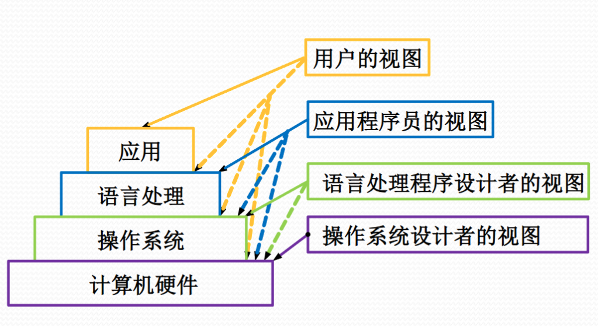

+++
date = '2025-05-03T16:55:10+08:00'
draft = false
title = '第一章：计算机操作系统概述'
summary = "操作系统笔记"
tags = ["笔记", "OS", "操作系统"]
categories = ["StudyBase"]
seriesOpened = true
series = ["笔记-操作系统"]
series_order = 1
+++

 


这部分并非重点，只是期末前大致跟着 mooc 和 PPT 稍微看看罢了。
 

## 历史

- 第一台：ENIAC, America, 1946
- 1945: 电子真空管，机器语言，科学计算
- 1956: 晶体管，批处理控制，Fortan[^1]/COBOL[^2], 数据处理领域
- 1959: 集成电路，多道程序，操作系统/数据库/高级语言，应用领域扩展
- 1976: （超）大规模集成电路
- 1980: 微型、廉价化
- 1990: 图形化的人机交互技术

## 组成

- 计算机系统
- 硬件：CPU，主存，IO，外设
- 软件：系统软件、支撑软件、应用软件

## 计算机系统的用户视图

 

## 演变的视角看os设计

- `Loader`装入程序：自动化将要运行的程序（表现为指令的集合）放入ROM；有时需要地址转换
- 批处理系统：引入作业控制语言，用户编写作业说明书，描述对一次计算机求解（作业）的控制；磁带出现
- 多道程序，磁盘的出现时期成为可能。

## 简述计算机操作系统

### os的组成

os可以视作由多个子系统组成，分别负责：

- 进程调度
- 进程通信
- 内存管理
- 设备管理
- 文件管理
- 网络通信
- 作业控制

### 分类

#### 操作控制方式

- **多道批处理操作系统**：old school，由作业说明书控制，程序员成批加载作业，不直接对计算机进行操作，所以称为 **脱机控制方式**
- **分时操作系统**：我们现在熟知的os的形式，采用**交互控制方式**
- 实时操作系统[^3] 

## os的资源管理

- 硬件资源：处理器、内存、外设
- 信息资源：数据、程序

- 处理器资源：那个程序占有处理器运行？
- 内存资源：程序/数据在内存中如何分布？
- 设备管理：如何分配、去配和使用设备？
- 信息资源管理：如何访问文件信息？
- 信号量资源：如何管理进程之间的通信？

### 屏蔽底层细节：驱动程序

- 最底层的、直接控制和监视各类硬件(或文件)资源的部分
- 隐藏底层硬件的具体细节，并向其他部分提供一个抽象的、通用的接口

### 资源共享方式：独占和并发

### 并发：资源分配策略

- 静态分配方式：进程运行前一次拿到全部独占资源
  - 资源使用效率低
- 动态分配方式：使用资源前临时申请
  - 可能产生竞争资源的死锁 
  - //并发访问的难题-详见第六章
- 资源抢占方式
  - 被抢夺资源的进程需要回滚执行

## os的程序执行：多道程序

### 为什么需要多道？
- CPU速度与I/O速度不匹配的矛盾非常突出
- 只有让多道程序同时进入内存争抢CPU运行，才可以够使得CPU和外围设备充分并行，从而提高计算机系统的使用效率

### 为了实现多道...

为进入内存执行的程序建立管理实体：进程

- OS应能管理与控制进程程序的执行
- OS协调管理各类资源在进程间的使用
  - 处理器的管理和调度
  - 主存储器的管理和调度
  - 其他资源的管理和调度

## os的操作方式

- 脱机作业控制方式：用户编写作业说明书，与程序数据一并提交；操作员通过控制台输入作业
- 联机作业控制方式

- 命令解释程序；会话语言；前台和后台命令

## os的人机交互

WIMP界面：
- 70年代后期
- Windows, Icons, Menu, Pointing Devices, 现代gui os的基本元素
- 不允许同时使用多个交互通道（用户需要等待系统响应后才能进行下一个操作），从而产生人-机交互的不平衡

## os的程序接口：系统调用

实现机制：陷入处理机制和陷入指令（aka访管指令/异常中断指令） 

实现方案：
1. 编写每个系统调用
2. 设计陷阱表，记录每一个系统调用的入口地址、参数个数
3. 保存现场（CPU的特殊寄存器等）的机制

## os系统结构

内核分成单内核、微内核、混合内核、外内核，但如今绝大部分实际使用的都是单内核。

[^1]: Fortran（Formula Translation）是一种高级编程语言，最初由IBM在1957年开发，主要用于科学计算和数值分析。尽管Fortran已经存在了很多年，但它仍然在科学计算领域占据重要地位，许多高性能计算（HPC）系统仍然使用Fortran进行开发。

[^2]: COBOL（Common Business-Oriented Language）是一种面向商业应用的高级编程语言，由美国国防部在1959年开发。尽管COBOL已经存在了很长时间，但它仍然在许多关键业务系统中使用，尤其是在需要处理大量数据和复杂业务逻辑的领域。 

[^3]: 实时操作系统（Real-Time Operating System，RTOS）是一种专门设计用于处理实时应用程序的操作系统。实时应用程序需要在严格的时间限制内完成其任务，因此RTOS必须能够保证任务的可预测性和及时性。