+++
date = '2025-05-05T21:36:22+08:00'
draft = false
title = '第二章：处理器管理'
summary = "操作系统笔记"
tags = ["笔记", "OS", "操作系统"]
categories = ["StudyBase"]
seriesOpened = true
series = ["笔记-操作系统"]
series_order = 2
+++

 


本文介绍了操作系统对处理器的操作，包括处理器的结构、中断、进程与线程及其调度，并讨论了几种处理器调度的算法。


## Part1 处理器基础概念

### 1.1 CPU部件简单示意图

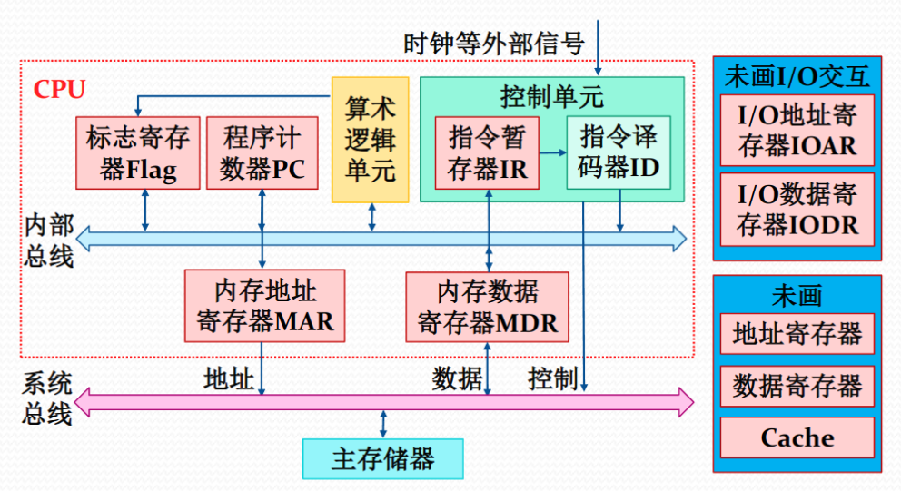

> 未画：IO交互、多级Cache等

### 1.2 寄存器分类

#### 用户可见寄存器

1. 所有程序（应用程序或系统程序）都可以使用
2. **用处：**：减少访存次数，提高指令执行效率
3. 分类：
   1. 数据寄存器/通用寄存器：`AX, BX, CX...`用于存储运算数据和中间结果，是CPU中最常用的寄存器组。
   2. 地址寄存器：
      1. 索引：`SI, DI`用于在内存寻址时作为偏移量，`SI`通常用于源操作数，`DI`用于目标操作数。
      2. 栈指针：`SP, BP, SP`用于指向栈顶，`BP`用于访问栈帧中的局部变量和参数。
      3. 段地址：`CS, DS, SS, ES`用于存储不同内存段的起始地址，其中`CS`用于代码段，`DS`用于数据段，`SS`用于栈段，`ES`用于附加数据段。

#### 控制与状态寄存器

- 主要职责：管理和监控CPU的运行状态
- 通常只能由操作系统等特权程序访问，普通应用程序无法直接操作它们。

1. 程序计数器 `PC`
   - 存储CPU即将要执行的下一条指令的内存地址
   - CPU每执行完一条指令，PC就会自动加1，指向下一条指令

2. 指令寄存器 `IR`
   - 存储CPU当前正在执行的指令
   - CPU从内存读取指令后，会先放入IR，然后解码并执行

3. 条件码 `CC`
   - 记录最近一次运算的结果状态
   - 包含的标志位：
     - 零标志位 `Z`：运算结果是否为0
     - 负标志位 `N`：运算结果是否为负数
     - 溢出标志位 `V`：运算结果是否发生溢出
     - 进位标志位 `C`：运算是否产生进位
   - 应用：这些标志位用于控制程序的执行流程，比如"如果结果为零，就跳转到某处"

4. 标志位 `Flags`
   - 作用：控制CPU的运行模式和状态
   - 主要标志位：
     - 中断位：表示是否有中断请求
     - 中断允许位：控制CPU是否响应中断
     - 中断屏蔽位：控制是否屏蔽某些中断
     - 处理器模式位：区分用户模式和内核模式
     - 内存保护位：控制内存访问权限
   - 重要性：这些标志位共同决定了CPU的**工作状态和安全级别**。

#### 程序状态字（`PSW`, Program Status Word）

程序状态字是一个重要的系统概念，它记录了程序运行时的各种状态信息。*PSW既是一个操作系统概念，也是一个实际的硬件实现*。

1. **PSW作为操作系统概念**
   - 作用：记录当前程序运行的动态信息
   - 包含内容：
     - PC, IR, CC
     - 中断相关标志位
     - 处理器模式位
     - 内存保护位
     - 调试控制位

2. **PSW作为硬件实现**
   - 实现方式：
     - 方式一：使用一组控制与状态寄存器
     - 方式二：使用专门的PSW寄存器
   - 不同CPU架构可能采用不同的实现方式。


PSW是连接硬件和操作系统的桥梁，它既反映了CPU的当前状态，也为操作系统提供了控制程序执行的手段。

### 1.3 指令与处理器模式

#### 指令执行过程

1. 取指阶段
  - 根据PC的值从存储器或高速缓存中读取指令
  - 将读取的指令放入IR中

2. 解码阶段
  - 分析IR中的指令内容
  - 确定指令的类型和操作

3. 执行阶段
  - 连接相关的CPU部件
  - 执行具体的运算操作
  - 将结果写回指定位置
  - 在 CC 中设置运算结果标志
  - 对于跳转指令：修改 PC 的值
  - 对于其他指令： PC 值自动加1

CPU根据 PC 取出指令 -> 将指令放入 IR -> 对指令进行译码 ->发出控制命令 -> 执行微操作 -> 完成指令执行

指令流水线：见COA

#### 特权指令与非特权指令

1. 特权指令：只能被操作系统内核使用的指令，与计算机核心资源相关，例如：启动I/O指令、置PC指令等
2. 非特权指令：能够被所有程序使用的指令，普通用户程序可以执行。

#### 处理器模式
通过对 CPU 设置处理器模式实现特权指令管理。一般设置0、1、2、3四种运行模式,对应不同保护级别：
- 0：OS内核，可以执行全部指令
- 1：系统调用，可以规定执行的指令子集
- 2：共享库程序，可以规定执行的指令子集
- 3：用户程序，只能执行非特权指令
                      
> 现代操作系统通常只使用0、3两种模式。

#### 处理器模式切换

1. 用户模式→内核模式
   - 触发条件：
     - 程序请求操作系统服务，如print
     - 程序运行时发生异常，如运行c出现除0
     - 程序运行时发生并响应中断

2. 内核模式→用户模式
   - 触发条件：OS内核处理完成后
   - 实现方式：调用中断返回指令（如Intel的iret）

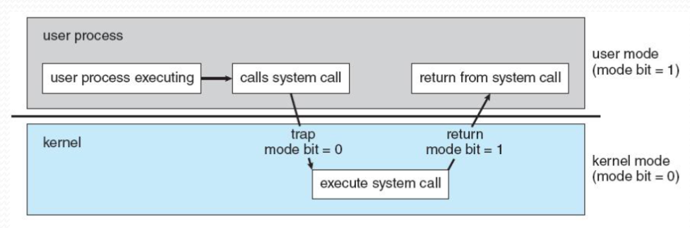

## Part2 中断管理

> 在单核CPU系统中，程序需要独占CPU资源才能执行指令。那么，操作系统是如何实现多程序并发执行的呢？

### 2.1 中断：基本概念

#### 中断的概念

中断是计算机系统中的一种重要机制，它允许系统在程序执行过程中响应紧急事件。具体来说，程序执行过程中遇到急需处理的事件，就暂时中止CPU上现行程序的运行，转去执行相应的事件处理程序，处理完成后返回原程序被中断处**或**调度其他程序执行。

> 操作系统是"中断驱动"的，也就是说，（广义上的）中断是激活操作系统的唯一方式。

#### 中断、异常与系统异常

在计算机系统中，中断事件可以分为三类：狭义的中断、异常和系统异常。这三类事件虽然都会导致CPU暂停当前程序的执行，但它们的来源和触发方式各不相同。

**狭义的中断**是指那些与当前正在执行的指令无关的外部事件，它们来自处理器外部。比如，当打印机完成打印任务时发出的I/O中断，或者系统时钟定期产生的时钟中断，这些都是典型的外部中断。这些中断事件的发生是*异步*的，与CPU当前执行的具体指令没有直接关系。

**异常**则是由正在执行的指令直接引起的中断事件。例如，当程序试图访问一个不存在的内存地址时，就会触发地址异常；当程序进行除以零的运算时，就会产生算术异常。这些异常都是同步的，与特定指令的执行直接相关。

**系统异常**是一种特殊的中断事件，它是由程序主动执行陷入指令（trap instruction）而触发的。这种机制使得用户程序能够请求操作系统的服务，比如请求使用打印机、创建新的进程，或者进行文件操作等。系统异常是用户程序与操作系统进行交互的重要方式。

> 通过中断机制，操作系统能够：
> - 及时响应外部事件
> - 处理程序异常
> - 实现多任务调度
> - 管理系统资源

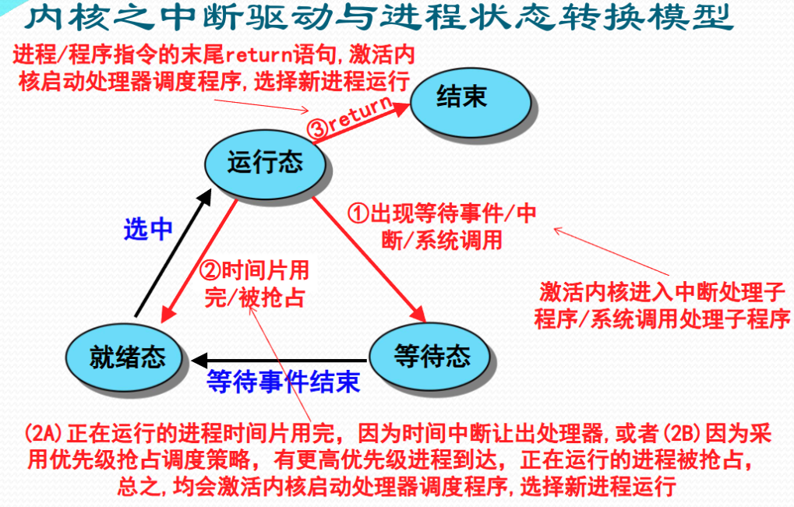

### 2.2 中断源

#### 中断事件的类型

在计算机系统中，中断事件可以根据其来源和性质分为多种类型，每种类型都有其特定的处理机制和应对策略。

**硬件故障中断事件**是由计算机硬件系统出现故障时产生的中断。这类中断可能来自处理器、内存或总线等核心硬件组件。当发生硬件故障时，系统会采取一系列保护措施：
- 首先保存当前程序的状态；
- 然后停止相关设备的运行；
- 最后停止CPU的工作。
- 系统会向操作员报告故障情况，等待人工干预来解决硬件问题

**程序性中断事件**是在处理器执行机器指令过程中产生的中断。这类中断包括多种情况：

- 当程序执行除法运算时遇到除数为零，或进行数值计算时发生溢出，这些都属于算术异常。对于简单的算术异常，系统可以直接报告给用户，或者允许用户编写专门的中断处理程序来处理。
- 而像非法指令、在用户态使用特权指令、访问越界内存地址等指令异常，系统通常会直接终止相关进程。
- 对于虚拟地址异常，系统会尝试调整内存分配后重新执行指令。

**自愿性中断事件**，也称为**系统调用**，是程序主动请求操作系统服务时产生的中断。当程序需要分配外部设备、进行输入输出操作时，就会触发这类中断。处理这类中断时，系统：
- 首先会进入操作系统内核，保存当前程序的状态
- 然后根据功能号查找对应的处理程序入口地址
- 最后跳转到具体的处理程序执行相应的服务

**I/O中断事件**来自外部设备，用于报告输入输出操作的状态。
- 当I/O操作完成时，系统会调整相关进程的状态，释放等待的进程，并将其加入到就绪进程队列中；
- 如果I/O操作出现错误或异常情况，系统会等待人工干预来处理这些问题。

**外部中断事件**是由外围设备发出的信号引起的中断。这类中断包括多种情况：

- *时钟中断*用于计时和处理器时间片的分配；
- *设备报到和结束中断*用于更新设备状态表；
- *键盘和鼠标信号中断*用于响应用户输入；
- *关机或重启中断*则用于确保系统安全关闭，包括将文件写回磁盘、停止设备和CPU的运行。

#### Linux对中断的分类

同步中断由CPU本身产生，又称为内部中断。这里同步是指中断请求信号与代码指令之间的同步执行，在一条指令执行完毕后，CPU才能进行中断，不能在执行期间（比如系统调用）。所以也称为异常（exception）。
异步中断是由外部硬件设备产生，又称为外部中断，与同步中断相反，异步中断可在任何时间产生，包括指令执行期间，所以也被称为中断（interrupt）。
异常又可分为可屏蔽中断（Maskable interrupt）和非屏蔽中断（Nomaskable interrupt）。而中断可分为故障（fault）、陷阱（trap）、终止（abort）三类。

### 2.3 中断系统

中断系统是计算机系统中**负责响应和处理中断的完整系统**，它由硬件和软件两个子系统组成。这种设计充分体现了计算机系统中软硬件协同设计的思想。

- 硬件子系统负责中断的响应；
- 软件子系统负责具体的中断处理

在指令执行周期中，系统会在最后增加一个特殊的微操作，专门用于响应可能发生的中断。这种设计确保了系统能够及时响应各种中断事件。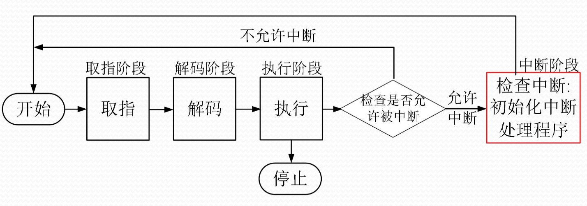

#### 硬件：中断装置

中断装置是计算机系统中**发现并响应中断和异常的硬件装置**。由于中断源的多样性，硬件实现的中断装置也有多种类型，分别用于处理不同类型的中断。这些中断装置的具体实现因计算机而异，主要包括三种类型：

- **处理器外的中断** 由 **中断控制器** 负责发现和响应；
- **处理器内的异常** 由指令的控制逻辑和实现线路发现和响应，这种机制称为**陷阱**；
- **请求操作系统服务的系统异常** 则是在处理器执行陷入指令时直接触发，这种机制称为**系统陷阱**。

##### 1. 中断控制器

中断控制器是CPU中的一个重要控制部件，它包含**中断控制逻辑线路**和**中断寄存器**。运行步骤：

1. 当外部设备需要发出中断请求时，会向中断控制器发送`IRQ`信号，并在中断寄存器中记录已发生的中断。
2. 在指令处理结束前，系统会检查中断寄存器，如果发现有不被屏蔽的中断产生，就会改变处理器内操作的顺序，转而执行操作系统中的中断处理程序。这个过程会通过**查询中断向量表**[^1]来完成。

##### 2. 陷阱与系统陷阱

陷阱和系统陷阱并不是单独出现的一个机制或部件，而是**指令逻辑和实现线路**的一部分。当执行指令出现异常时，系统会根据异常情况转向操作系统的异常处理程序。

例如，对于虚拟地址异常（页错误），系统需要重新执行指令，这时会通过设置页面异常处理程序来处理；而当执行陷入指令时，系统会直接触发系统陷阱，激活系统调用处理程序。


##### 中断响应过程

中断响应过程是一个复杂而有序的过程。

1. 首先，系统需要发现中断源并提出中断请求；
2. 然后检查中断寄存器中记录的中断；
3. 接着决定这些中断是否应该被屏蔽；
3. 当有多个需要响应的中断源时，系统会根据规定的优先级选择一个；
4. 之后，系统会中断当前程序的执行，将当前程序的PSW保存到核心栈[^2]中，最后转向操作系统的中断处理程序。这是中断系统的软件部分。

#### 软件：中断处理程序

中断处理程序是操作系统用来处理中断事件的核心控制程序，它的主要职责是**处理各种中断事件**并**确保系统能够恢复正常操作**。

##### 中断处理过程
中断处理过程是一个精心设计的流程。
1. 首先，程序需要保护那些未被硬件自动保护的处理器状态，确保系统状态不会在处理中断时被破坏；
2. 然后，通过分析被中断进程的程序状态字（PSW）中的中断码字段，系统能够准确识别中断的来源；
3. 接下来，系统会根据中断类型查找中断向量表，执行相应的中断处理子程序；
4. 最后，系统会恢复正常操作。这个过程可能有两种情况：
   1. 处理完成后直接返回到被中断的进程继续执行；
   2. 对于其他一些中断，系统可能需要中断当前进程的运行，调整进程队列，启动进程调度(处理器低级调度)，选择下一个要执行的进程并恢复其执行。

### 2.3 多中断的相应与处理


**中断屏蔽**是中断处理中的一个重要机制。当计算机检测到中断时，中断装置会通过中断屏蔽位来决定是否响应已发生的中断。这种机制允许系统有选择地响应中断，避免某些不必要的中断干扰系统的正常运行。

**中断优先级**是另一个关键概念，它决定了当计算机同时检测到多个中断时，中断装置响应（而非处理）这些中断的顺序。不同的中断类型有不同的优先级，例如一种可能的处理次序：
1. 处理机硬件故障中断通常具有最高优先级；
2. 其次是自愿性中断事件、程序性中断事件、时钟等外部中断事件、输入输出中断事件；
3. 最后是重启动和关机中断事件。

> 需要注意的是，不同类型的操作系统可能会采用不同的中断优先级策略。例如在实时操作系统（RTOS）中，中断优先级通常严格按照任务紧急程度设定，如控制工业设备的中断优先级会高于网络或文件系统相关的中断，以保证系统实时性；而在通用操作系统如 Linux 中，中断优先级较为灵活，更多依赖于中断控制器（如 APIC）配置和内核调度策略。

**中断的嵌套处理**是一个复杂但重要的特性。它允许计算机在响应一个中断后，在中断处理过程中再响应其他中断。这种机制提高了系统的响应能力，但也带来了额外的复杂性：比如，中断的嵌套处理改变中断处理次序，先响应的有可能后处理。**中断的嵌套处理通常被限制在一定层数内，比如最多允许3层嵌套**。这种限制是必要的，因为每增加一层嵌套，都会带来显著的系统开销。

**多中断的响应与处理**是一个综合性的问题，它涉及到中断屏蔽、中断优先级和中断嵌套等多个方面：
- 中断屏蔽机制使系统能够选择性地忽略某些中断；
- 中断优先级决定了系统**响应**中断的顺序；
- 中断的嵌套处理虽然提供了更灵活的中断处理能力，但也会改变中断的处理次序，并且每增加一层嵌套都会带来额外的系统开销。

#### 总结：中断系统操作中断的全过程

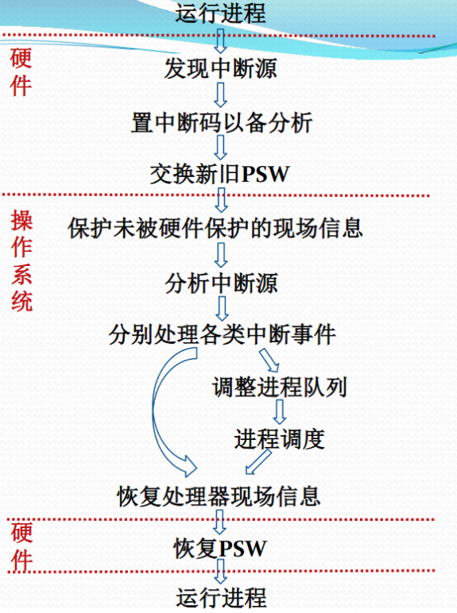

> 整个过程如上所示[^3]。

## Part3 进程管理

### 3.1 basics

> 操作系统需要全方位地管理计算机系统中运行的程序，这是一个复杂而重要的任务。为了更好地实现这个目标，操作系统为每个正在运行的程序建立了一个 instance（实体）用于管理，这就是进程。进程的引入使得操作系统能够更有效地*管理程序执行、分配资源并进行调度。*

#### 进程的概念

> "进程是一个具有一定独立功能的程序关于某个数据集合的一次运行活动。"

这句话强调的是"进程"不仅仅是程序代码，而是**程序在某次执行中的实例**，包括其运行所需的资源（如内存、打开的文件、寄存器状态等）。它具有独立的执行上下文和控制权，**是操作系统调度和资源分配的基本单位**，因此不同于静态的"程序"，是"活的实体"。

#### 进程的形式化定义：\\( \text{Process} = ( P, C, D, R, PSW ) \\)

1. 操作系统用来管理运行程序的数据结构`P`，它记录了进程的各种管理信息；
2. 运行程序的内存代码`C`，存储了程序的指令；
3. 运行程序的内存数据`D`，包含了程序运行时的数据；
4. 运行程序的通用寄存器信息`R`，记录了程序运行时的寄存器状态；
5. 操作系统控制程序执行的程序状态字信息`PSW`，包含了程序运行的各种状态标志。

#### 进程之间的关系

进程之间的关系可以呈现出多种形式。
1. 当不同的程序在不同的数据集上运行时，它们构成了两个完全无关的进程；
2. 而当不同的程序在相同的数据集上运行时，它们就构成了两个共享数据的交往进程；
3. 相同的代码在不同数据集上运行会形成两个共享代码的无关进程，这种共享的代码被称为**可再入程序**，比如文本编辑器就是典型的可再入程序。可再入程序是**纯代码**的，这意味着在执行过程中不会修改它的代码段，也不会依赖任何单一实例的数据段。

前述的程序与数据集均是内存级的，所以即使是在不同时段中针对同一个外存数据文件运行同一个外存程序文件，由于每次运行都会产生不同的进程**实体**，所以这也会构成两个不同的进程。

### 3.2 进程的状态

#### 简要：三态模型

进程在其生命周期中会经历不同的状态。

- 运行态表示进程正在占有处理器运行；
- 就绪态表示进程已经具备了运行条件，正在等待处理器分配；
- 等待态/阻塞态则表示进程由于等待资源、输入输出或信号等原因而不具备运行条件。

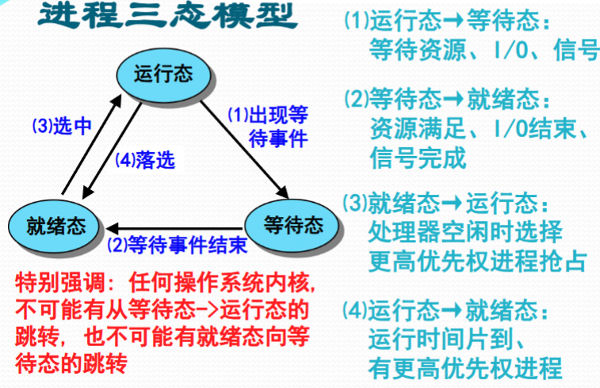

#### 进程挂起

当系统资源不足时，通常表现为系统性能低下或出现死锁。为了解决这两个问题，执行进程挂起：挂起的本质是剥夺某些进程的内存及其他资源，将它们调入操作系统的对换区（Swap），暂时不参与进程调度，等到适当的时机再调入内存、恢复资源、重新参与运行。

**挂起态与等待态有着本质的区别**：等待态的进程虽然暂时不能运行，但仍然占有已申请到的资源（放在内存）；而挂起态的进程则没有任何资源（放在swap分区）。

操作系统通常会选择将等待态的进程转入**挂起等待态**，也可以选择将就绪态的进程转入**挂起就绪态**，在某些情况下，运行态的进程还可以主动挂起自己（挂起就绪态）。当等待的事件结束后，挂起等待态的进程会转入挂起就绪态，而系统一般会选择将挂起就绪态的进程予以恢复。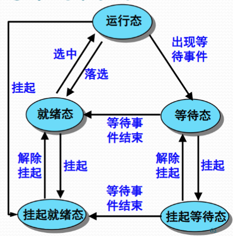

#### 更详细的进程状态转换：SVR4 进程状态模型

SVR4 进程状态模型是 UNIX System V Release 4 中定义的一种细化的进程状态表示方法，它将进程分为用户态运行、内核态运行、就绪、等待和停止等状态，明确区分了**运行态中的用户态与内核态**，并通过状态转换图反映了系统调用、中断、调度、等待与唤醒（等待到就绪）等行为对进程状态的影响，有助于操作系统更精确地管理和调度进程。


### 3.3 进程的数据描述

#### 进程控制块

进程控制块（Process Control Block，PCB）是操作系统用来记录和刻画进程状态及环境信息的数据结构。通过PCB，操作系统能够全面管理进程的物理实体，准确刻画进程的执行现状，并有效控制进程的执行。PCB包含了三个主要部分：标识信息、现场信息和控制信息。

1. **标识信息**用于存放唯一标识该进程的信息，包括
   1. 系统分配的进程标识号、进程组标识号
   2. 用户定义的进程名和进程组名
2. **现场信息**记录了进程运行时的处理器现场信息，包括
   1. 用户可见寄存器（如数据寄存器和地址寄存器）的内容
   2. 控制与状态寄存器（如PC、IR、PSW）的内容
   3. 核心栈[^2]与用户栈的指针信息。
   
   这些信息对于进程的上下文切换至关重要。
3. **控制信息**则包含了与进程管理和调度相关的各种信息，包括
   1. 进程的调度信息（如状态、等待事件/原因、优先级）
   2. 进程组成信息（如代码/数据地址、外存映像地址）
   3. 队列指引元（如进程队列指针、父子兄弟进程指针）
   4. 通信相关信息（如消息队列、信号量、锁）
   5. 进程特权信息（如内存访问权限、处理器特权）
   6. 处理器使用信息（如占用的处理器、时间片、处理器使用时间）
   7. 资源清单信息（如正占有的资源、已使用的资源）。


#### 进程映像

进程映像（Process Image）是**某一时刻进程的内容及其执行状态的集合**，它是**进程在内存中的物理实体**。进程映像包含四个主要部分：
1. 进程控制块（PCB），用于保存进程的标识信息、状态信息和控制信息；
2. 进程程序块，即进程执行的程序空间；
3. 进程数据块，包含进程处理的数据空间，包括数据、处理函数的用户栈和可修改的程序；
4. 核心栈，这是进程在内核模式下运行时使用的堆栈，主要用于处理中断或系统调用。

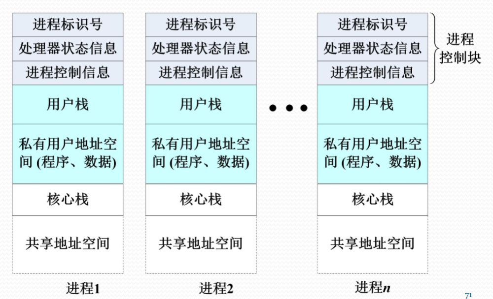

#### 进程上下文

进程上下文（Process Context）是进程执行所需的环境支持，包括CPU现场和Cache中的执行信息。它由操作系统中的进程物理实体和支持进程运行的环境共同组成，包括三个主要部分：
1. 用户级上下文，包含用户程序块、用户数据区、用户栈和用户共享内存；
2. 寄存器上下文，包含PSW、栈指针和通用寄存器的内容；
3. 系统级上下文，包含PCB、内存区表[^4]和核心栈。
进程上下文完整地刻画了进程的执行情况，是进程切换和恢复的关键。

### 3.4 进程管理的实现

#### 进程管理软件

操作系统的进程管理功能是通过一系列关键软件模块实现的。这些模块包括：
1. 系统调用处理程序、中断处理程序、异常处理程序，它们负责处理各种系统事件和用户请求；
2. 队列管理模块，负责维护和管理各种进程队列，是进程管理的核心组件；
3. 进程控制程序，负责创建、撤销、阻塞、唤醒等进程控制操作；
4. 进程调度程序，通常作为独立进程运行，负责决定哪个进程获得处理器资源；
5. 进程通信程序，提供了进程间通信的各种机制，通常由多个程序包组成。

此外，还有一些外围程序，如终端登录与作业控制程序、性能监控程序、审计程序等，它们共同构成了完整的进程管理系统。

#### 进程实现的队列模型

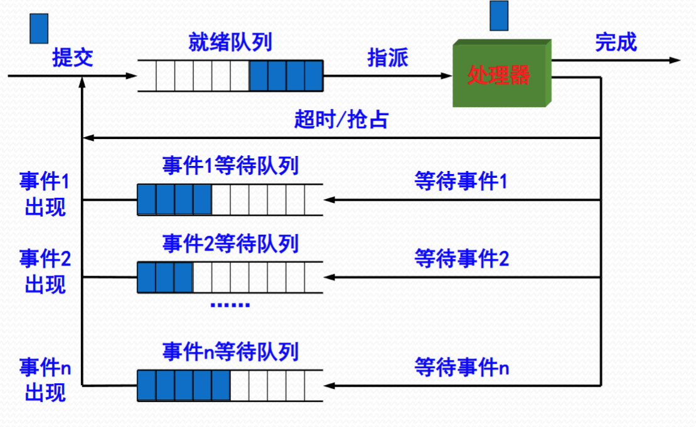

**队列管理模块是操作系统实现进程管理的核心模块**。操作系统会建立多个进程队列，主要包括一个就绪队列和多个等待队列（因为进程被要求等待的原因有很多）。这些队列可以根据需要组织为先进先出队列（公平性）或优先队列（合理性）。

队列中的进程通过PCB中的队列指引元（recap: linkage属于PCB的控制信息，见上文）进行连接，可以采用单指引元、双指引元或索引连接的方式。每个进程控制块（PCB）中包含用于连接进程队列的指针或索引信息，称为指引元（linkage）。根据队列的具体实现，可能是单向链表（单指针）、双向链表（双指针），或者通过索引表管理（索引连接），这些结构支持高效地插入、删除和遍历队列中的进程。

队列管理模块提供了出队和入队等基本操作，而进程与资源的调度都是围绕这些进程队列展开的。

#### 进程控制原语

进程控制原语[^5]是操作系统提供的一组基本操作，用于实现进程的控制与管理。这些原语包括：

1. 进程创建：在进程表中添加新项，申请并初始化PCB，生成进程标识，建立进程映像，分配必要资源，最后将进程移入就绪队列；
2. 进程撤销：从队列中移除进程，归还所有资源，撤销进程标识，回收PCB，并从进程表中移除相应表项；
3. 进程阻塞：保存现场信息，修改PCB，将进程移入等待队列，并调度其他进程执行；
4. 进程唤醒：将进程从等待队列中移出，修改PCB，移入就绪队列，如果被唤醒进程的优先级高于当前运行进程，还会触发抢占；
5. 进程挂起：修改进程状态并调整相关队列，收回内存等资源送至对换区；
6. 进程激活：分配内存，修改状态并调整相关队列。

此外，还有一些其他原语，如修改进程特权的原语。

这些进程控制原语在执行过程中会涉及对操作系统核心数据结构的修改，包括进程表、PCB池、队列和资源表等。*为了防止与时间有关的错误，这些操作必须作为原语执行*。

### 3.5 进程切换与模式切换

#### 进程切换

进程切换是指**从正在运行的进程中收回处理器，让待运行的进程来占有处理器运行**的过程。从本质上来说，进程切换就是被中断运行进程与待运行进程之间的上下文切换。这个过程包括三个主要步骤：
- 被中断进程的上下文，
- 转向进程调度，
- 恢复待运行进程的上下文。

#### 模式切换

进程切换必须在操作系统内核模式下完成，这就需要模式切换。模式切换，也称为处理器状态切换，包括两种方向：从用户模式到内核模式的切换，这通常由**中断、异常或系统调用**中断用户进程执行而触发；从内核模式到用户模式的切换，这通常由**操作系统执行中断返回指令**将控制权交还给用户进程而触发。

#### 模式切换的工作流程

中断装置负责完成正向模式切换，这个过程包括：

1. 将处理器模式转为内核模式
2. 保存当前进程的PC和PSW值到核心栈
3. 转向中断、异常或系统调用处理程序

而中断返回指令则负责完成逆向模式转换，包括从待运行进程的核心栈中弹出PSW和PC值，并将处理器模式转回用户模式。

#### 进程切换的工作流程

1. 由中断或异常触发正向模式切换并压入PSW和PC；
2. 保存被中断进程的现场信息；
3. 处理具体的中断或异常；
4. 把被中断进程的系统堆栈指针SP值保存到PCB中；
5. 调整被中断进程的PCB信息，如进程状态；
6. 把被中断进程的PCB加入相关队列；
7. 选择下一个占用CPU运行的进程；
8. 修改被选中进程的PCB信息；
9. 设置被选中进程的地址空间，恢复存储管理信息；
10. 恢复被选中进程的SP值到处理器寄存器SP；
11. 恢复被选中进程的现场信息进入处理器；
12. 最后，由中断返回指令触发逆向模式转换并弹出PSW和PC。

#### 进程切换的发生时机

进程切换通常发生在中断、异常或系统调用的处理过程中。常见的情况包括：当发生阻塞式系统调用或虚拟地址异常时，被中断进程会进入等待态；当发生时间片中断或I/O中断后发现更高优先级进程时，被中断进程会转入就绪态；当发生终止用系统调用或不能继续执行的异常时，被中断进程会进入终止态。

需要注意的是，并非所有的中断或异常都会引起进程状态转换和进程切换。有些中断或异常处理完成后，系统只是简单地将控制权交回给被中断进程。这种情况下的处理流程是：
- 首先由中断或异常触发正向模式切换并压入PSW和PC；
- 然后保存被中断进程的现场信息；
- 接着处理中断或异常；
- 之后恢复被中断进程的现场信息；
- 最后由中断返回指令触发逆向模式转换并弹出PSW和PC。



#### 习题：`fork()`系统调用实例分析

让我们通过一个具体的例子来理解进程的创建过程。考虑以下C程序：

```c
main() {
    fork();   /* 第一个fork调用 */
    fork();   /* 第二个fork调用 */
    fork();   /* 第三个fork调用 */
}
```

这个程序在UNIX系统中执行时，会产生多个进程。让我们分析一下进程的创建过程：

1. 程序开始执行时，只有一个进程（称为进程A）
2. 执行第一个fork()后，创建了一个子进程（进程B），此时有两个进程
3. 这两个进程都会执行第二个fork()，各自创建一个子进程（A->C 和 B->E），此时有四个进程
4. 这四个进程都会执行第三个fork()，各自创建一个子进程（A->D、B->F、C->G和 E->H），最终得到八个进程

进程的创建过程可以用树形结构表示：

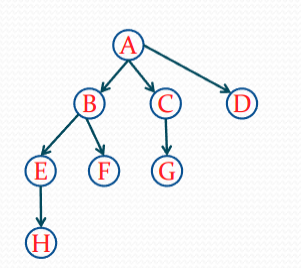

这个例子展示了fork()系统调用的一个重要特性：**每次调用都会创建一个新的进程，新进程是原进程的副本，包括代码段、数据段和堆栈段。新进程从fork()调用后的指令开始执行，而原进程继续执行fork()后的指令。**这种机制使得程序能够创建多个并发执行的进程。


## Part4 多线程技术

### 4.1 多线程环境概述

~~沟槽的os不讲线程是什么就开始扯多线程，COA的知识倒是水了一堆~~先看看线程是什么。

> 线程是操作系统调度的最小执行单元，属于某一进程，并与同进程内其他线程共享**代码段、堆、全局变量**等资源，但拥有独立的**程序计数器、寄存器集合和栈空间**。线程由线程ID、程序计数器、寄存器、线程栈和线程局部存储等组成，相比进程具有创建和切换开销小的优势，适用于高并发场景。线程可分为内核线程和用户线程，现代操作系统通常采用一对一的映射模型[^6]进行管理。


#### 单线程结构进程：问题与解决方案

传统的进程是单线程结构的，这种结构在并发程序设计上存在一些问题：
1. 进程切换的开销较大，因为需要保存和恢复整个进程的上下文；
2. 进程间通信的开销也很大，因为需要跨越进程边界；
3. 单线程结构限制了进程并发的粒度[^7]，因为进程内部不能并发执行；
4. 这种结构降低了并行计算的效率，因为每个进程只有一个执行流。

为了解决这些问题，操作系统设计者提出了将进程的两项功能分离的思路：**将"独立分配资源"与"被调度分派执行"分开**。在这种设计下，**进程作为系统资源分配和保护的独立单位**，不需要频繁切换；而**线程作为系统调度和分派的基本单位**，能够轻装运行，会被频繁地调度和切换。这种设计减少了进程并发执行所付出的时空开销，使得并发粒度更细、并发性更好。

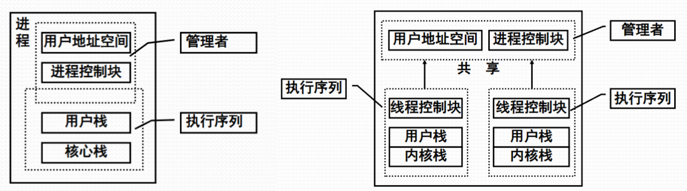
> 单线程与多线程的进程结构区别⬆

#### 多线程环境下的进程

在多线程环境中，进程的概念发生了变化。进程成为操作系统中进行保护和资源分配的独立单位，具有两个主要特征：

1. 它拥有用来容纳进程映像的虚拟地址空间（第三章）；
2. 它具备对进程、文件和设备的存取保护机制。

这种设计使得进程能够更好地管理资源和提供保护。

#### 多线程环境下的线程概念

线程是**进程的一条执行路径**，是调度的基本单位。同一个进程中的所有线程**共享进程获得的主存空间和资源**。线程的组成部分：
- 线程执行状态
- 受保护的线程上下文（用于存储现场信息）
- 独立的程序指令计数器
- 执行堆栈
- 以及容纳局部变量的静态存储器

##### 线程的状态与调度

线程的状态包括**运行、就绪和睡眠**三种基本状态。需要注意的是，挂起(swapped)状态是与资源相关的，属于进程级别的状态。与线程状态变化有关的线程操作包括：

- 孵化（创建新线程）
- 封锁（暂停线程执行）
- 活化（恢复线程执行）
- 剥夺（强制暂停线程）
- 指派（分配处理器给线程）
- 结束（终止线程）

线程调度是操作系统中的重要机制。在操作系统感知线程的环境下，处理器调度的对象是线程，而进程没有传统的三状态（或者说只有挂起状态）。

在操作系统不感知线程的环境下，处理器调度的对象仍然是进程，而线程的调度则由用户空间中的用户调度程序负责。

#### 并发多线程程序设计的优点

- 线程切换的速度比进程切换快得多；
- 减少了系统管理开销；
- 线程间通信更容易实现；
- 提高了并行程度；
- 节省了内存空间。

#### 多线程技术的应用

- 处理前台和后台工作
- 支持客户端/服务器应用模式
- 加快程序执行速度
- 以及设计更复杂的用户接口

### 4.2 内核级线程与用户级线程

在操作系统中，线程的实现方式主要分为两种：内核级线程(Kernel-Level Threads, KLT)和用户级线程(User-Level Threads, ULT)。这两种实现方式各有特点，适用于不同的应用场景。

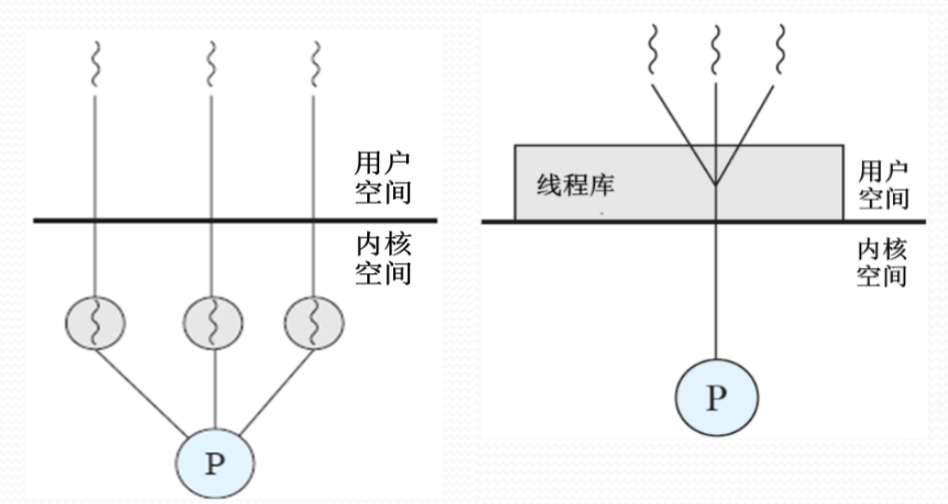
> KLT和ULT的示意图⬆

#### KLT

内核级线程是由操作系统内核直接管理的线程。在这种实现方式下，**线程管理的所有工作都由操作系统内核来完成**。操作系统为开发者提供了专门的应用程序设计接口(API)，通过这些 api 可以创建和管理内核级线程。内核级线程的一个显著特点是**操作系统可以直接调度这些线程，这使得系统能够更灵活地处理线程的调度和切换**。

内核级线程具有几个重要的优势。

1. 当进程中的某个线程被阻塞时，内核可以调度同一进程中的其他线程继续运行，这**提高了系统的并发性能**。
2. 在多处理器环境中，内核可以同时调度同一进程中的多个线程并行执行，**充分利用多核处理器的优势**。
3. 此外，操作系统内核本身也可以采用多线程技术来实现，这****有助于提高操作系统的执行速度和效率****。

不过，内核级线程也存在一些缺点，比如在用户态运行的应用程序线程需要在内核态进行调度和管理，这导致**线程切换时需要模式切换，带来较大的系统开销**。

#### ULT

用户级线程则是在用户空间运行的线程，它们由用户空间的线程库提供支持。在这种实现方式下，**任何需要使用多线程的应用程序都需要通过线程库进行程序设计，并在与线程库连接后才能运行**。用户级线程的一个重要特点是**内核完全不知道这些线程的存在，线程管理的所有工作都由应用程序自己完成**。

1. 用户级线程的主要优势在于其**高效性**。由于所有线程管理的数据结构都位于进程的用户空间中，线程切换不需要进入内核模式，这大大节省了模式切换的开销和内核资源。
2. 用户级线程允许进程根据具体应用需求选择或定制调度算法，提供了更大的**灵活性**。
3. ULT 可以在任何支持基本进程的操作系统上运行，因为内核不需要为支持用户级线程做任何特殊工作，所以更**兼容性**。

然而，用户级线程也存在一些局限性。

1. 对单个进程而言，它们无法充分利用多处理器的优势，因为操作系统只能调度进程，而一个进程中只能有一个用户级线程在执行。

2. 如果某个用户级线程发生阻塞，整个进程都会被阻塞，这可能会影响系统的响应性。

##### Jacketing技术

为了解决用户级线程的阻塞问题，人们开发了Jacketing技术。这种技术**将阻塞式系统调用改造成非阻塞式的**。当线程需要执行系统调用时，会先执行jacketing程序。这个程序会检查资源的可用情况，然后决定是执行进程切换还是将控制权传递给另一个线程。这种机制可以在一定程度上缓解用户级线程的阻塞问题，提高系统的并发性能。

具体地说，Jacketing 的原理是通过在用户态对潜在阻塞的系统调用进行封装（即"加套"），在真正执行系统调用之前，先用非阻塞方法（如轮询、`select`、`poll` 等）检测所需资源是否可用；如果资源尚不可用，则不立即发起系统调用，而是将控制权交还给用户级线程调度器[^8]，由其选择其他可运行的线程继续执行，从而避免整个用户级线程系统因一个线程阻塞而陷入停顿。举例来说，如果某线程要对一个文件描述符进行 `read()` 操作，Jacketing 会先用 `select()` 检查该描述符是否可读；如果不可读，就不执行 `read()`，而是先挂起当前线程并调度其他线程运行，等条件满足后再恢复该线程并执行真正的 `read()`，从而避免了内核因阻塞调用而挂起整个进程。


#### 总结

ULT 由用户态库管理，不依赖内核调度，因此适合在单核或非并行环境下模拟逻辑上的"并发"操作，开销小、切换快；而KLT由操作系统直接调度，能将多个线程真正并行运行在多个处理器上，适合利用多核硬件实现实际的"物理"并行。因此，**ULT适用于解决逻辑并行性问题，KLT适用于解决物理并行性问题。**

### 4.3 多线程实现的混合策略

多线程实现的混合策略是一种结合了 ULT 和 KLT 优点的实现方式。在这种策略下，**线程的创建完全在用户空间中进行，而一个应用程序中的多个 ULT 会被映射到一定数量的 KLT 上**。这种映射关系是灵活的，**KLT <= ULT**，通过调整 KLT 的数量，可以达到较好的并行效果。这种策略有效地结合了纯粹用户级线程和内核级线程的优点，同时减少了它们各自的缺点：

1. 它组合了 ULT 和 KLT 的设施，使得系统既具有 ULT 的灵活性，又具备 KLT 的并行能力；
2. 线程的创建、调度和同步都在应用程序中进行，这保持了用户级线程的高效性；
3. 程序员可以根据具体的应用需求和机器配置来调整内核级线程的数量，以达到最佳的整体性能。

#### 混合策略下的状态管理

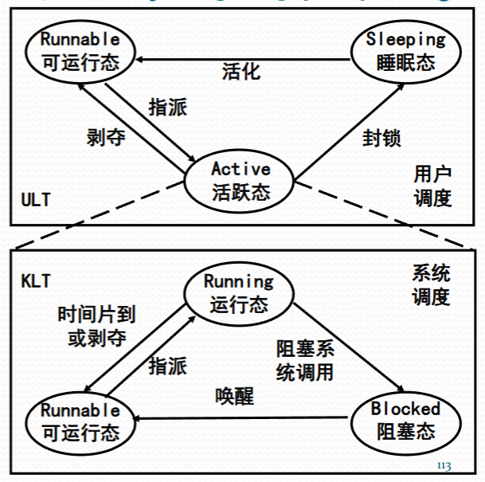

在混合策略下，线程的状态管理呈现出独特的特征。KLT 仍然保持传统的三态（运行/活跃/Active、就绪/可运行/Runnable、阻塞/睡眠/Sleeping），由系统调度负责管理；而 ULT 也维持其三态，但由用户调度负责管理。特别的是，处于活跃状态的 ULT 代表着绑定到 KLT 的三种状态，这些活跃态的 ULT 在运行时可以激活用户调度。对于阻塞系统调用[^9]，系统可以使用 Jacketing 技术来启动用户调度，从而调整活跃态 ULT 的执行。

这种混合策略的实现方式使得系统能够更好地平衡性能和灵活性。通过将用户级线程映射到内核级线程，系统既能够利用多处理器的并行能力，又能够保持用户级线程的轻量级特性。同时，通过允许程序员调整内核级线程的数量，系统可以更好地适应不同的应用场景和硬件环境。

### 4.4 补充：Solaris[^10] 多线程技术

Solaris 多线程技术采用了多层次线程模型，增加了轻量级进程（LWP，Light Weight Process）作为用户线程（ULT）与内核线程（KLT）之间的桥梁。LWP 是内核调度的基本单位，每个 LWP 绑定一个内核线程，负责执行用户线程的上下文切换和系统调用请求，弥补了纯用户线程调度无法感知内核状态的不足。在状态管理上，Solaris 不仅维护传统的运行、就绪、阻塞状态，还为 LWP 引入独立的状态管理，使得用户线程和 LWP 状态分离且协同，用户线程的阻塞不会直接阻塞 LWP，从而提高系统并发性能和灵活性。相比一般的一对一模型或纯用户级线程模型，Solaris 的多层次设计有效平衡了线程调度的效率与内核资源利用。


### 4.5 总结：多线程的不同实现策略示意图

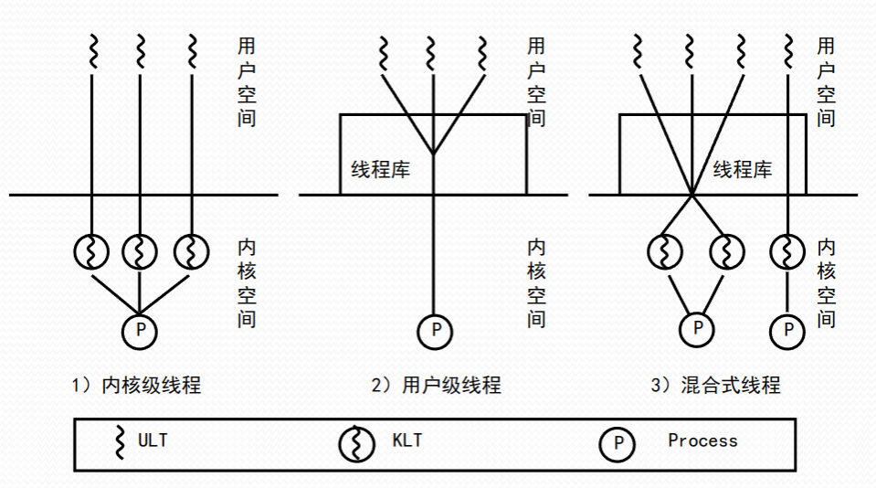

## Part5 处理器调度

### 5.1 处理器调度的层次

> 作系统的处理器调度可以分为三个层次：高级调度、中级调度和低级调度。这三个层次的调度各自负责不同的任务，共同协作以确保系统的高效运行。

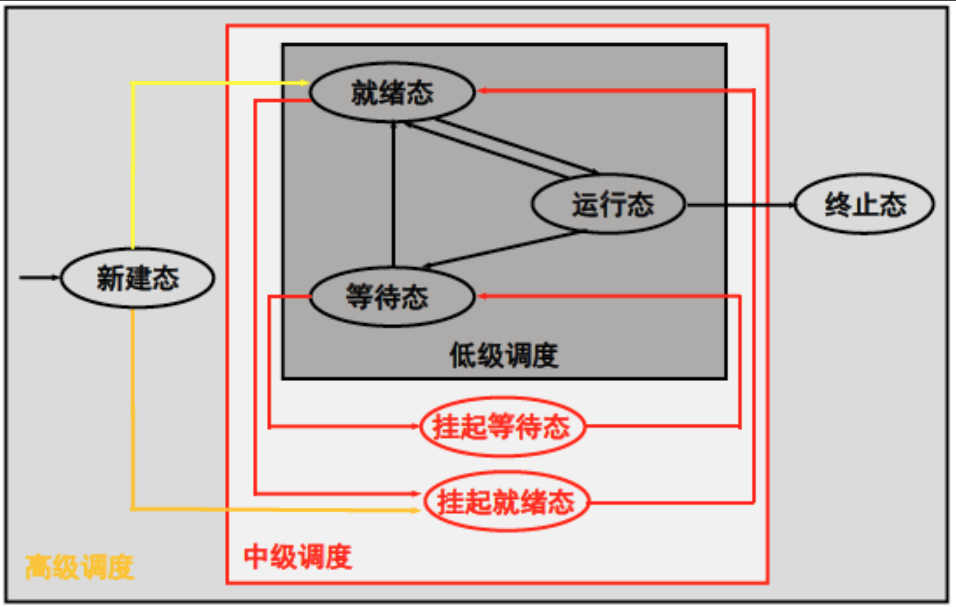

#### 高级调度

高级调度，也称为长程调度或作业调度，是处理器调度的最高层次。它的主要职责是**决定哪些程序能够加入到执行的进程池中**。在分时操作系统中，高级调度负责
- 决定是否接受终端用户的连接请求
- 判断用户命令是否能够被系统接纳并构成进程
- 决定新建态进程是否能够加入就绪进程队列。

在批处理操作系统中，高级调度的作用更为突出。它需要按照特定的原则从后备作业队列中选择作业进入主存，并为这些作业做好运行前的准备工作以及完成后的善后工作。

#### 中级调度

中级调度，也称为平衡负载调度，是处理器调度的中间层次。引入中级调度的主要目的是**提高内存利用率和作业吞吐量**。中级调度负责**决定哪些进程被允许驻留在主存中参与竞争处理器及其他资源**，起到短期调整系统负荷的作用。

中级调度的一个重要功能是**将一些进程换出主存，使它们进入"挂起(swapped)"状态，从而不参与进程调度**。这种机制能够有效地平顺系统的负载，防止系统资源过度使用。通过这种方式，系统可以在保持良好性能的同时，确保资源的合理分配。

#### 低级调度

(也就是狭义上的处理器调度，这个part的重点)

低级调度/处理器调度/进程调度/短程调度，是处理器调度的最底层。它负责**按照某种原则把处理器分派给就绪态进程或内核级线程(KLT)**。进程调度程序（也称为分派程序）是操作系统中实现处理器调度的核心程序，是操作系统最重要的组成部分之一。

低级调度的主要功能包括：
1. 记住进程或内核级线程的状态
2. 决定某个进程或内核级线程什么时候获得处理器，以及占用多长时间
3. 把处理器分派给进程或内核级线程
4. 收回处理器

处理器调度策略的优劣**直接影响到整个系统的性能**。一个好的调度策略能够提高系统的吞吐量，减少响应时间，并确保系统资源的公平分配。

### 5.2 处理器调度算法：介绍

在选择处理器调度算法时，需要考虑多个关键因素。
1. 首先是**资源利用率**。算法应该能够使CPU和其他资源的使用率尽可能高，并且能够支持资源的并行工作，有时还需要考虑资源的平衡使用。
2. 其次是**响应时间**。对于交互式用户来说，响应时间应该尽可能小，对于实时任务则需要尽快处理，有时还需要满足特定的时间期限要求。
3. **周转时间**也是一个重要指标，它指的是从任务提交给系统开始到执行完成获得结果为止的时间间隔，算法应该使周转时间或平均周转时间尽可能短。
4. **吞吐量**反映了系统在单位时间内处理的进程数量，应该尽可能提高。
5. 最后，**公平性**也是不可忽视的因素，算法需要确保每个用户和每个进程都能获得合理的CPU份额或其他资源份额。

#### 优先数调度算法

优先数调度算法是一种基于进程优先级的调度策略，根据**分配给进程的优先数**来决定下一个运行的进程。这种算法可以分为抢占式和非抢占式两种类型。优先数的确定需要考虑多个因素，包括：

- 进程所负担任务的紧迫程度
- 进程的交互性
- 进程使用外设的频率
- 进程使用处理器的服务时间长短

与时间相关的优先数计算方式包括计算时间短的进程优先(SPN)、剩余计算时间短的进程优先(SRT)、响应比高的进程优先(HRRF)、时间片轮转(RR)、多级反馈调度(Feedback)，以及先来先服务(FCFS)等策略。

> 其实就是等待时间更短咯。

先来先服务策略主要用于高级调度，在低级调度中可能会导致以计算为主的进程获得过多优势。 


补充：非抢占式调度算法

非抢占式算法顾名思义，在上文出现过的状态图中的“preempted”的一个转换都不会出现——比如在经典的三态模型中，不存在从运行态到就绪态（回忆一下）的转换。这意味着这种os存在风险：

1. 死锁风险：当一个进程获得CPU后，如果它陷入死循环或者出现bug无法正常结束，由于没有运行态到就绪态的强制转换，这个进程会一直占用CPU，导致其他进程永远无法执行。比如一个进程在计算过程中出现无限循环，系统将无法强制切换它。

2. 响应延迟：如果当前运行的进程执行时间很长，其他进程（包括高优先级进程）必须等待它完成。比如一个进程在进行大量数据处理，即使有更紧急的任务（如用户输入处理）需要执行，也必须等待当前进程完成。

3. 系统资源浪费：如果当前运行的进程在等待I/O操作（如读取磁盘），由于没有强制切换机制，CPU会处于空闲状态，造成资源浪费。比如一个进程在等待网络响应，CPU只能空转等待。

4. 实时性差：对于需要实时响应的系统（如工业控制系统），非抢占式调度无法保证关键任务的及时执行。比如一个需要实时响应的传感器数据处理任务，可能因为其他进程的长时间运行而错过处理时机。

5. 优先级失效：即使系统设置了进程优先级，在非抢占式调度下，低优先级进程一旦获得CPU，高优先级进程也必须等待，导致优先级机制失效。比如一个低优先级的后台任务可能阻塞高优先级的用户交互任务。


#### 时间片轮转调度算法（Round Robin，RR）

RR 是一种基于时间片的调度策略。它**根据各个进程进入就绪队列的时间先后，轮流让每个进程占有CPU一个时间片**。当时间片结束时，系统会产生时间片中断，将当前进程挂起并选择下一个进程执行。时间片长度的选择非常重要，如果时间片过长，算法会退化为先来先服务算法；如果时间片过短，则会导致调度开销占比过大。时间片轮转算法可以采用单时间片、多时间片或动态时间片的方式实现。

#### 分级调度算法(feedback)

分级调度算法/多队列策略/反馈循环队列，是一种结合了优先级和时间片的调度策略。其基本思想是建立多个具有不同优先级的就绪进程队列，队列之间按照优先数进行调度。高优先级的就绪进程会获得较短的时间片，而在同一个就绪进程队列中的进程具有相同的优先数和时间片。分级原则通常考虑外设访问、交互性、时间紧迫程度、系统效率和用户立场等因素。

在现代操作系统中，分级调度算法的实现通常包含多个高优先级的实时进程队列（如硬实时[^11]、网络、软实时[^12]）和多个分时任务[^13]的进程队列。这些队列的数量可能多达32到128个，系统会根据基准优先数[^14]和执行行为[^15]来调整进程的优先级。

#### 彩票调度算法

在彩票调度算法中，“彩票”实际上是一个抽象的概念，**代表进程获得系统资源（如CPU时间）的机会**。每个进程被分配一定数量的彩票，彩票的数量通常与进程的优先级或重要性相关。例如，一个高优先级的进程可能会被分配更多的彩票，从而增加其获得CPU时间的机会。通过分配不同数量的彩票，系统可以体现进程的优先级。

当系统需要决定哪个进程获得CPU时间时，调度程序会随机选择一张彩票。持有该彩票的进程将获得CPU时间。这种随机选择的方式确保了资源分配的公平性和灵活性。

**彩票交换**是彩票调度算法中的一个重要特性，允许进程之间交换彩票。这种交换机制使得系统资源分配更加灵活，例如，在某些情况下，进程之间可能需要合作完成任务。通过交换彩票，进程可以调整其获得资源的机会，以适应不同的工作负载；如果一个进程发现它不需要那么多的CPU时间，它可以将部分彩票交换给其他需要更多资源的进程。

### 5.3 处理器调度算法：应用

| 算法 | 英文名 | 英文缩写 | 是否抢占式 |
|------|--------|----------|------------|
| 先来先服务 | First-Come, First-Served | FCFS | 非抢占 |
| 最短进程优先 | Shortest Process Next | SPN | 非抢占 |
| 最短剩余时间优先 | Shortest Remaining Time | SRT | 抢占 |
| 最高响应比优先 | Highest Response Ratio First | HRRF | 非抢占 |
| 时间片轮转 | Round Robin | RR | 抢占 |
| 多级反馈调度 | Feedback | \ | 抢占 |

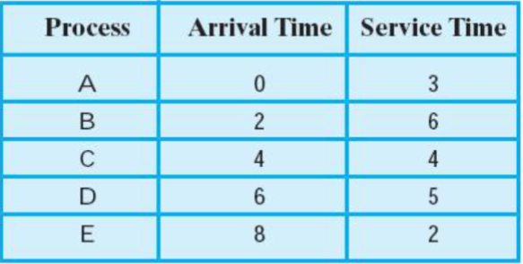

#### FCFS

- 某个进程就绪时，都加入就绪队列(ready queue);
- 当前正在运行的进程停止执行时，选择在就绪队列存在时间最长的进程运行

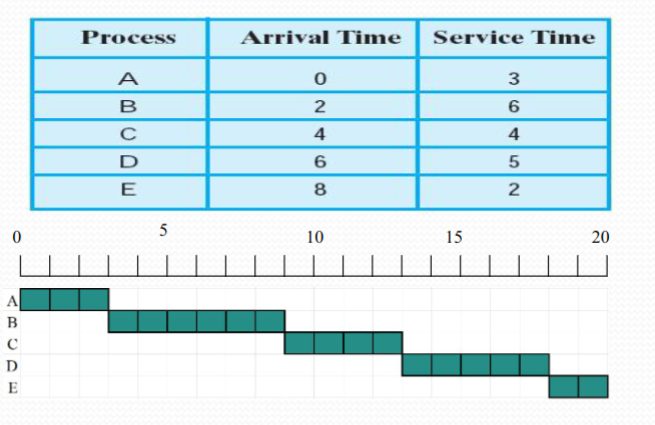

问题：
1. 一个很快就能做好的短进程可能不得不等待很长时间才能获得执行；
2. 计算速度大于IO,所以I/O多的进程不得不等待计算为主的进程做完，偏袒计算为主的进程

#### SPN

- 针对FCFS的第一个问题的简单粗暴解决方式：短进程将会越过长进程，优先获得调度

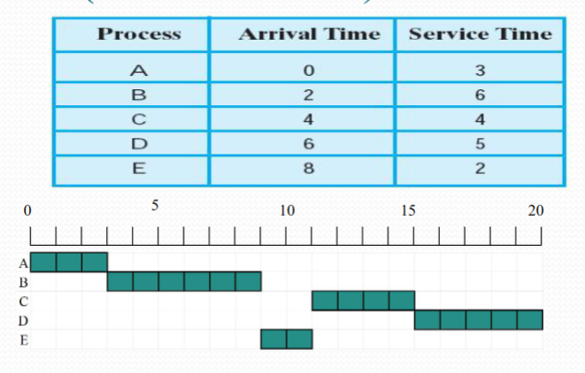

问题：只要持续不断地提供短进程，长进程有会一直无法执行。饿！

#### SRT

- 在一个队列中，调度器总是会挑选预期剩余时间更短的进程。
- 抢占式调度！当一个新进程加入就绪队列，他可能比当前运行的进程具有更短的剩余时间，只要该新进程就绪，调度器就可能抢占当前正在运行的进程

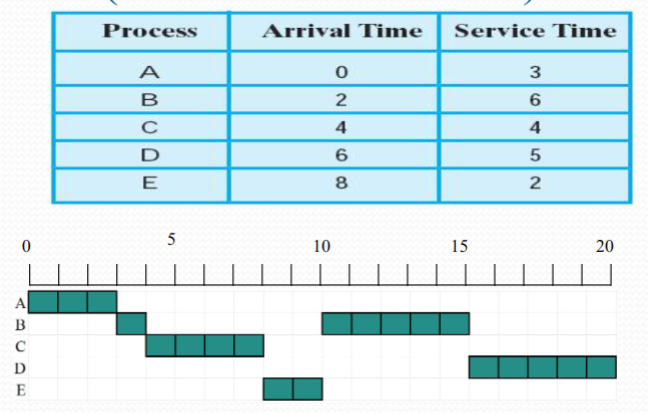

#### HRRT

- ***并非*** 抢占式算法。选择响应比最高的。
- 其中响应比的计算公式为

$$
\text{响应比} = \frac{\text{等待时间} + \text{期待（预估）处理器的服务时间}}{\text{期待（预估）处理器的服务时间}}
$$
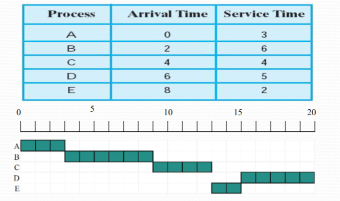

#### RR

- 基于 CPU 时钟周期的抢占式调度。
- 以一个周期性间隔（时间片）产生时钟中断，当中断发生时，当前正在运行的进程被置于就绪队列中，然后基于 FCFS 策略选择下一个就绪进程运行

> RR 不需要预先知道每个进程需要多少 CPU 时间，因为无论进程需要执行多长时间，它都只能在一个时间片内执行，时间片结束后就会被强制剥夺 CPU 使用权，放到就绪队列的末尾，等待下一次轮转。这种设计使得RR算法具有很好的公平性，每个进程都能获得平等的执行机会，同时也避免了某些进程长时间占用CPU导致其他进程饥饿的问题。
> 
> 由于RR算法只关注当前时间片内的执行，而不需要预测或估计进程的总执行时间，因此它特别适合用于分时系统，能够为多个用户提供良好的交互体验。这种"不需要预知"的特性使得RR算法实现简单，且能够适应各种不同类型的进程，无论它们是CPU密集型还是I/O密集型（顾名思义了好吧）。

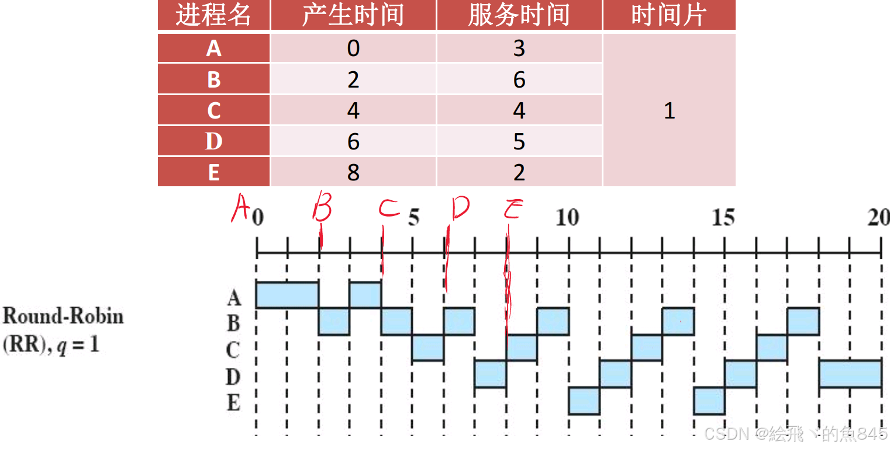

#### Feedback

##### 基本原则

- 建立不同优先级的就绪进程队列(Ready Queue, RQ)
- 多个就绪进程队列之间按照优先级调度
- 高优先级的就绪进程，分配的时间片短
- 单个就绪进程队列中的进程的优先数和时间片相同, 按照FCFS算法调度
- 优先级分级原则：外设访问, 交互性, 时间紧迫程度, 系统效率, 用户立场……

##### 实现方案（优先级不同）

1. 当一个进程第一次进入系统时，它被放置在 RQ0，当它第一次被抢占后并返回就绪状态时，它被放置在 RQ1。在随后的时间里，每当它被抢占时，它被降级到下一个低优先级队列中。一个短进程很快会执行完，不会在就绪队列中降很多级
2. q: 进程能连续运行的时间单位数。
   1. 当 \\(q=1\\) 时，表示每个进程只能执行1个时间单位，这种设置下算法会频繁地进行进程切换，虽然能保证很好的响应性，但会带来较大的系统开销。
   2. 当 \\(q=2^i\\)（ \\(i\\) 为进程的优先级）时，时间片的大小会随着进程优先级的降低而呈指数级增长，这意味着优先级越低的进程获得的时间片越长。这种设计的巧妙之处在于：新到达的进程（通常优先级较高）会获得较短的时间片，可以快速响应；而已经在系统中运行较久的进程（优先级较低）会获得较长的时间片，这样可以减少进程切换的次数，提高系统整体效率。


### 拓展阅读：实际系统的处理器调度方案

#### 传统Unix系统

传统Unix系统采用了一个基于多级反馈队列的调度算法，这个算法结合了时间片轮转和动态优先级调整的特点。系统维护多个优先级队列，每个队列中的进程都采用时间片轮转的方式执行，确保同一优先级内的进程能够公平地获得CPU时间。系统每秒都会重新计算所有进程的优先级，这种频繁的优先级调整使得系统能够及时响应进程状态的变化。

在优先级计算方面，系统首先会给每个进程分配一个基本优先级，这个基本优先级的设置将进程划分到不同的固定优先级区域中。这种划分有助于系统对不同类型的进程进行分类管理，比如系统进程、用户进程等。在基本优先级的基础上，系统还引入了可控调节因子，这些因子可以根据进程的行为特征（如CPU使用时间、I/O等待时间等）来动态调整进程的实际优先级。

这种调度机制的设计体现了Unix系统对公平性和响应性的平衡：通过多级队列确保不同优先级的进程都能得到执行机会，通过时间片轮转保证同优先级进程的公平性，通过动态优先级调整来适应进程的实际运行情况。可控调节因子的引入则使得系统管理员能够根据具体需求来调整调度策略，使系统更好地适应不同的工作负载。这种设计使得传统Unix系统能够有效地处理各种类型的进程，既保证了系统的响应性，又维持了良好的吞吐量。

#### Unix SVR4

Unix SVR4采用了一个精心设计的多级反馈队列调度系统，这个系统分为两个主要层次：实时优先级层次和分时优先级层次。在实时优先级层次中，进程的优先级和时间片大小都是预先设定好的固定值，这些进程在系统运行过程中不会改变其优先级，当有更高优先级的实时进程就绪时，系统会在抢占点立即进行进程切换，确保实时任务的及时响应。而在分时优先级层次中，系统采用了动态调整的机制，优先级范围从0到59，其中优先级0的进程获得最长的时间片（100毫秒），随着优先级数值的增加，时间片逐渐缩短，直到优先级59的进程只获得10毫秒的时间片。这种设计体现了系统对不同类型进程的差异化处理：实时进程需要保证及时响应，因此使用固定优先级；而分时进程则通过动态调整优先级和时间片来平衡系统的响应性和吞吐量，优先级越高的进程获得的时间片越短，这样可以更频繁地检查是否有新的交互请求，提供更好的用户体验。这种多层次的调度设计使得Unix SVR4能够同时满足实时任务和分时任务的不同需求，是一个经典的操作系统调度算法实现。

#### Windows 2000/XP

Windows的调度系统采用了基于内核级线程的可抢占式调度机制，其设计目标是同时满足交互式用户环境和服务器程序的需求。系统将优先级分为两个主要层次：实时优先级层次（优先数31-16）和可变优先级层次（优先数15-0）。在实时优先级层次中，优先级是固定的，主要用于处理通信任务和实时任务，确保这些关键任务能够及时响应。而在可变优先级层次中，系统采用了动态调整机制，主要用于处理用户提交的交互式任务，优先级可以根据任务的行为和系统状态进行调整。

Windows的优先级调整机制非常精细，它通过进程基本优先数和线程基本优先数的组合来确定线程的优先级。进程基本优先数的范围是0到15，而线程基本优先数可以在-2到2之间调整。线程的初始优先级是这两个值的和，但必须保持在0到15的范围内。系统还允许线程的动态优先级在初始优先级到15之间浮动，这种设计使得系统能够根据线程的实际运行情况来调整其优先级。

在多处理器环境下，Windows采用了特殊的调度策略：当系统有N个处理器时，N-1个最高优先级的线程会各自占用一个处理器，而其他所有线程则共享剩下的一个处理器。这种设计既保证了高优先级任务的及时处理，又为低优先级任务提供了执行机会，实现了系统资源的合理分配。

整个调度系统采用多级反馈队列的设计，每个优先级都对应一个就绪进程队列，这种设计使得系统能够根据任务的优先级快速找到下一个要执行的线程。通过这种复杂的优先级调整机制和多处理器调度策略，Windows系统能够同时满足实时任务、交互式任务和服务器程序的不同需求，提供灵活而高效的调度服务。


[^1]: 中断向量表是一个包含各种中断服务程序(处理中断请求的代码)地址的特定内存区域。

[^2]: "进程映像的组成部分"

[^3]: 沟槽的os不说人话，"置中断码"的意思是 CPU 会根据中断源生成一个中断向量或中断号（即"中断码"），用于索引中断向量表、后续在处理程序中分析中断原因或具体参数。

[^4]: 内存区表（Memory Region Table）是操作系统用于记录和管理进程所占用各段内存区域的数据结构，描述了进程地址空间中每个区域的起始地址、大小、访问权限和用途。例如，一个进程可能有一段用于代码执行的只读段（如 .text），一段用于数据的可读写段（如 .data），以及一段动态分配的堆区和用户栈，每个区域的信息都会在内存区表中登记，以便内核在内存管理和访问控制中正确处理。

[^5]: 原语(primitive)是由若干条指令构成的完成特定功能的程序，其执行具有不可分割性（原子性）。原语的执行通常通过关中断来实现，确保在执行过程中不会被其他操作打断。除了进程控制原语外，还有一类常用的原语是进程通信原语，用于实现进程间的通信功能。

[^6]: 每创建一个用户线程，系统就对应地创建一个内核线程。这种模型下，线程的创建、销毁和调度都由操作系统内核直接管理。

[^7]: 粒度指的是并发执行的最小单位，指的是任务划分的细致程度。简单来说，粒度粗，每个并发单位执行的工作多，划分得少；粒度细，每个并发单位执行的工作少，划分兼职部诗人得多，更灵活。**粒度越细，并发性越高。**

[^8]: 用户级线程调度器是一个运行在**用户态**的调度逻辑，负责在不依赖操作系统内核的情况下，管理和切换同一进程内多个用户线程的执行。它负责决定哪个线程先执行、哪个线程等待、如何响应线程的阻塞或完成等状态变化。这个调度器由线程库实现，例如 `pthread` 的用户级实现、GNU Portable Threads（GNU Pth）、协程库（如 libco）等。它并不是操作系统的一部分，而是由程序员或语言/框架作者在用户空间设计和控制的。由于用户级线程调度器无法被操作系统直接感知，因此它调度的粒度细、切换快，但缺点是无法感知线程的实际运行状态（比如是否被 I/O 阻塞），因此常与 Jacketing 等技术配合以提高实际并发性。

[^9]: os课件原文"非阻塞系统调用可使用Jacketing启动用户调度，调整活跃态ULT"我的评价是不像是人能想出来的句子

[^10]: 最早实现多线程支持的 Unix 操作系统之一

[^11]: 必须在严格的时间限制内完成，否则会导致系统失败。例如，控制飞机飞行的系统。

[^12]: 可以在一定的时间限制内完成，但偶尔的延迟是可以接受的。例如，视频流处理。

[^13]: 分时任务是指那些不需要严格时间限制的进程，通常用于交互式应用程序，如文本编辑器或网页浏览器。这些进程的优先级通常较低。

[^14]: 这是系统为每个进程分配的一个初始优先级值，通常基于进程的类型和重要性。系统会根据进程的执行行为（如CPU使用率、I/O操作等）动态调整这个优先级。

[^15]: 进程在执行过程中的表现，包括CPU使用率、I/O操作频率、等待时间等。系统会根据这些行为来调整进程的优先级，以确保系统的响应性和效率。