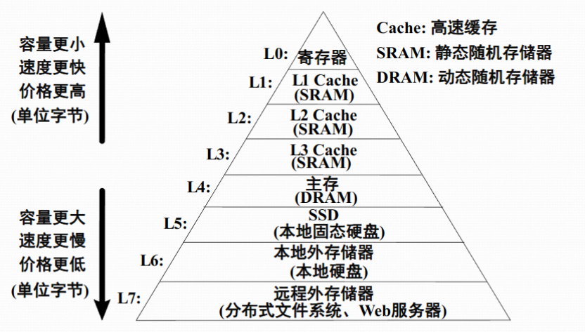
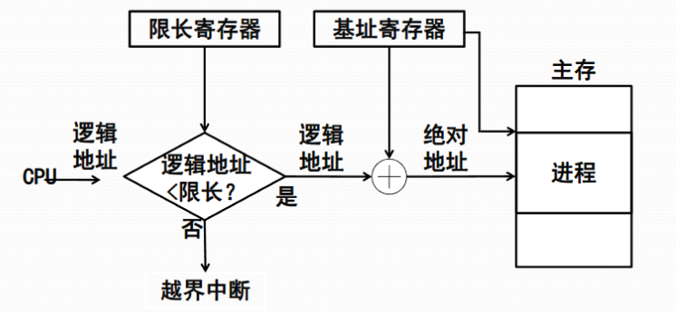

+++
date = '2025-05-21T10:06:52+08:00'
draft = false
title = '第三章 存储管理'
summary = "本文介绍了 os 对应用使用主存的管理，包括存储管理的主要概念、虚存的概念、连续分区管理、段页式的存储管理等。很多内容在 COA 已经提及。"
tags = ["笔记", "OS", "操作系统"]
categories = ["StudyBase"]
seriesOpened = false
series = ["笔记-操作系统"]
series_order = 3
+++

 


本文介绍了 os 对应用使用主存的管理，包括存储管理的主要概念、虚存的概念、连续分区管理、段页式的存储管理等。很多内容在 COA 已经提及。


## Part1 存储管理

### 1.1 Recap: COA

**逻辑地址**是指用户在编程时所使用的虚拟地址空间，这种地址从0开始编号。逻辑地址有两种常见的表现形式：一种是一维的逻辑地址，也就是我们通常说的线性地址(linear address)；另一种是二维的逻辑地址，将地址分为两部分，分别表示一个粗略的地址范围（可以称为"段", segment），和段内的偏移，这种方式在段式存储管理中较为常见。**用户编写程序时无需关心程序实际被加载到主存的哪个位置**。

**段式程序设计**是一种将程序划分为多个功能段的设计方法，比如代码段、数据段和堆栈段等。用户还可以通过段覆盖[^1]等技术，扩展内存空间的使用范围。不过需要注意的是，这些技术属于程序设计的范畴，而不是操作系统存储管理的直接功能。

[^1]: 一种在内存有限的情况下运行大程序的技术。将程序分成若干个功能相对独立的段，这些段在内存中并不是同时常驻的，而是根据需要动态地装入和替换。比如，一个大型程序被划分为主程序段和多个功能子程序段，内存中只保留当前需要执行的那一段，其余的段则存放在外部存储器（如磁盘）上。当程序运行到需要调用某个未在内存中的段时，操作系统或运行时系统会将当前内存中的某个段保存到外部存储器，然后把所需的新段装入到刚才腾出的内存空间中。

与逻辑地址相对应的是**物理地址，也叫绝对地址**。物理地址是指程序在实际执行过程中，处理器访问主存时所使用的真实地址。处理器在执行指令时，最终都是通过物理地址来访问内存单元的。

#### 主存储器的复用方式

在多道程序设计环境下，主存储器需要被多个程序复用。常见的复用方式有两种：

1. **按照分区进行复用**，即将主存划分为若干个固定或可变大小的分区，每个程序或程序段占用一个分区；
2. **按照页框（也称为页架）进行复用**，即将主存划分为多个固定大小的页框，一个程序或程序段可以占用多个页框，这样可以更灵活地利用主存空间。

#### 存储管理的基本模式


1. **单连续存储管理**：一种最简单的管理方式，适用于一维逻辑地址空间的程序，这类程序会占用主存中的一个固定分区或可变分区；
2. **段式存储管理**：适用于采用段式二维逻辑地址空间的程序，这些程序会被分配到主存中的多个可变分区。
2. **页式存储管理**：将一维逻辑地址空间的程序分配到主存中的多个页框中，每个页框大小相同。
3. **段页式存储管理**：结合了段式和页式的优点，适用于段式二维逻辑地址空间的程序，这些程序会被分配到主存中的多个页框中，每个段又可以被分页，从而实现更高效和灵活的内存管理。

### 1.2 存储管理的工作

OS进行存储管理具体都做了：

#### 1. 地址转换

地址转换是os进行存储管理的核心操作之一，也被称为重定位。它的作用是将用户程序中使用的逻辑地址转换为主存中的物理地址。地址转换可以分为静态重定位和动态重定位两种方式。

1. 静态重定位：在程序装入内存时一次性完成地址的转换，通常由装入程序（Loader）负责，这种方式多见于早期的小型操作系统。
2. 动态重定位：在程序运行过程中，由硬件地址转换机构实时完成逻辑地址到物理地址的转换，这种方式更为灵活高效。

#### 2. 主存空间的分配与回收

当进程需要运行时，存储管理软件会为其分配主存空间，并通过维护分配表来记录各进程所占用的内存区域；当进程结束或主动释放内存资源时，存储管理软件则负责回收相应的主存空间，并及时更新分配表的信息，确保主存资源能够被高效利用。

#### 3. 主存空间的共享

在多道程序设计环境下，多个程序可以同时驻留在主存中，各自占用一定的存储空间，共享同一个主存；此外，某些协作进程还可以共享主存中的特定区域，比如共享的程序块或数据块，以便实现进程间的高效协作。

#### 4. 存储保护

用于防止主存中的多个进程相互干扰。操作系统需要对主存中的程序和数据进行严格的访问控制。

- 对于进程私有的主存区域，只有本进程可以读写；
- 对于公共区域的共享信息，访问权限则根据授权进行控制；
- 而非本进程的信息则禁止访问。

存储保护通常需要软硬件协同实现：CPU会在访问内存时检查权限，如果发现非法访问则产生地址保护异常，由操作系统进行相应处理。

#### 5. 主存储器空间的扩充

通过将磁盘等外部存储设备作为主存的扩展，操作系统可以只将进程的部分内容装入内存。常见的扩充技术包括对换和虚拟存储：
1. 对换技术：将暂时不运行的进程整体调出主存
2. 虚拟存储：只需将进程的部分内容调入主存

实现这些功能需要操作系统和硬件的密切配合，例如对换的决策由操作系统完成，而具体的数据调入调出则依赖硬件支持；当 CPU 访问到尚未装入主存的虚拟地址时，会触发异常，由操作系统负责将所需内容调入内存并重新执行指令。

### 1.3 虚存概念

随着计算机应用的发展，主存容量的限制逐渐成为用户和系统面临的重要瓶颈。**早期，用户在编写程序时必须时刻考虑主存的容量**，程序规模受到很大限制，多道程序设计中可同时运行的程序数量也因此受限。

然而，实际分析用户程序的运行行为可以发现，程序在执行过程中往往具有空间和时间的局部性特征。也就是说，程序在某一阶段只会访问其全部代码和数据中的一小部分，且这些访问具有顺序性、循环性等规律。因此，**完全没有必要将整个程序一次性全部装入主存**。

虚拟存储器的基本思想正是基于上述观察。操作系统将进程的全部信息保存在辅存（如磁盘/ssd）中，运行时只需将当前需要的部分内容装入主存。随着程序的执行，操作系统会根据实际访问情况，动态地将所需的内容从辅存调入主存，而将暂时不需要的信息调出主存，存放回辅存。这样，主存的容量不再成为程序规模和多道程序数量的直接限制。

实现虚拟存储器需要操作系统自动管理两个地址空间：

1. 虚拟地址空间（通常对应于辅存），用于容纳进程的全部内容；
2. 实际地址空间（即主存），用于承载进程当前正在执行的部分。

对于用户而言，系统表现出一个远大于实际主存容量的"虚拟主存"，每个用户都可以认为自己使用了一个完整的主存，这个虚拟的完整的主存对应的就是虚存，其地址就对应逻辑地址；用户可以像使用大容量主存一样编程，无需关心实际主存的物理限制。虚拟存储器本质上是一种地址空间扩展技术，对大多数用户来说是完全透明的，只有在极端追求性能优化时，用户才需要关注虚拟存储器的实现细节。


### 1.4 存储管理的硬件支撑



#### 存储管理的范围

os的存储管理负责管理主存储器，但在现代计算机系统中，存储管理的对象远不止主存本身。为了提升系统整体性能，部分主存中的程序和数据，尤其是关键性能数据，还会被调入更高速的缓存（Cache）中，存储管理需要对其进行管理；甚至包括对联想存储器（内容寻址存储器）[^2]的管理。此外，为了实现更大的虚拟地址空间，操作系统还需要管理存放在硬盘、固态硬盘，甚至网络硬盘上的"虚拟"的存储器，比如某些网盘服务支持把网盘空间作为本地硬盘挂载。

[^2]: 联想存储器，也叫内容寻址存储器（Content Addressable Memory，简称CAM），是一种可以通过存储内容本身而不是地址来访问数据的特殊存储器。它主要应用在对高速查找有特殊需求的领域，比如网络交换机、路由器中的查找表、某些高性能缓存系统等。在普通个人电脑（PC）和大多数服务器中，常规的主存（RAM）并不是联想存储器，而是按地址访问的随机存取存储器（DRAM、SRAM等）。不过，现代计算机系统内部有些特定部件可能会用到类似内容寻址的技术，比如CPU的TLB（快表），但这并不等同于大规模、通用的联想存储器。

#### Cache的结构

高速缓存存储器（Cache）是位于CPU和主存之间的小容量、高速的存储器，通常采用静态存储芯片（SRAM）实现。虽然容量较小，但其速度远高于主存（通常为DRAM），能够接近CPU的运行速度。由于CPU在执行程序时经常会重复读取同样的数据块，Cache的引入和容量的增大可以显著提升CPU读取数据的命中率，从而大幅提升系统性能。

Cache的内部结构通常包括**高速存储器本体、联想存储器、地址转换部件和替换逻辑**等。

- **联想存储器**：一种可以根据内容进行寻址的存储器
- **地址转换部件**：通过联想存储器建立目录表，实现逻辑地址到Cache地址的快速转换。当CPU访问的数据在Cache中命中时，可以直接从Cache读取；未命中时则需要从主存读取数据并放入Cache。
- **替换部件**：负责在Cache已满时，根据一定的策略替换数据块，并相应地修改地址转换部件的内容。

由于芯片面积和成本的限制，Cache的容量通常较小。为兼顾性能和成本，现代处理器通常将Cache划分为多级：L1、L2和L3。

- L1 Cache一般分为数据缓存和指令缓存，内置于CPU内部，容量最小（32-256KB）但速度最快，对CPU性能影响最大；
- L2 Cache可以是内置也可以是外置，容量和速度介于L1和L3之间（512KB-8M）；
- L3 Cache多为外置，主要用于高端服务器和部分高性能应用（game等）。但对很多应用来说，总线改善比设置L3更加有利于提升系统性能



现代处理器，如 Intel Core i7 处理器内部集成了三级缓存，这些缓存都直接位于CPU芯片内部，不再像早期那样需要通过主板上的外部总线与CPU连接。

L1和L2缓存通常是每个核心（Core）独立拥有的，每个核心有自己的L1和L2缓存，用于存放该核心最近使用的数据和指令（如 6 核的CPU的一级cache会说自己是 6 * 32KB，每个核心一个 32KB 的 cache）而L3缓存则是整个处理器芯片上的所有核心共同使用的，所有核心都可以访问，用来存放各核心之间需要共享或频繁交换的数据。这样的设计可以提高多核心处理器的数据交换效率，减少访问主内存的次数，从而提升整体性能。



#### 地址转换/存储保护的硬件支撑


处理器生成的逻辑地址首先会和"限长寄存器"中的值进行比较，判断这个地址是否越界，如果越界就会触发越界中断，防止程序访问不属于自己的内存空间。如果没有越界，逻辑地址会和"基址寄存器"中的值进行相加，得到实际的物理地址。基址寄存器保存了当前进程在物理内存中的起始位置，这样即使进程被加载到不同的物理内存区域，程序内部的地址也不用修改。最终，经过这样的地址转换，进程i就可以安全地访问属于自己的物理内存空间。

#### 总结

存储管理与硬件的协作是实现高效内存管理的关键。程序执行和数据访问的局部性原理使得Cache的使用能够极大提升程序执行效率；同时，动态重定位、存储保护等功能如果没有硬件的支持，在效率上是无法实现的。例如，没有虚拟地址中断机制，虚拟存储器就无法实现；没有页面替换等硬件支撑机制，虚拟存储器的效率也会大打折扣。因此，现代操作系统的存储管理离不开硬件的有力支撑，软硬件协同才能实现高效、可靠的内存管理。

## Part2 单连续分区的存储管理

### 2.1 单连续分区的存储管理概述

> 一些基础概念，以及其如何进行地址转换、存储保护
> 
> 

单连续分区存储管理是一种非常基础且早期的内存管理方式。在这种管理模式下，每个进程在主存中都被分配到一个物理上完全连续的存储空间，也就是说，**进程所使用的内存区域在物理上是连在一起的，没有被其他进程或系统数据分割开**。这种方式的最大特点就是简单直接，易于实现。

在单用户连续分区存储管理中，主存通常被划分为两个部分：

1. 系统区，专门留给操作系统本身使用
2. 用户区，专门用来装载和运行用户的程序

为了防止用户程序越界访问到操作系统的内存区域，硬件上会设置一个**栅栏寄存器**，其中存放的是一个内存地址，这个地址用来标记操作系统区和用户区的分界线。每当CPU访问内存时，都会检查这个栅栏寄存器，确保用户程序只能访问属于自己的那一部分内存，这样就实现了**基本的存储保护**。

在这种模式下，**地址转换通常采用静态重定位的方式**。也就是说，在用户程序被装入内存的那一刻，系统会把程序中所有的指令地址和数据地址都一次性地转换成实际的物理地址。这样做的好处是实现简单，硬件开销低，但缺点是灵活性较差，程序一旦装入后就不能再移动。


单用户连续分区存储管理非常适合早期的**单用户、单任务**操作系统，比如DOS等。由于只有一个用户程序在运行，内存的分配和管理都非常直接，不需要复杂的调度和保护机制。

### 2.2 固定分区的存储管理

随着计算机的发展，出现了固定分区存储管理的思想。固定分区存储管理的基本做法是把主存划分为若干个大小不同、大小固定的分区，每个分区可以装入一个作业或进程。分区的数量和大小在系统启动时就已经确定，不能动态改变。

每当有新作业需要运行时，系统会为它分配一个空闲的分区。地址转换依然可以采用静态重定位（动态也行，见下面），硬件实现的复杂度也不高。这种方式在早期的多道程序设计操作系统中被广泛采用，虽然比单用户连续分区更灵活，但由于分区大小固定，容易造成内存空间的浪费（比如作业比分区小很多时，剩余空间无法被利用）。

虽然固定分区的分区大小和位置在系统启动时就确定了，但每个作业装入时，还是可以通过下限寄存器和上限寄存器实现动态重定位。


如上图，当CPU发出一个逻辑地址时，这个地址会先加上分区的下限地址B，得到绝对地址（也就是物理地址）。然后，系统会判断这个绝对地址是否小于上限寄存器的值（B+L2），如果小于，说明访问的是本分区的合法范围，访问被允许；如果超出，就会触发越界中断，防止程序访问到不属于自己的内存空间。

### 2.3 可变分区存储管理

#### 概念

在固定分区管理下，分区的数量和大小在系统启动时就已经确定，这样虽然实现简单，但当遇到大尺寸程序时，可能没有足够大的分区可用，而当作业较小时又会存在内存内零头，造成分区内的空间浪费。为了解决这些问题，可变分区存储管理允许系统根据进程的实际内存需求**动态地划分分区**，并且**分区的数量也不再固定**。

在可变分区存储管理中，每当有新的进程需要运行时，操作系统会根据该进程所需的主存容量，检查当前主存中是否有足够的空闲空间。如果有，就会按照进程的实际需要量，从空闲空间中划分出一个合适大小的分区分配给进程；如果没有足够的空间，则该进程需要等待，直到有足够的主存资源可用。由于每个进程分配的分区大小都是根据实际需求动态确定的，因此主存中的分区数量会随着进程的创建和结束不断变化。

#### 分配策略

在实际分配内存时，系统需要决定如何从众多空闲分区中选择一个合适的分区来满足进程的需求。为此，出现了多种分配算法。

- 最先适应分配算法：从头开始查找第一个足够大的空闲分区分配给进程
- 邻近适应分配算法：从上一次分配结束的位置继续查找
- 最优适应分配算法：选择最接近进程需求的最小空闲分区
- 最坏适应分配算法：选择最大的空闲分区

#### 存储管理：地址转换与内存保护


> 实现地址转换（动态重定位）、和存储保护的硬件机制

CPU发出一个逻辑地址，首先将这个逻辑地址与限长寄存器中的值进行比较。如果逻辑地址小于限长寄存器的值，说明访问的是进程分配到的合法范围，流程继续；如果不小于，说明越界，系统会触发越界中断，阻止非法访问。接下来，合法的逻辑地址会与基址寄存器中的值相加，得到绝对地址（物理地址），然后访问主存中的实际位置。

#### 问题

虽然可变分区方式能够更好地适应不同进程的内存需求，但随着进程的不断创建和释放，**主存中会逐渐出现一些零散的小空闲分区，这些分区由于太小而无法被有效利用，被称为内存外零头**。在采用最优适配算法时，最容易产生大量的外零头；无论采用哪种分配算法，都无法完全避免外零头的产生。

#### 解决：程序浮动技术


为了解决外零头问题，操作系统还引入了**移动技术/程序浮动技术**。通过将主存中的进程移动位置，把零散的小空闲分区合并成较大的连续空间，从而提高内存的利用率。实现这种技术需要硬件支持动态重定位，使得进程在内存中的物理位置可以在运行时发生变化，而不会影响其正常执行。

当作业i请求分配x大小的主存时，操作系统首先会查阅主存分配表，查看当前有哪些空闲的内存区块。如果有一个空闲区块的大小大于等于x，那么就直接将这块内存分配给作业i，并在主存分配表中记录相关信息，同时设置该进程的基址和限长寄存器的值，完成分配。

如果没有单个空闲区块能满足x的需求，系统会进一步判断所有空闲区块的总和是否大于等于x。如果总和也不够，说明内存资源不足，作业i只能等待主存资源的释放。如果总和足够，但被分散成了多个小块，这时系统会通过"移动主存中其他分区"的方式（也就是内存紧缩[^3]或整理），把分散的空闲区块合并成一个足够大的连续空间。整理完成后，系统会修改主存分配表中相关项，并更新被移动分区的基址和限长寄存器的值，最后再将合并出来的空间分配给作业i。

[^3]: 你的内零头比较零碎，但是你的内存总和呢，又弥补了这一部分。如果把移动技术去掉的话，就会显得你的内存利用率比较少。现在最好的办法呢，就是在进行可变分区管理的同时，做一个内存紧缩术……

## Part3 页式存储管理

### 3.1 基本原理

页式存储管理是一种**将主存划分为多个大小相等的物理块（称为页框）的内存管理方式**。与可变分区不同，分页系统不再要求进程在主存中占据连续的空间，而是**将进程的逻辑地址空间划分为与页框大小相同的若干页**。每个逻辑页可以被装载到任意一个空闲的物理页框中，这样就大大提高了主存的利用率，也简化了内存分配和回收的过程。

在页式存储管理中，进程的

1. 逻辑地址由两部分组成
   1. 页号：标识逻辑地址属于进程的第几页
   2. 页内单元号：表示在该页内的具体偏移位置
2. 物理地址同样由两部分组成
   1. 页框号：对应主存中的实际物理页框
   2. 单元号：表示在该页框内的具体偏移位置


> 如上图，当CPU访问内存时，首先会根据逻辑地址中的页号查找进程的页表，页表记录了每个逻辑页对应的物理页框号。通过查表，系统可以将逻辑页号转换为物理页框号，然后与页内单元号组合，得到最终的物理地址。整个地址转换过程对用户是透明的，用户只需按照逻辑地址编程，无需关心程序实际被装载到主存的哪个位置。


为了管理主存中页框的分配情况，操作系统通常会维护一张**位示图**，每一位对应一个页框，标记其是否被占用。当有新进程需要分配内存时，系统会在位示图中查找空闲页框，并将其分配给进程，同时在进程的页表中记录映射关系。进程结束或释放内存时，系统会相应地回收页框并更新位示图。

页式存储管理还支持**进程间的页共享**，实现多个进程共享程
序和数据。
1. 数据共享：不同进程可以通过各自的页表，将不同的逻辑页号映射到同一个物理页框，实现数据的共享
2. 程序共享：不同进程必须将相同的逻辑页号映射到同一个物理页框，这样才能保证共享代码中的跳转等操作能够正确执行。

### 3.2 页式存储管理的地址转换

#### 页式存储管理的代价

在页式存储管理中，地址转换的过程虽然实现了内存的灵活分配，但也带来了一定的性能开销——由于**页表通常存放在主存中**，每次CPU需要访问内存时，每次地址转换都要：

1. 必须先通过逻辑地址中的页号查找主存的页表，获取对应的页框号；
2. 然后再根据实际的物理地址访存。

#### 解决方案

为了解决这个问题，操作系统和硬件引入了**快表（TLB，Translation Lookaside Buffer）**机制。快表是一种专用的高速缓存存储器，用于存放页表中最近使用的一部分内容。它的本质是一种**联想存储器**，可以根据页号直接查找对应的页框号，而不需要像普通内存那样按地址顺序访问。

每当CPU需要进行地址转换时，首先会查找快表，如果所需的页表项已经在快表中（称为命中），就可以直接得到页框号，形成物理地址，整个过程非常迅速。如果没有命中，则需要访问主存中的页表，获取页框号后再将该项登记到快表中。快表的容量有限，当需要登记新页而快表已满时，会根据一定的替换策略淘汰旧的表项。


引入快表后，地址转换的平均代价大大降低。假设主存访问时间为\\(200 ns\\)，快表访问时间为 \\(40ns\\)，快表的命中率为\\(90\\%\\)，那么平均每次地址转换的耗时为 
$$ (200+40) * 90\\% + (200+200+40) * 10\\% = 260 ns$$
相比于没有快表时每次都需要两次主存访问（\\(400 ns\\)），性能提升非常明显。

（注意这种题目的计算方式：快表 miss 的时候还是要把访问快表的时间算上！计算多级 cache 的时候也要这么做）


**在多道程序环境下，每个进程都有自己的页表。**操作系统会在**进程表**中为每个进程登记其页表的位置和长度。当某个进程获得CPU运行权时，系统会将该进程的页表起始地址和长度装载到**页表控制寄存器**中，这样CPU在进行地址转换时就能正确地查找属于当前进程的页表。通过快表和页表控制寄存器的配合，系统既保证了多进程环境下的内存隔离，又大幅提升了地址转换的效率。

#### 完整流程图


首先，系统会根据当前运行进程的信息，从进程表中查找到该进程对应的页表起始地址和页表长度，并通过页表控制寄存器进行管理。接下来，系统会将逻辑地址中的页号与页表长度进行比较，如果页号超出了页表长度，说明访问越界，系统会触发越界中断，防止非法访问。如果页号合法，系统会优先在快表（也叫联想寄存器或TLB）中查找该页号对应的物理块号，如果快表命中，就可以直接得到块号；如果没有命中，则需要通过页表查找，将页号映射为物理块号[^4]。最后，物理块号和页内单元号组合成绝对地址，访问主存中的实际物理单元。整个流程保证了每个进程的虚拟地址空间能够被正确、安全地映射到物理内存，同时通过快表加速了地址转换过程，提高了系统的运行效率。

[^4]: 一个细节：从页表中获取块号和从 TLB 中获取块号的方式是有区别的。前者是通过页表控制寄存器中的页表始址和页号索引到目标页表项的地址：页表始址 + 页号 * 页表项大小（页表并不包含页号，因为本来就是按顺序排的，靠偏移量寻址）；而  TLB 就显示了联想寄存器的特征：直接遍历快表项，寻找一致的页号即可。

### 3.3 页式虚拟存储管理

#### 抖动

在虚拟存储管理中，抖动（Thrashing）是一种典型的性能问题。当**系统频繁地将刚刚被换出的页面又很快调入主存**时，处理器的大部分时间都被用于页面的调入和调出，而不是实际执行用户进程的指令。出现抖动的根本原因在于**主存容量不足以容纳进程当前一段时间内实际需要的活跃页面集合，导致缺页中断频繁发生**，系统不断地在主存和辅存之间交换页面，极大地降低了CPU和内存的利用率。

#### 局部性原理

早在1968年，P. Denning等学者就通过对大量程序的分析发现，**无论是指令还是数据**的访问，都呈现出聚集成群的特点。局部性又可以分为时间局部性和空间局部性。
1. 时间局部性指的是最近被访问过的指令或数据，很快还会被再次访问；
1. 空间局部性则是指一旦某个存储单元被访问，其相邻的存储单元也很快会被访问。

在实际程序中，局部性原理的表现非常明显——

1. 大多数程序以顺序方式执行指令，只有少量分支和过程调用，导致指令访问集中在一小段代码区域；
2. 循环结构的存在，使得少量代码被多次重复执行；
3. 过程（方法、函数）调用的深度有限，指令引用通常局限在少量过程内部；
4. 对数组、记录等数据结构的操作，往往涉及对相邻数据项的连续访问；
5. 程序的某些部分是互斥的，并不会在每次运行时都被用到。

经验与分析表明，程序具有局部性、进程执行时没有必要把全部信息调入主存、只需装入一部分的假设是合理的，**程序部分装入的情况下，只要调度得当，不仅可正确运行，而且能在主存中放置更多进程，充分利用处理器和存储空间**。而实现这一点的正是虚拟内存。

#### 虚拟内存

##### 1. 基本思想
将进程的全部页面都视为虚拟存储器的一部分，实际运行时只需将部分页面装入主存。随着程序的执行，操作系统会根据进程的访问行为，动态地将需要的页面从辅存调入主存，同时将暂时不需要的页面调出主存。

现代操作系统普遍采用这种按需调页的方式，首次运行时只需将进程的第一页装入主存，这种策略被称为**请求页式存储管理**。

##### 2. 技术支持

虚拟内存的实现依赖于软硬件的紧密配合。

1. 首先，硬件层面必须支持分页或分段等虚拟存储方案，能够实现逻辑地址到物理地址的动态转换；
2. 其次，操作系统需要具备在主存和辅助存储器之间高效管理页面或段的能力，包括页面的调入、调出、置换等操作。


为了支持虚拟内存，**页表结构也需要相应扩展**。每个页表项不仅要记录实际物理块号，还要包含一系列标志位，例如

1. 主存驻留标志（表示该页是否在主存）
3. 写回标志（指示该页是否被修改过）
3. 保护标志（用于访问控制）
3. 引用标志（用于页面置换算法）
3. 可移动标志（是否可以被 os 移动或换出主存）

此外，还需要记录该页在辅存中的物理地址，以便在发生缺页时能够正确地从辅存调入。

#### 包含虚存后的完整流程


首先，CPU根据逻辑地址去查找快表（TLB），如果快表中有该页的记录（快表中的项不可能不在主存），就可以直接形成物理地址，继续执行指令。如果快表中没有该页的记录，就需要查页表，判断该页是否已经在主存中。如果该页已经在主存，就将其信息登记到快表中，然后形成绝对地址，继续执行指令。如果该页不在主存，就会发生缺页中断，系统需要进行页面调度。此时，操作系统会先保护当前现场，然后判断主存中是否有空闲的页框。如果有空闲页框，就直接将所需页面从辅助存储器调入主存，调整页表、快表和主存分配表，恢复现场，重新执行被中断的指令。如果没有空闲页框，系统就需要选择一个页面进行淘汰（调出主存）。在选择要淘汰的页面时，还要判断该页是否被修改过，如果被修改过，就需要先将该页写回到辅助存储器的相应位置；如果没有被修改，则可以直接覆盖。完成页面调度后，系统会将新页面调入主存，更新相关表项，恢复现场，最后重新执行被中断的指令。整个流程体现了虚拟存储管理中软硬件协同工作的机制，既保证了内存的高效利用，也实现了对进程地址空间的透明扩展和保护。

### 3.4 页面调度

#### 基础

在页式虚拟存储管理中，当主存空间已经被占满，而又有新的页面需要装入时，系统必须按照一定的策略将主存中已有的某些页面调出，为新页面腾出空间。这个选择淘汰页面的过程就叫做**页面调度**，而具体采用的策略则称为**页面调度算法**。页面调度算法的优劣直接影响系统的性能。如果算法设计不合理，就可能频繁出现抖动（颠簸）现象，会极大地降低系统效率。

#### 衡量标准：缺页中断率

假设在进程运行过程中，成功访问主存的次数记为\\(S\\)，因页面不在主存而发生缺页中断的次数记为\\(F\\)，总访问次数\\(A=S+F\\)，缺页中断率就是
$$ f = \frac{F}{A} = \frac{F}{F + S} $$
也就是进程在访问内存时发生缺页中断的概率。缺页中断率不仅反映了存储管理的性能，也是衡量用户程序编写效率的重要依据。

#### 影响因素

1. 分配给进程的主存页框数越多，能够同时驻留在主存的页面就越多，缺页中断率自然会降低；
2. 页面的大小也有影响，页面尺寸越大，单个页面能容纳的数据越多，缺页中断率通常也会降低，但过大的页面会导致内存浪费；
3. 用户的编程方式对缺页中断率有着显著影响。



#### 用户影响中断率的一个例子

在处理大数组时，如果按照行优先顺序访问数组元素，能够充分利用局部性原理，减少缺页次数；而如果采用列优先顺序访问，在主存页框很少的情况下，每次访问都可能跨越不同的页面，导致频繁缺页，极大地增加缺页中断率。

例如：假定仅分得一个主存页框，页面尺寸为128个字，数组元素按行存放，开始时第一页在主存

```c
int A[128][128];
for(int j=0;j<128;j++)
  for(int i=0;i<128;i++) 
    A[i][j]=0;
```

每执行一次赋值就要中断，产生\\((128 * 128 - 1)\\)次中断

```c
int A[128][128];
for(int i=0;i<128;i++)
  for(int j=0;j<128;j++) 
    A[i][j]=0; 
```
只在外层产生中断，共产生\\((128 - 1)\\)次中断

通过合理的程序设计，可以有效提升内存利用率，降低缺页中断率，从而提升系统整体性能。


### 3.5 页面调度算法

#### OPT

最优页面调度算法（OPT，也称Belady算法）是理想情况下的推演：能够在每次需要淘汰页面时，总是选择那个未来最长时间内不会被访问的页面，或者说以后再也不会被访问的页面。这样可以保证缺页次数最少，达到理论上的最优效果。然而，由于操作系统无法预知未来的页面访问序列，OPT算法只能（作为基准）用于理论分析和模拟，无法在实际系统中实现。

实际操作系统中常用的页面调度算法有先进先出（FIFO）、最近最少使用（LRU）、最不常用（LFU）和时钟（CLOCK）算法。

#### FIFO

FIFO算法的思想非常简单，每次总是淘汰最早被调入主存的页面，也就是驻留时间最长的页面。这种方法模拟的是程序执行的顺序性，有一定合理性，实现也容易，但有时会出现"Belady异常"，即增加主存页面数反而导致缺页次数增加。

#### LRU

LRU算法则试图模拟程序的局部性原理，每次淘汰最近一段时间内最久未被访问的页面。这样可以更好地保留那些刚刚被使用过、很可能还会被再次访问的页面。LRU算法的理论效果接近OPT，但严格实现需要维护每个页面的访问时间或顺序，**硬件和系统开销较大**。

实际中常用引用标志位和定时中断等方式进行近似模拟，比如定期清零引用标志，访问时置1，淘汰时随机选择一个2标志为0的页面。


#### LFU
LFU算法关注页面在一段时间内的访问频率，每次淘汰访问次数最少的页面。它更强调长期的访问统计，**适合那些访问模式较为稳定的场景，但对突发性热点数据的适应性较差**。LFU通常需要为每个页面维护一个计数器，定期清零以避免老旧统计影响决策。

#### CLOCK

CLOCK算法是一种对LRU的近似实现，采用循环队列（环形表）和引用标志位。每次淘汰页面时，从当前指针所指页面开始扫描，如果遇到引用标志为1的页面就将其清零并跳过，直到找到第一个引用标志为0的页面进行淘汰。这样既能兼顾局部性，又大大降低了实现复杂度，是实际操作系统中应用非常广泛的页面置换算法。

### 3.5 页的大小设计

#### 大小权衡

1. 页的大小如果设置得较大，每个页面内部被浪费的空间（即内部碎片, internal fragments）就会更多，因为每个进程分配到的最后一页未必能完全用满，页越大浪费越多；
2. 页越小，一个进程需要的页数就越多，这样每个进程的页表就会变得更大，系统需要维护更多的页表项，甚至页表本身也可能需要分页，导致一部分页表也要放在虚拟内存里，增加了管理的复杂性和开销。
3. 辅助存储（Secondary Memory, 如硬盘、SSD）在设计时通常更适合高效地传输较大的数据块，所以如果页的大小较大，每次页面调入或换出时，I/O效率会更高，系统整体性能也可能更好。

#### 不同的页表

这段话的意思是，如果操作系统和硬件支持多种不同的页面大小，就可以根据不同应用或内存访问模式的需求，灵活地选择合适的页面大小，从而更高效地利用 TLB——大页面可以减少 TLB 缺失率，提高 TLB 的命中率，而小页面则可以减少内部碎片，提高内存利用率。多种页面大小的支持让系统在性能和资源利用之间有更多选择和优化空间。

不过，实际上大多数操作系统只支持一种固定的页面大小。这是因为支持多种页面大小会增加操作系统和硬件设计的复杂性，需要更复杂的内存管理和地址转换机制。

### 3.6 伙伴系统，Buddy System

#### 伙伴系统

伙伴系统（Buddy System）是一种兼顾固定分区和可变分区优点的主存管理算法，由Knuth在1973年提出。其核心思想是将主存按2的幂次划分为不同大小的空闲块，每个块都可以被对半分割成两个"伙伴"，这两个伙伴可以在空闲时合并还原为更大的块。比如一块4页的内存可以分成两个2页的伙伴，2页的又可以分成两个1页的伙伴。这样，系统可以根据实际需求灵活分配和回收不同大小的内存块，同时便于合并和管理，减少外部碎片。


在Linux内核中，伙伴系统的实现依赖于多个数据结构。`mem_map`数组用于描述每个物理页框的状态，`free_area`数组则以不同阶（2的幂次）管理空闲块，`bitmap`数组用于快速标记和查找空闲块。伙伴系统以页框为最小分配单位，适合大块内存的分配，但对于内核中大量的小对象（如inode、vma、task_struct等）来说，直接用页框分配会造成较大的内部碎片。

```c
// 待补充：linux的伙伴系统源码
```

#### 存储小型结构体：cache-slab-page-object[^5]

[^5]: 一些误解：首先，这里的cache是缓存的意思，本质上还是存在于主存中的结构，并非常说的高速缓存；其次，虽然slab是管理比page小的结构的，但是一般比page大，一个slab可能含有不止一个page。


为此，Linux引入了基于伙伴系统的slab分配器。slab分配器的基本思想是为经常使用的小对象建立缓存池（slab），对象的分配和释放都通过slab分配器管理，只有当缓存不足时才向伙伴系统申请更多空间。这样可以充分利用主存，减少内部碎片，并且通过对象的局部化管理提升分配效率。

在 Linux 内核的 slab 分配器中，cache 是针对某一类内核对象（如 pcb、inode、vma 等）专门建立的内存缓存池。每种对象类型有一个独立的 cache，用于高效地分配和回收该类型的对象。每个 cache 下会维护多个 slab，slab 是 slab 分配器管理内存的基本单元，本质上是由一组连续的 page组成的较大内存块。一个 slab 可能包含 1 个或多个 page，具体取决于对象的大小和 slab 的配置。

slab分配器还支持多种不同大小的缓存池，常见的有32B、64B、128B、256B、512B、1KB、2KB、4KB、8KB、16KB、32KB、64KB和128KB等，单位大小呈2的幂数增长，保证了内部碎片率不超过50%。

在 slab 内部，这些 page 会被进一步切分成许多大小相同的 object（对象单元），每个 object 用来存放一个实际的内核数据结构实例，比如一个 pcb 或 inode。这样，一个 slab 可以容纳几十、上百甚至更多个 object。slab 的状态可以分为满 slab（所有 object 都被分配）、半满 slab（部分 object 被分配）、空 slab（所有 object 都空闲），分配器会根据 slab 的状态进行高效的对象分配和回收。

**工作流程**是：当内核需要分配一个对象时，首先在对应的 cache 中查找有空闲 object 的 slab，优先从半满 slab 分配；如果没有合适的 slab，就从空 slab 分配；如果还没有空 slab，就新分配一组 page 组成新的 slab，并将其挂载到 cache 下。释放对象时，对象会被回收到 slab 中，如果 slab 变为空 slab，可以被回收或复用。整个流程实现了从 cache 到 slab，再到 page，最后到 object 的分层管理和高效分配，极大地提升了内核中小对象的分配效率，减少了内存碎片。

一些内核 api:

1. `kmem_cache_create()`：创建专用cache，规定对象的大小和slab的构成，并加入cache管理队列；
2. `kmem_cache_alloc()` `kmem_cache_free()`：分配和释放一个拥有专用slab队列的对象；
3. `kmem_cache_grow()`：向伙伴系统申请向cache增加一个slab；
4. `kmem_cache_reap()`：定时回收空闲slab；
4. `kmem_cache_destroy()`/`kmem_cache_shrink()`：用于cache的销毁和收缩；
5. `kmalloc()`/`kfree()`：从通用的缓冲区队列中申请和释放空间；
6. `kmem_getpages()`/`kmem_freepages()`：slab与页框级分配器的接口，当slab分配器要创建新的slab或cache时，通过`kmem_getpages()`向内核提供的伙伴算法来获得一组连续页框；如果释放分配给slab分配器的页框，则调用`kmem_freepages()`函数。

### 3.7 局部页面替换算法

#### 局部最佳页面替换算法

局部最佳页面替换算法（Local Minimum，简称MIN）是1976年由Prieve提出的一种理论上的页面置换算法。它与全局最佳（OPT）算法类似，都需要事先知道程序的页面访问序列，但MIN算法更关注进程在某一局部时间段内的行为。其核心思想是引入一个**滑动窗口**机制：对于进程在某一时刻\\(t\\)访问的页面，算法会考察接下来一个固定长度的时间区间 \\((t, t+τ)\\)[^6]，\\(τ\\)为系统设定的常量。如果在这个滑动窗口内该页面不会被再次访问，那么就可以将其从主存中移出；如果会被再次访问，则该页面应继续保留在主存的驻留集中。


[^6]: 从课件上的例子看是闭区间。

通过调整\\(τ\\)的大小，可以在缺页次数和主存占用之间进行权衡：\\(τ\\)越大，驻留集越大，缺页次数越少，但会占用更多的主存空间。

局部最佳页面替换算法的优点在于它能够根据进程的实际访问行为动态调整驻留集的大小，理论上可以进一步降低缺页率。然而，由于它同样需要预知未来的页面访问序列，因此只能用于理论分析和模拟，无法在实际操作系统中直接实现。尽管如此，MIN算法为后续自适应页面置换算法的设计提供了重要的理论参考和启发。

#### 工作集置换算法
> 不能预测未来，但是可以考察过去

**工作集模型**是对进程在运行过程中实际所需主存页面集合的一种动态刻画。它的核心思想是：在某一段时间间隔内，进程运行所需频繁访问的页面集合就是该进程在该时刻的"工作集"。用数学符号表示，\\( W(t, Δ) \\)表示在时刻\\(t-Δ\\)到\\(t\\)之间访问过的所有页面的集合，其中\\(Δ\\)是系统设定的窗口长度，也叫"工作集窗口尺寸"。通过滑动这个时间窗口，可以动态观察进程的内存访问行为，进而估算进程在未来一段时间内实际需要驻留在主存的页面数。

与局部最佳页面替换算法不同，工作集模型并不需要预知未来的页面访问序列，而是基于程序的局部性原理，通过回顾进程最近一段时间的页面访问历史来估算其主存需求。

在实际操作中，操作系统会持续监控每个进程的工作集，只有属于当前工作集的页面才能留在主存；系统会定期检查并将那些不再属于工作集的页面从主存中淘汰出去。只有当进程的工作集驻留在主存时，进程才能执行。


与工作集模型密切相关的还有**缺页率控制策略（Page-Fault Frequency, PFF）**。系统会为缺页率设定上限和下限，如果某进程的缺页率高于上限，就为其分配更多的主存页框；如果缺页率低于下限，则可以适当减少分配。这样，进程的驻留集大小始终与其实际工作集需求保持接近，从而实现主存资源的动态优化分配。当缺页率过高且没有空闲页框时，系统甚至会挂起部分进程，确保主存不会因过载而发生抖动。

### 3.8 多级页表

> 现代计算机普遍支持 \\( 2^{32} \sim 2^{64} \\)容量的逻辑地址空间，采用分页存储管理时，页表相当大，以Windows为例，其运行的Intel x86平台具有32位地址，规定页面\\(4KB(2^{12})\\)时，那么，\\(4GB(2^{32})\\)的逻辑地址空间由1兆\\((2^{20})\\)个页组成，若每个页表项占用4个字节，则需要占用\\(4MB(2^{22})\\)连续主存空间存放页表。系统中有许多进程，因此页表存储开销很大。

多级页表的基本思想是将原本需要连续存放的大页表拆分为多个较小的页表页，并通过多级索引的方式进行管理。以二级页表为例，系统为每个进程建立一个页目录表（一级页表），每个目录项指向一个页表页（二级页表），而每个页表页的表项则给出虚拟页面与物理页框的对应关系。

页表页在内存中同样可以是不连续存放的。这样一来，就需要有一个新的索引结构来记录每个页表页在内存中的位置，这个索引结构就是**页目录**。页目录的每一项指向一个页表页，而每个页表页的每一项再指向用户程序的实际页面。也就是说，页目录项负责索引页表页的位置，页表页项负责索引用户程序页面的位置。**这种多级索引的方式，就是多级页表结构的本质。**

逻辑地址在这种结构下被划分为三部分：页目录号、页表页号和页内偏移。地址转换时，CPU首先通过页目录号找到对应的页表页，再通过页表页号找到具体的页表项，最后结合页内偏移形成物理地址。虽然多级页表增加了地址转换的步骤，带来一定的时间开销，但通过以时间换空间，有效解决了大页表带来的空间浪费问题。


### 3.9 反置页表 (Inverted Page Table, IPT)

#### 思想

页式存储管理的专用的硬件机构：
1. MMU, 内存管理单元: CPU 管理虚拟/物理存储器的控制线路，把虚拟地址映射为物理地址，并提供存储保护，必要时以某种算法执行页面淘汰和替换

2. IPT, 反置页表：MMU 使用的数据结构。

页表设计的一个重要缺陷是，页表的大小与虚拟地址空间的大小成正比，而虚拟的空间是可以随着进程数量不停叠加的，这就让页表变得越来越大，所以才会出现多级页表这种东西被迫拿时间换空间。

"反置"：传统的页表结构中，每个进程都有一个页表，页表的每一项用来记录该进程的每一个虚拟页对应的物理页框号；而在反置页表中，整个系统只维护一张全局的页表，这张表的每一项对应一个物理页框，而不是虚拟页，每一项记录了当前物理页框属于哪个进程、对应哪个虚拟页号。

反置页表的核心思想是：不再为每个进程的每一页都建立独立的页表项，而是**针对主存中的每个物理页框建立一个表项**。

#### 结构

1. 页号：虚拟地址页号
2. 进程标志符：使用该页的进程号。页号和进程标志符结合起来，标志一个特定进程的虚拟地址空间的一页。
3. 标志位：有效、引用、修改、保护和锁定等标志信息
4. 链指针：哈希链。当系统需要根据进程号和虚拟页号查找某个虚拟页是否已经被映射到物理内存时，不能像传统页表那样直接通过下标确定偏移量，而是需要在反置页表中查找所有项。为了加快查找速度，通常会采用哈希表结构。

#### 地址转换流程


首先，CPU生成的逻辑地址由进程标识、页号和页内位移三部分组成。系统会将进程标识和页号作为输入，通过哈希函数计算出一个哈希值，这个哈希值用来在哈希表中定位到一个入口。哈希表的每个入口对应反置页表中的一个链表头，链表中的每一项都包含进程号、页号、标志位和链指针等信息。

查找时，系统会沿着哈希链逐项比对进程号和页号，直到找到与当前逻辑地址对应的那一项。（若未能找到匹配的页表项,说明该页不在主存,产生缺页中断,请求操作系统调入，图没画）找到后，通过该项在反置页表中的索引位置，就可以确定对应的物理页框号。最后，将物理页框号和逻辑地址中的位移部分组合，形成最终的物理地址，实现地址转换。

## Part4 段式存储管理

### 4.1 基本原理

**段式程序设计**是一种将程序划分为若干功能段的设计方法，每个段都可以从0开始编址，段内的地址空间是连续的。这样做的好处是不同类型分开管理，比如代码段、数据段、堆栈段等，每个段都可以根据实际需求独立分配和扩展。段式存储管理的逻辑地址由两部分组成：段号和段内单元号，段号用来标识具体是哪个段，单元号则表示在该段内的偏移位置。

**段式存储管理**的基本思想是基于可变分区存储管理实现的。不过，一个进程可以同时占用多个分区——每个分区对应一个段。为支持段式管理，

1. 硬件需要增加**一组用户可见的段地址寄存器**，常见的如代码段、数据段、堆栈段和附加段等，这些寄存器在地址转换时起到关键作用。

2. os 还需要为每个进程维护一张**段表**，每个段在段表中占有一个表项，表项中记录了该段的起始物理地址（段始址）段的长度（段限长）以及存储保护、可移动、可扩充等标志位。

段式存储的地址转换就很简单了。


#### 段的共享

段的共享可以通过**不同进程的段表项指向同一个段基址**来实现。为了保证共享段的安全性，系统会对共享段的信息进行严格保护，比如规定某些段只能读不能写，如果进程违反了访问权限，就会触发保护中断。

### 4.2 段式虚拟存储管理

段式虚拟存储管理的基本思想是**将进程的所有分段都存放在辅存中，运行时只需将当前需要的一段或几段装入主存**。随着程序的执行，操作系统会根据访问需求动态地将所需的段调入主存，而不需要一次性全部装入。段的调入和调出过程由操作系统自动完成，对用户来说是完全透明的。这与早期的段覆盖技术不同，后者需要用户手动控制主存的扩充，而段式虚拟存储管理则完全由操作系统负责。


为支持段式虚拟存储管理，段表结构也需要扩充。每个段表项除了记录段的起始地址和长度外，还会包含一系列特征位，比如：

1. 特征位：`00`不在内存，`01`在内存，`11`共享段
2. 存取权限：`00`可执行，`01`可读，`11`可写
3. 扩充位：`0`定长，`1`可扩充
4. 标志位：`00`未修改，`01`已修改，`11`不可移动

#### 地址转换


首先，CPU发出对S段B单元的访问请求，硬件会先判断S段是否已经在内存中，不在内存触发段中断；如果S段在内存，接下来判断B是否小于S段长度，如果超出则触发越界中断；如果没有越界，再检查访问权限，若权限不符则触发保护中断。只有在长度和权限都合法的情况下，硬件才能将段内地址转换为绝对物理地址，并继续执行指令。

上述流程中若触发中断，流程就会转入 os（软件）处理。

1. 保护中断意味着非法存取；
2. 越界中断时，如果S段不可以扩充则报地址错，如果可以，系统会检查S段末端相邻的空闲区长度是否满足扩充要求，若满足则进行扩充，否则需要移动或调出其他分段以腾出空间；
3. 缺段中断时，如果主存中有足够的连续空间容纳S段，系统就会将S段装入内存，如果没有足够的空间，同样需要移动或调出其他分段，直到满足要求。

如果触发越界/缺段中断后成功把S段调入主存，接下来就调整S段段表、主存分配表，并重新执行被中断打断的那条含有访存（就是一开始“访问S段B单元”请求）的指令。

### 4.3 段页式存储管理

縫合怪，本质上是一种特殊的段式存储，不过每一段中的内容不再是连续的——段内使用页式管理。

#### 段页式存储管理的地址转换


#### 段页式虚拟存储管理的地址转换


### 4.4 分段和分页的比较

1. 分段是信息的逻辑单位，由源程序的逻辑结构所决定，用户可见；而分页是信息的物理单位，与源程序的逻辑结构无关，用户不可见。
2. 段长可根据用户需要来规定，段起始地址可从任何主存地址开始；而页长由系统确定，页面只能以页大小的整倍数地址开始。
3. 分段方式中，源程序(段号，段内位移)经连结装配后地址仍保持二维结构；分页方式中，源程序(页号，页内位移)经连结装配后地址变成了一维结构。[^7]

[^7]: 这种一维二维的说法我不是很感冒，要是想说分段更符合程序自然结构直接说不就行了，这种说法搞得跟有什么物理上的分别一样。
