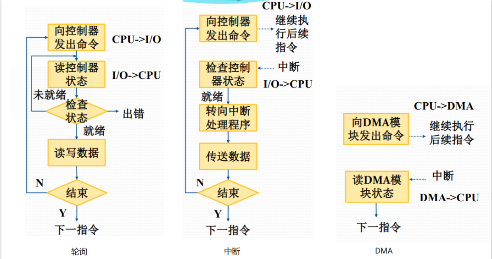
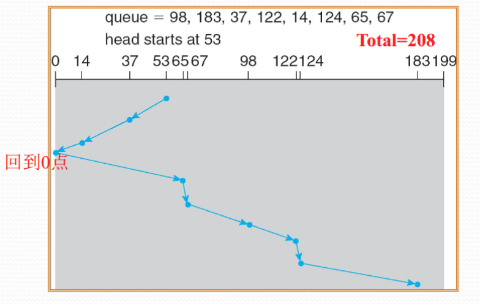

+++
date = '2025-05-22T17:04:32+08:00'
draft = false
title = '第四章 设备管理'
summary = "本文介绍了 os 对外围设备的管理。介绍了 IO 的基本概念， IO 处理的各级软硬件，设备的分配，以及磁盘调度的优化措施，最后介绍了虚拟系统与批处理作业的管理。"
tags = ["笔记", "OS", "操作系统"]
categories = ["StudyBase"]
seriesOpened = true
series = ["笔记-操作系统"]
series_order = 4
+++

 


本文介绍了 os 对外围设备的管理。介绍了 IO 的基本概念， IO 处理的各级软硬件，设备的分配，以及磁盘调度的优化措施，最后介绍了虚拟系统与批处理作业的管理。


## Part1 设备管理概述

### 1.1 I/O 设备

I/O设备，也称为输入输出设备、外围设备或外部设备，是计算机系统与外部世界（如用户、其他计算机或设备）进行信息交换或存储的桥梁。

I/O操作指的是**内存和外设之间的信息传送**操作，这些操作不仅影响计算机系统的通用性和可扩展性，也是决定系统综合处理能力（短板效应）和性价比的重要因素。

#### 分类

从信息传输的角度来看，I/O设备可以分为

1. **输入设备**：负责将外界信息输入到计算机中，例如**键盘、鼠标、扫描仪**等；
2. **输出设备**：将计算结果输出到外部，如**显示器、打印机**等；
3. **输入输出设备**：既能输入也能输出信息，典型代表有**磁盘驱动器、网卡**等。

如果从交互功能的角度分类，I/O设备可以分为

1. **人机交互设备**：用于用户与计算机之间的交互通信，如**鼠标、键盘、显示器**等；
2. **存储设备**：用于存储大量信息并支持快速检索，如**磁盘驱动器、光盘驱动器**等；
3. **机机通信设备**：用于计算机之间的通信，例如**网卡、调制解调器**等。

从设备管理的视角出发，I/O设备又可以分为

1. 字符设备：以字符为单位进行信息交换，如**鼠标、显示器**等；
2. 块设备：以固定大小的数据块为单位进行信息交换，典型如**磁盘**，块是存储介质上连续信息组成的一个区域；
3. 网络设备：用于计算机间的通信，可以被抽象为传送字符流的字符设备，也可以被抽象为传送连续小块数据的块设备。

### 1.2 设备管理概述

#### 设备管理的目标

1. 并行：解决设备和CPU速度不匹配的问题，使主机和设备能够充分并行工作，提高设备的使用效率；
2. 抽象：屏蔽设备的物理细节和操作过程，**通过配置驱动程序为上层提供统一的接口**。操作系统可以将设备抽象为**裸设备**，也可以进一步抽象为**设备文件**，方便用户和应用程序进行统一管理和访问。

#### 设备管理的功能

- **设备中断处理**：当外设完成数据传输或需要与主机通信时，会通过中断机制通知CPU，操作系统需要及时响应和处理中断，保证数据的正确传递和系统的高效运行。

- **缓冲区管理**：协调主机和外设之间速度的差异。通过设置缓冲区，可以实现数据的暂存和批量传送，减少CPU等待时间，提高整体吞吐率。

- **设备的分配和回收**：os 需要根据进程的请求，合理分配有限的设备资源，并在使用结束后及时回收，避免资源浪费和冲突。

- **设备驱动调度**：协调多个进程对同一设备的访问请求，按照一定的策略进行排队和调度，权衡**公平性/高效性**

- **虚拟设备的实现**：通过软件手段将物理设备抽象为多个虚拟设备，或者将多个物理设备整合为一个虚拟设备，为多用户、多任务环境下的设备共享和隔离提供了有力支持，也是云计算和虚拟化技术（如，VPS）的基础之一。

#### 设备管理的实现层次

最底层是I/O硬件，包括

1. **I/O 设备及其接口线路**负责实现主机与外设之间的物理连接和信号传递；
2. **控制部件**则负责解释主机发出的命令、管理数据传输过程，并处理设备状态的反馈；
3. **通道**是一种专门用于管理复杂 I/O 操作的硬件部件，能够在主机和多个外设之间实现高效的数据传输和任务调度。

在硬件之上，是I/O软件层。

1. **系统I/O软件**：由操作系统内核负责，主要实现设备驱动、缓冲管理、中断处理、设备分配等功能，为上层应用提供统一的接口和抽象。

2. **用户空间I/O软件**：运行在用户进程中，通常以**库函数或 API** 的形式出现，负责发起I/O请求、处理数据格式转换等。

### 1.3 I/O 控制方式

#### 设备控制的硬件：设备控制器

设备控制器是实现I/O设备模块化和通用性的重要硬件部件。通常，设备的机械部分和电子部分是分开的，电子部分即为设备控制器[^1]。



##### COA 复习：设备控制的硬件实现

设备控制器位于主机（CPU -> I/O总线）和设备（接口电缆）之间，起到桥梁和协调的作用。它主要由三部分组成：数据缓冲寄存器、状态/控制寄存器，以及地址译码和I/O控制逻辑。

数据缓冲寄存器用于暂存主机和外设之间传输的数据，保证数据能够顺利地在不同速度的主机和设备之间交换。状态/控制寄存器则用来存放设备的当前状态信息和控制命令，主机可以通过这些寄存器了解设备的工作状态或向设备发送控制指令。地址译码和I/O控制逻辑负责识别主机发来的地址和控制信号，判断主机要访问的是哪个设备、进行什么操作，并协调数据和命令的传递。

在设备控制器的另一侧，连接着外设接口控制逻辑，这部分负责与具体的外部设备进行通信，实现数据、状态和控制信号的最终交互。

整个设备控制器通过数据线、地址线和控制线与主机相连，通过接口电缆与外设相连，实现了主机和外设之间的数据和控制信息的双向传递。



操作系统和主机系统并不直接与设备本身交互，而是通过设备控制器来实现对设备的具体控制。设备控制器作为**CPU与设备之间的桥梁**，负责：

1. 接收和识别CPU或通道发来的命令
2. 实现主机与设备之间的数据交换
3. 发现和记录设备及自身的状态信息
4. 在连接多台设备时，识别设备地址。

[^1]: 这个部件的名字有点多：设备适配器、I/O控制器、I/O控制接口、I/O模块或I/O接口，题目都有可能出现……

在I/O控制方式上，操作系统主要采用三种典型方式：轮询方式、中断方式和DMA方式。

#### I/O控制的不同方式

##### I/O 控制的轮询方式

轮询方式下，处理器向控制器发送I/O命令后，会不断轮询设备状态，只有设备就绪时才进行数据交换，等待I/O操作完成后，处理器才可以继续其他操作。这种方式会导致CPU资源的浪费。

##### I/O 控制的中断方式

中断方式则更为高效，处理器向控制器发出 I/O 命令后可以继续执行其他任务（若进程支持异步I/O，后续
指令仍可是该进程中的指令；否则，进程被挂起[^2]，处理器执行其他工作），等设备准备好后由控制器发出中断信号，CPU 响应中断并进行数据交换和中断处理。

[^2]: os 课件原话，但是捏，我认为这里更准确的说是进入了阻塞态（block/sleep）而不是挂起（swap/suspend）

##### I/O 控制的 DMA 方式

DMA（`Direct Memory Access`, 直接存储器访问）方式则进一步解放了CPU。DMA 模块能够在不需要 CPU 干预的情况下，直接控制**主存和设备控制器之间**的数据传送。处理器只需向 DMA 模块发出 I/O 命令，DMA模块负责整个数据传送过程，传送结束后再通过中断通知CPU。

DMA方式中还存在"周期窃取机制"——DMA的工作自然需要占用总线，这不是反而耽误了CPU？其实，DMA并不是一直拥有总线的控制权，而是在CPU和内存之间的数据传输过程中，在CPU不使用总线的某些时刻，悄悄插入自己的一些传输周期，把数据搬运到内存或从内存取出。这个过程就像"趁空隙偷偷用一下"，所以叫"周期窃取"。DMA 和 CPU 可以同时通过总线访问内存，CPU会在某些主存周期内让出总线控制权给DMA，虽然数据传送过程是不连续和不规则的，但对 CPU 与主存的数据交换影响较小，**因为CPU大部分时间与 Cache 进行数据交换，直接访问内存的频率较低**。



##### 复习 COA: DMA模块的硬件实现

DMA控制器的核心由四个部分组成：数据计数器、数据寄存器、地址寄存器和控制逻辑。

1. 数据计数器用于记录还需要传输的数据字节数，每完成一次数据传输，计数器就会自动递减，直到所有数据传输完毕。
2. 数据寄存器用来暂存正在传输的数据，实现数据在线路上的缓冲和中转。
3. 地址寄存器则保存当前要访问的内存地址，每传输一个数据，地址寄存器会自动加一，指向下一个内存单元。
4. 控制逻辑部分负责整个DMA传输过程的协调和管理，包括响应CPU发出的DMA请求、发出DMA确认信号、处理中断、读写控制等。

DMA控制器通过数据线和地址线与主存和外设进行数据和地址的交换，同时通过多根控制线与CPU进行通信，实现DMA请求、确认、中断和读写等操作。



#### I/O 通道

IO通道/通道控制器/IO处理器，是实现复杂I/O任务自动化和高效并行处理的重要硬件部件。与普通的设备控制器相比，I/O通道具备更强的独立处理能力，能够完成逻辑上独立的I/O任务。

现代大型计算机系统通常采用四级连接结构：处理器、通道、控制器和设备。通道位于处理器和设备控制器之间，可以同时管理和调度多台同类或不同类的设备。

在 I/O 通道的工作模式下，处理器不再直接执行具体的 I/O 指令，而是

1. 将 I/O 操作的详细步骤编写成"通道程序"，并将通道程序的起始地址（CAW，通道地址字）写入指定寄存器，启动相应的通道；
2. 通道随后根据 CAW 从主存中读取通道程序，自动控制I/O设备完成数据传输和相关操作，而 CPU 则可以继续执行其他任务，实现高度的并行；
3. 当 I/O 操作完成后，I/O 通道会向CPU发出中断信号，通知主机 I/O 任务已结束。CPU 响应中断后，通过读取通道程序状态字（CSW）获取通道的执行情况，并据此进行后续的 I/O 处理。

### 1.4 总线

在计算机系统中，由于I/O设备的种类繁多，速度差异极大，数据传送率可能相差几个数量级，单靠简单的点对点连接[^3]无法实现高效的数据交换。总线是一种共享通信通道，是为了解决 I/O 设备与CPU、主存、各设备 I/O 之间速度不匹配的问题。

[^3]: 指的是在早期或非常简单的计算机系统中，每一个 I/O 设备都通过一组专用的信号线直接与CPU或主存相连

#### 单总线结构

最基础的单总线结构模型将CPU、主存和所有I/O模块都连接到同一条总线上。

1. 优点：是简单、易于扩展，适合设备数量较少的场景。
2. 缺点：但当系统中设备数量增多时，共用总线会带来带宽压力，慢速外设占用总线时间过不同 I/O 设备的数据速率差异过大

#### 三级总线模型

为进一步提升系统性能，现代计算机常采用三级总线模型。主存和Cache通过主存总线连接，主存总线与扩展总线之间通过**扩展总线借接口**实现数据交换，扩展总线则连接各类I/O设备。

1. 优点：主存与I/O之间的数据传送和处理器的内存活动可以分离，支持更多的I/O设备。
2. 缺点：当**不同 I/O 设备的数据速率差异过大**时，三级总线的效率还是会受到影响。

#### 南桥北桥

针对不同速率设备的需求，南桥（低速）与北桥（高速）结构应运而生。北桥芯片通过处理器总线、存储总线、PCI 总线连接 CPU、主存和高速 I/O 设备（如显卡、PCI设备），南桥芯片则通过 E(ISA) 总线等连接低速I/O设备。这样可以根据设备的数据速率分层管理，既保证了高速设备的带宽需求，又兼顾了低速设备的接入。

#### 基于通道的服务器总线模型

在服务器和高端系统中，还常见基于通道的总线模型。这种结构支持**CPU、主存和多个I/O通道**之间的数据传送，同时支持**I/O通道与I/O控制器、I/O控制器与设备**之间的高效数据交换。

## Part2 设备管理软件

### 2.1 I/O 软件的实现层次

#### I/O 软件的设计

##### 设计目标

I/O软件的设计目标主要体现在高效率和通用性两个方面。

1. 高效率要求操作系统能够最大限度地提升设备的使用效率，尤其是磁盘等慢速I/O设备的操作效率；
2. 通用性则要求用统一的标准和接口来管理所有类型的设备，无论是输入、输出还是存储设备，都能通过一致的方式进行访问和控制。

##### 设计思路

为实现这些目标，I/O软件通常采用**层次化的设计思路**。低层软件负责**屏蔽硬件的具体细节，为上层提供统一的抽象接口**；高层软件**则面向用户，提供简洁、友好且一致的操作界面**。

##### 设计要考虑的问题

1. **设备无关性**：应用程序在访问设备时无需关心具体的硬件类型和操作细节，所有设备都通过统一的接口进行管理。
2. **出错处理**：低层I/O软件应尽可能在底层解决常见的硬件错误，避免将错误暴露给高层应用，提升系统的健壮性。
3. **同步和异步传输**是I/O操作的两种基本方式。
   - 同步（阻塞）传输：**发起I/O操作的进程在数据传输完成前一直处于等待状态**，CPU此时会去调度其他就绪进程运行；
   - 异步（中断驱动）传输：发起I/O请求的进程在启动I/O后可以继续执行自己的其他任务（如果有），或者直接让出CPU，等I/O完成时通过中断通知进程进行后续处理。
   
4. **缓冲技术**：通过在内存中设置数据缓冲区，实现数据的暂存和批量传送，从而提高 I/O 吞吐率，减少CPU等待时间。

#### I/O 软件的层次结构

一个典型的 I/O 操作执行过程通常包括以下几个步骤：
1. 首先，进程中的软件通过文件描述符发起读写请求(执行读库函数/写库函数)；
2. 独立于设备的 I/O 软件会检查参数的正确性，并尝试从高速缓存或缓冲区直接满足请求。
3. 如果数据不在缓冲区，则需要进行物理 I/O 操作，包括
  - 将设备逻辑名转换为物理名
  - 检查权限
  - 请求排队
  - 阻塞申请 I/O 的进程
4. 随后，内核启动设备驱动程序，分配缓冲区并准备接收数据，向设备控制寄存器发出启动命令或建立 DMA 传输。设备控制器负责具体的数据传输，DMA 控制器在一块数据传输完成后产生I/O结束中断，CPU响应中断并调用相应的中断处理程序。
5. 最后，当应用进程被再次调度执行时，从I/O系统调用的断点恢复，完成整个I/O操作流程。

### 2.2 I/O 软件的实现

#### I/O 中断处理程序

I/O 中断处理程序是操作系统中与硬件设备最为密切相关的底层模块，其设计目标是**尽量减少与系统其他部分的耦合**。通常，当进程请求 I/O 操作时会被阻塞，待数据传输结束后，设备产生 I/O 中断，CPU 响应中断请求并转入中断处理程序。中断处理程序的工作流程：

1. 检查设备状态寄存器，判断中断的具体原因，并根据 I/O 操作的完成情况进行相应处理。
2. 如果数据传输过程中出现错误，中断处理程序会向上层软件报告设备的出错信息，并尝试重新执行操作；
3. 如果 I/O 操作正常结束，则会唤醒等待该传输的进程，使其转为就绪态；
4. 如果设备队列中还有其他等待的 I/O 命令，中断处理程序会通知相关软件启动下一个 I/O 请求。

#### 设备驱动程序

设备驱动程序则包含了**与具体设备密切相关**的所有代码。它们的主要工作：

- 从独立于设备的软件中接收 I/O 请求
- 将用户提交的逻辑 I/O 请求转化为物理 I/O 操作的启动和执行
- 并监督设备的运行状态，访问数据缓冲区，进行必要的纠错处理

设备驱动程序的主要功能包括：

- 设备初始化（在数据传输前预置设备、控制器和通道状态）
- 执行设备驱动例程（启动设备、组织通道程序、启动通道工作）
- 处理设备、控制器和通道发出的各种具体中断

每个设备驱动程序原则只处理一种设备，或者一类紧密相关的设备。为提高可移植性和结构清晰度，设备驱动程序通常采用**分层实现**，高层驱动处理**设备类别相关的操作**，低层驱动则负责**具体设备的物理操作**。

为了实现分层，系统通过**驱动栈**的方式逐层调用，系统建立栈，接到 I/O 请求时先调用栈顶的驱动程序，然后继续向下调用低层驱动程序，直至所有物理操作被处理完毕。这种方式虽然增加了一定的系统开销，但极大地提升了驱动的可维护性和扩展性。

#### 独立于设备的 I/O 软件

独立于设备的 I/O 软件负责实现适用于所有设备的通用 I/O 功能，并向用户层软件提供一致性的接口。其主要职责包括：

- 设备命名（如通过路径名寻址设备）
- 设备保护（判断用户是否有权访问设备）
- 提供与设备无关的数据单位（如字符或块）
- 缓冲技术（协调CPU与I/O速度差异）
- 设备分配和状态跟踪
- 错误处理和报告（对驱动无法处理的错误进行上报）

#### 用户空间的 I/O 软件

用户空间的 I/O 软件主要以**库函数**的形式存在，放在操作系统内核之外，运行时与应用程序链接，提供标准化的 I/O 操作接口。

此外，还有**虚拟设备软件**——通过软件手段，把一种物理设备"伪装"成另一种设备，或者在没有真实硬件的情况下模拟出设备功能的软件。它的作用是让操作系统和应用程序像操作真实硬件一样，去操作这些"虚拟"的设备，从而实现仿真、兼容或测试等目的。比如，在虚拟机软件（如VMware、VirtualBox）中，虚拟网卡让虚拟机像有真实网卡一样联网，但实际上这些"网卡"只是软件模拟出来的，数据通过主机和虚拟机之间的内存交换。

### 2.3 I/O 缓冲

#### 目的

1. 设置 I/O 缓冲的根本目的是为了**解决 CPU 与外设之间速度不匹配的问题**。由于 CPU 的处理速度远高于大多数 I/O 设备，直接进行数据交换会导致 CPU 频繁等待，极大地影响系统效率。
2. 缓冲区还能调节逻辑记录大小和物理记录大小不一致的问题
3. 提高CPU和设备的并行性
4. 减少I/O操作对CPU的中断次数
5. 放宽对CPU中断响应时间的要求

#### 实现

**I/O缓冲区是 os 在内存中专门开辟的存储区域，用于临时存放 I/O 操作过程中传输的数据**。

- 写操作时，数据首先被送入缓冲区，只有当缓冲区装满或达到某个条件时，系统才会将缓冲区的内容批量写入设备。
- 读操作时，系统会将设备上的物理记录读入缓冲区，进程则根据需要从缓冲区中读取数据。

常见的缓冲技术包括单缓冲、双缓冲和循环缓冲。

1. 单缓冲技术：在主存中设置一个缓冲区，数据在设备和用户进程之间通过缓冲区中转。输入时，数据先读入缓冲区，再送到用户区；输出时，数据先从用户区送到缓冲区，再写入设备。
2. 双缓冲技术：在主存中设置两个缓冲区，实现设备和进程之间的数据交替传输。这样一边缓冲区在进行数据传输时，另一边可以被进程或设备同时使用，大大提高了并行性和数据吞吐率。
3. 循环缓冲技术：分配一组缓冲区，每个缓冲区通过指针链接成环，数据在多个缓冲区之间循环流动，进一步调节设备和进程速度不匹配的问题，适用于高并发和大数据量的I/O场景。

## Part3 设备分配

### 3.1 设备独立性

传统上，在作业执行前，用户或程序需要提前指定某一台具体的物理设备。这样做会让设备分配的实现会变得简单直接，在一些微型计算机操作系统中，这种方式被广泛采用。但这种做法也带来了明显的局限性：**一旦所指定的设备出现故障，即使系统中还有其他同类设备可用，作业也无法继续运行**，极大地影响了系统的灵活性和可靠性。

为了解决这个问题，现代操作系统普遍采用了设备独立性的思想。所谓设备独立性，就是让**用户和应用程序在提出设备请求时，不再关心具体是哪一台物理设备，而是只需要指定一个逻辑上能够完成要求功能的设备（逻辑设备）**。这样，用户进程和实际的物理设备之间就被有效地隔离开来。**系统会通过内部的机制，将逻辑设备和物理设备建立起映射关系**，通常，操作系统会维护一张逻辑设备名与物理设备名的对应表，在需要分配设备时，自动完成逻辑到物理的转换。

这种机制带来了很多好处。

1. 应用程序与具体的物理设备解耦，系统在增减或更换设备时，无需修改用户的源程序，极大地提高了**程序的可移植性和系统的可维护性**。
2. 让系统能够灵活应对各种 I/O 设备的故障，当某台设备不可用时，可以自动切换到其他同类设备，提升了**系统的可靠性**。
3. 让设备的分配更加灵活高效，有利于多道程序环境下对设备资源的充分利用，**实现更高的并发和资源利用率**。

### 3.2 独占型外围设备的分配

在操作系统中，**独占型外围设备指的是那些在同一时刻只能被一个进程独占使用的设备**，比如打印机、磁带机等。这类设备的管理需要特别关注互斥性，防止多个进程同时访问同一设备导致冲突。对于独占型设备的分配，主要有两种方式：静态分配和动态分配。

#### 静态分配

静态分配是指**进程在运行前就向系统申请所需的设备，系统在进程开始执行前就完成设备的分配**。这样做的

1. 好处：实现简单，且因为所有设备的分配在进程运行前就已经确定，不会出现进程在运行过程中因等待设备而相互阻塞的情况。
2. 缺点：就是**设备利用率较低**——某些设备可能被分配给了暂时不需要它们的进程，导致资源浪费。

#### 动态分配与死锁

动态分配则**允许进程在运行过程中根据需要随时申请和释放设备**。

1. 好处：能够显著提高设备的利用率，使得设备资源能够被更多进程灵活地共享和使用。
2. 缺点：**死锁**的风险。由于多个进程可能在运行过程中交替申请和释放设备，如果不加以妥善管理，就可能出现**进程相互等待对方释放设备的情况**，最终导致所有相关进程都无法继续执行。

> ⬆️举一个典型的死锁例子：假设系统中有一台打印机和一台磁带机，进程 P 和进程 Q 都需要使用这两台设备。进程 P 先申请并获得了打印机，随后进程切换到 Q，Q 申请磁带机，再切换回 P。随后，P 在申请磁带机时被阻塞，因为此时磁带机已经被进程 Q 占用，而 Q 在申请打印机时也被阻塞，因为打印机已经被进程 P 占用。这样，两个进程都在等待对方释放自己需要的设备，形成了死锁，系统无法继续推进。

#### 设备分配的数据结构

为了实现设备的有效分配和管理，操作系统通常会设计专门的数据结构来记录设备的使用情况。常见的数据结构包括设备类表和设备表。

**设备类表用于记录每一类设备的总体信息**，比如设备类别、总台数、当前空闲台数以及该类设备表的起始地址等，在支持设备独立性的系统中，这种结构非常重要。

每一类设备还会有自己的**设备表，详细登记该类中每一台物理设备的具体信息**，包括物理设备名、逻辑设备名、当前占有设备的进程、分配标志以及设备的好坏状态等。通过这些数据结构，操作系统能够实现对设备的动态分配、回收和状态监控，保证系统资源的高效和安全使用。

## Part4 共享型外围设备——磁盘的驱动


笑了，找磁盘找到 os 来了。

##### COA 复习：磁盘

磁盘存取时间的计算：

$$
T_a = T_s + T_r + T_t = T_s + \frac{1}{2r} + \frac{b}{rN}
$$

- \\(T_s\\)：寻道时间
- \\(T_r\\)：旋转延迟
- \\(T_t\\)：传输时间
- \\(r\\)：磁盘转速
- \\(b\\)：读取的扇区数
- \\(N\\)：磁盘转速

以及磁内部也可能有自己的cache，cache还有自己的替换策略如LRU、LFU。


### 4.1 磁盘调度基础

在多进程环境下，磁盘往往会在一个时段接收到多个I/O请求。如果操作系统对这些请求采取随机响应的方式，磁盘的整体性能会非常低下。为此，操作系统会采用磁盘调度策略，对所有等待访问磁盘的I/O请求进行合理排序和调度，以**尽量减少磁盘访问的总处理时间，提高系统的吞吐率**。

磁盘调度的核心目标，就是**通过调整I/O请求的处理顺序，减少磁盘机械部件的移动时间和旋转延迟**，从而提升磁盘的整体访问效率。磁盘调度主要包括移臂调度和旋转调度两大类。

### 4.2 磁盘的驱动调度（移臂调度）

移臂调度的重点在于如何让磁头臂的移动距离最短，从而减少寻道时间；磁盘调度策略的选择直接影响系统的响应速度和磁盘资源的利用率。

#### 先进先出（FCFS）

最基础的调度方式是先进先出（FCFS），即按照I/O请求到达的顺序依次处理。这种方式实现简单，对所有进程都很**公平**，但并不能优化磁盘的寻道和访问效率，容易导致磁头臂频繁大幅移动。

#### 优先级调度

优先级调度则根据作业或进程的重要性分配磁盘资源。通常，**短作业和交互作业会被赋予较高的优先级**，而长作业优先级较低，这样可以让大量短作业快速通过系统，提升交互体验。

不过，优先级调度并不会优化磁盘本身的使用率，而且长作业可能会长时间等待，甚至出现"饥饿"现象。

#### 后进先出 LIFO

后进先出（LIFO）调度在某些事务处理系统中较为常见。它优先处理最近到达的请求，这样**磁头臂在顺序文件中移动的距离会很小，甚至不需要移动**。利用这种局部性可以提高吞吐量，减少队列长度。只要某个作业积极地发起I/O请求，它就能很快得到服务。

但如果磁盘一直处于繁忙状态，某些早到的请求可能会长期得不到处理，出现"饥饿"问题。

#### 最短服务时间优先 SSTF

最短服务时间优先（SSTF）是一种常用的优化策略。每次都选择距离当前磁头臂位置最近的请求进行处理，从而减少单次寻道时间。

SSTF的平均性能通常优于FIFO，但它也可能导致远离当前磁头位置的请求长期得不到服务，出现"饥饿"问题。

#### 扫描 SCAN/LOOK

扫描（SCAN）及其变种是磁盘调度中非常重要的一类算法。SCAN算法要求磁头臂沿一个方向移动，沿途依次处理所有等待的请求，直到到达磁盘一端或该方向上没有更多请求。随后磁头臂反转方向，继续处理相反方向上的请求。LOOK算法是SCAN的改进版，磁头臂只移动到有请求的最远磁道，不会无谓地移动到磁盘边缘，这种方式类似于电梯的运行，因此也被称为电梯调度算法。

#### 循环扫描 C-SCAN/C-LOOK

循环扫描（C-SCAN）进一步优化了扫描策略。它**限定磁头臂只在一个方向上处理请求，移动到磁盘一端后，磁头臂直接返回到另一端的起始位置，再次开始扫描**。这样可以保证所有请求的等待时间更加均匀，减少了边缘磁道请求的等待时间。

#### N-step-SCAN 和 FSCAN

N-step-SCAN和FSCAN是为了解决扫描类算法中可能出现的"磁头臂粘性"问题而提出的。

N-step-SCAN 将请求队列分成长度为 N 的子队列，每次只用 SCAN 处理一个子队列，新到的请求会被放入其他队列。这样可以**防止某些进程反复请求同一磁道而垄断设备**。当N很大时，N-step-SCAN的性能接近SCAN；当 N 为 1 时，退化为FIFO。

FSCAN 则采用两个子队列，扫描开始时所有请求都在一个队列中，另一个队列为空，扫描过程中新到的请求全部进入另一个队列，只有等当前队列处理完毕后才会处理新队列的请求，**这样可以有效避免新请求"插队"导致的饥饿问题**。

### 4.3 磁盘的驱动调度（旋转调度）

除了寻道时间，磁盘访问的另一个重要瓶颈是旋转延迟。旋转调度的目标是通过优化同一柱面内各请求的处理顺序，尽量减少磁盘旋转等待的总时间。

#### 循环排序

1. 循环排序是一种常见的旋转调度方式，通过合理安排I/O请求的顺序，使得磁头在最少的旋转圈数内完成对同一柱面上所有扇区的访问。现代磁盘还常配备旋转位置测定硬件和多磁头同时读写技术，这些都进一步提升了旋转调度的效率。
   1. 多磁头技术：在同一磁盘上设置多个读写头，可以同时读写多个扇区，从而提高数据传输速率。   
   2. 旋转位置测定硬件：通过硬件电路实时监测磁头在磁盘上的位置，从而精确控制磁头移动，减少旋转等待时间。
   
为了更好地理解旋转调度中的循环排序原理，我们以一个具体的例子来说明。假设某旋转型磁盘设备的一个磁道上有4个物理块，磁盘旋转一周需要20毫秒。现在磁盘收到4个I/O请求，分别是读记录4、读记录3、读记录2、读记录1。定位需要半圈，读出记录需要1/4圈。

1. 如果按照I/O请求的原始次序依次处理（4、3、2、1），第一个请求平均等待1/2圈，读出1/4圈，后续每个请求都要等磁盘转到目标记录，平均需要3/4圈。这样总处理时间为 $$1/2+1/4+3×3/4=3$$ 圈，也就是60毫秒。

2. 如果将请求排序为顺序读1、2、3、4，磁头只需顺着磁道依次读取，除了第一个请求平均等待1/2圈、读出1/4圈外，后续每个请求只需再等1/4圈即可。这样总处理时间为 $$1/2+1/4+3×1/4=1.5$$ 圈，即30毫秒。

3. 如果进一步优化，假设当前读写位置正好在记录3处，那么可以将请求排序为4、1、2、3。这样每次只需等1/4圈，4个请求总共只需1圈，也就是20毫秒。

#### 优化分布与数据排列

在磁盘的实际使用中，除了调度算法本身，数据在磁盘存储空间中的物理排列方式也对访问效率有着重要影响。合理的优化分布可以有效减少旋转延迟和寻道时间，从而提升整体性能。

##### 交替排序

在顺序处理扇区数据时，磁头可能还未处理完当前扇区，下一个顺序扇区就已经转过头了，导致需要等待磁盘再旋转一圈才能访问。为了解决这个问题，可以采用交叉编号的方式，将物理上相邻的扇区编号间隔开。**交叉因子**是交叉编号的比例，例如，交叉因子为 n:1 时，相邻编号的扇区在物理上会间隔 n-1 个扇区，这样磁头处理完一个扇区后，刚好赶上下一个需要访问的扇区，无需多余等待。

##### 集中分布

**把相邻扇区集中成簇进行读写**也是一种常见的优化手段。通过将相关数据集中存储在物理上连续的扇区中，可以减少磁头的移动和旋转等待，提升大批量数据读写的效率。

另一种方式是**按柱面集中存储数据**，即将同一组相关数据集中存放在同一个柱面上，这样在读写时只需移动磁头臂到对应柱面，无需频繁切换柱面和等待旋转，进一步减少了寻道和旋转延迟。

### 4.4 磁盘冗余阵列-RAID技术

> RAID（Redundant Arrays of Inexpensive Disks 或 Redundant Arrays of Independent Disks，廉价/独立磁盘冗余阵列）技术最早由伯克利大学提出，旨在解决CPU性能提升远快于磁盘性能的矛盾。随着计算机处理器性能每年大幅提升，而传统硬盘的性能提升却十分有限，研究人员希望通过一种新的磁盘组织方式，提升存储系统的整体性能和可靠性，同时兼顾成本。

RAID的基本思想是将多个普通硬盘组合成一个磁盘阵列，通过数据分布和冗余校验等机制，实现数据的并行读写和容错能力。这样不仅可以提升I/O性能，还能在部分硬盘损坏时保证数据安全。RAID有多个级别，不同级别在性能、空间利用率和容错能力上各有侧重。

##### RAID0：条带化存储，无冗余

RAID0 将数据分成条带，轮流写入所有硬盘，实现并行交叉存取。这样可以大幅提升读写速度，适合大数据量、高吞吐的应用场景。

RAID0 的空间利用率为100%，读写性能理论上是单盘的N倍，但没有任何冗余校验，一旦有一块盘损坏，整个阵列的数据都会丢失，可靠性较差。

##### RAID1：镜像存储，双份冗余

RAID1 采用镜像技术，将所有数据完整地写入两块或多块硬盘。这样任何一块盘损坏，数据都不会丢失，容错性极高。

读请求可以从任意一块盘读取，最好情况下是原来的N倍，写性能则取决于最慢的盘。空间利用率为1/2，成本较高，适合对数据安全性要求极高的场合。

##### RAID2：位级并行与海明码校验

RAID2 将数据按位或字节交叉存放在多个硬盘上，并使用海明码进行冗余校验。它能定位并纠正单个位错误，适合大量顺序数据访问，但需要多个冗余盘，成本较高，实际应用较少。空间利用率为 \\(n/(n+k)\\)，其中 \\(n\\) 为数据盘数， \\(k\\) 为校验盘数，\\( 2^k \geq n + k + 1 \\)。

##### RAID 3：字节级并行与单盘奇偶校验

RAID3 是 RAID2 的简化版，采用字节级条带化和单一奇偶校验盘。所有数据盘并行读写，校验盘负责奇偶校验。读性能接近N-1倍，写性能受限于校验盘，空间利用率为 \\((N-1)/N\\)。适合大文件顺序读写，对小文件随机访问不友好。

##### RAID4：块级条带与单盘奇偶校验

RAID4 采用块级条带化，数据块分布在各个数据盘，单独设一块校验盘存放奇偶校验码。读性能高，写性能受限于校验盘。空间利用率为 \\((N-1)/N\\)。与 RAID3 相比，RAID4 更适合普通文件的存储和访问。

##### RAID5：分布式奇偶校验

RAID5 在 RAID4 的基础上，将奇偶校验码分布在所有硬盘上，避免了校验盘的写入瓶颈。读性能接近N倍，写性能略低于 RAID0，但容错性更好。空间利用率为 \\((N-1)/N\\)，任意一块盘损坏时数据仍可恢复。RAID5 广泛应用于企业级存储系统。

##### RAID6：双重分布式奇偶校验

RAID6 在 RAID5 的基础上增加了第二种独立的校验算法（如 P 和 Q 校验），即使有两块盘同时损坏也能恢复数据。

读性能接近N倍，写性能略低于RAID 5，空间利用率为 \\((N-2)/N\\)。适合对数据安全性要求极高的场合。

##### RAID10：镜像+条带化的组合

RAID10（也称RAID1+0）将 RAID1 的镜像和 RAID0 的条带化结合起来，先将硬盘分组做镜像，再对镜像组做条带化。这样既有 RAID0 的高性能，又有 RAID1 的数据安全性。读性能最好情况下是原来的 N 倍，写性能为 N/2 倍，空间利用率为 1/2。即使坏掉 N-1 块盘，只要每组有一块可用，数据就不会丢失。

## Part5 虚拟设备

虚拟设备技术是指**利用一类物理设备来模拟另一类物理设备**的技术。例如，内存卡可以模拟磁盘，块设备可以模拟字符设备；输入输出重定向也是一种虚拟设备的应用。

### 5.1 SPOOLing 系统

SPOOLing（Simultaneous Peripheral Operations On-Line，外部设备联机并行操作），“假脱机技术”，就是一种典型的虚拟设备技术。它是一种以**共享型磁盘设备**模拟**独占型物理设备**的技术，也是一种速度匹配技术；它最初是为了解决慢速字符设备（如打印机、打卡机等）与主机之间速度不匹配的问题，通过操作系统的调度和管理，**将慢速设备的I/O操作转化为对高速磁盘的操作**，从而实现设备的高效利用和进程的快速切换。

#### 原理与实现方式

SPOOLing系统的核心思想，是用共享型磁盘设备来模拟独占型物理设备。具体做法是：当进程需要进行输入输出操作时，先将数据写入磁盘上的输入井或输出井（即专门用于暂存I/O数据的磁盘区域），而不是直接与慢速设备交互。这样，进程的I/O操作实际上都变成了对磁盘的读写，只有在需要最终输出到慢速设备时，才由系统统一调度，将数据从磁盘输出井传送到目标设备。这样既缩短了进程在内存中的驻留时间，也加快了进程的周转速度，提高了系统的整体吞吐量。

#### 软件组成和工作流程

一个典型的SPOOLing系统通常包括三个主要的软件模块：预输入程序、缓输出程序和井管理程序。

1. **预输入程序**负责将数据从输入设备预先传送到磁盘的输入井；
2. **缓输出程序**则负责将数据从磁盘的输出井传送到输出设备；
3. **井管理程序**则负责协调作业进程与输入井、输出井之间的数据交换，实际上实现了I/O的重定向。

SPOOLing的具体流程是：首先，输入设备（如打卡机、终端等）将作业数据输入到系统，预输入程序负责把这些数据收集起来，存放到磁盘上的输入井中。每个作业的信息都会被记录在输入井里，等待后续处理。作业调度程序根据系统资源和调度策略，从输入井中选择合适的作业，交给并管理程序（作业管理程序）来实际运行。运行作业时，程序会从输入井中读取作业数据，执行计算，并将结果写入磁盘上的输出井。最后，缓输出程序负责把输出井中的作业结果，按照一定顺序送到输出设备（如打印机、终端等），完成最终的输出。

通过这种方式，所有的I/O操作都以磁盘为中介，极大地提升了系统的并发能力和资源利用率。

#### 实际应用

以打印SPOOLing系统为例，操作系统会设置一个专门的打印目录和一个守护进程。用户进程在需要打印时，先将待打印的内容完整地生成一个文件，存放在打印目录下。只有守护进程拥有直接操作打印机的权限。当打印机空闲时，守护进程会自动启动，从打印目录中取出待打印文件，依次完成打印任务。这样，用户进程无需等待打印机完成输出即可结束，大大提高了系统的响应速度和打印设备的利用率。

### 5.2 批处理系统的作业管理

#### 作业说明语言与作业说明书

在多道批处理操作系统中，作业管理是核心功能之一。作业说明语言是一种专门用于描述作业控制和运行需求的语言，用户通过它来指定作业的输入、输出、所需资源、运行顺序等信息。每个作业在提交时，都会附带一份作业说明书，详细刻画该作业的控制方式和运行要求，便于操作系统自动识别和管理。

#### 作业的状态与生命周期

作业在批处理系统中会经历多个不同的状态。
1. 最初，作业处于输入状态（预输入），即作业数据和说明书被输入到系统。
2. 随后，作业进入后备状态（空闲），在后备队列中等待系统资源的分配。
3. 资源满足后，作业被调度进入运行状态，开始实际执行。
4. 作业完成后，进入完成状态（缓输出），等待输出结果被送往相应的输出设备。
5. 整个过程中，作业的状态转换由操作系统自动管理。

#### 作业调度与调度算法

- 优先数调度：根据作业的重要性或紧急程度分配优先级，优先级高的作业先运行。
- 短作业优先：优先调度预计运行时间较短的作业，提高系统吞吐率。
- 响应比高者优先：综合考虑作业等待时间和运行时间，优先调度响应比高的作业，兼顾公平性和效率。
- 设备搭配调度：根据作业对设备的需求进行合理搭配，避免资源冲突，提高设备利用率。



##### 例题

有一多道程序设计系统，

1. 进程调度采用时间片调度算法，不考虑进程的输入输出和操作系统的调度开销；
2. 存储管理采用可变分区方式，用户空间为100K，采用最先适应算法分配主存且不允许移动；
3. 系统配有4台磁带机，对磁带机采用静态分配策略。

今有如下作业序列：问分别采用先来先服务或响应比高者优先作业的平均周转时间是多少？

答案：

- 先来先服务：

- 响应比高者优先：



