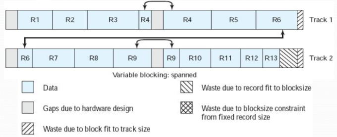

+++
date = '2025-05-24T18:14:22+08:00'
draft = false
title = '第五章 文件管理'
summary = "本文介绍了文件管理的基本概念、文件的逻辑结构、文件的物理结构、文件的组织方式、文件的实现层次等。"
tags = ["笔记", "OS", "操作系统"]
categories = ["StudyBase"]
seriesOpened = true
series = ["笔记-操作系统"]
series_order = -1
+++

 

## Part1 文件管理概述

### 1.1 文件的概念

#### 文件的定义

文件是指**具有符号名、在逻辑上具有完整意义的一组相关信息项的序列**。无论是文档（document）还是计算机文件（file），本质上都是信息的有序集合。每个文件都通过一个文件名来标识，这个文件名通常由字母、数字和其他符号组成，其格式和长度会因操作系统的不同而有所差异。

从计算机来讲文件就是对信息的一种抽象，一种组织存储内信息的数据结构。

#### 文件的命名方式

文件的命名一般包括文件名和扩展名两部分。文件名用于唯一识别文件，而扩展名则用来标识文件的类型或特性，两者之间通常用圆点分隔。不同操作系统对扩展名有不同的约定。例如，在Windows系统中，

- `.COM`表示可执行的二进制代码文件
- `.EXE`表示可执行的浮点二进制代码文件
- `.LIB`表示库程序文件
- `.BAT`表示批处理命令文件
- `.OBJ`表示编译或汇编生成的目标文件

UNIX系统的文件命名方式则更加灵活，通常不强制要求扩展名，但也有一些通用的命名习惯。

#### 文件的分类

文件可以按照不同的标准进行分类。

1. 按**用途**可以分为系统文件、库文件和用户文件；
2. 按**保护级别**可以分为只读文件、读写文件和不保护文件；
3. 按**信息的时限**可以分为临时文件、永久文件和档案文件；
4. 按**设备类型**可以分为磁盘文件、磁带文件、光盘文件和软盘文件。

此外，还可以根据文件的逻辑结构或物理结构进行更细致的分类。

#### 引入文件（这一数据结构）的优点

引入文件的最大优点在于**极大地方便了用户**。用户无需记住信息在辅助存储器中的物理位置，也无需关心信息如何存放到存储介质上，只要知道文件名并给出相应的操作请求，就能实现对信息的按名存取。

文件**安全可靠**，因为用户通过文件系统才能实现对文件的访问，而文件系统能为文件访问提供多种安全、保密和保护措施，有效防止对文件信息的破坏或窃用，提高了文件的安全性和可靠性。

此外，文件系统支持**文件的备份和恢复功能**，在文件使用过程中如果出现硬件故障，可以通过备份机制组织重执，进一步提升了系统的可靠性。

文件系统还支持**文件的共享**，不同用户可以通过同名或异名访问同一个文件，提高了文件和存储空间的利用率。

总之，**把数据组织成文件的形式进行管理和控制，是计算机数据管理领域的一项重大进步**。

### 1.2 文件系统及其功能

#### 文件系统的概念

**文件系统是 os 专门负责存取和管理信息的模块**。它以统一的方式管理用户和系统的信息存储、检索、更新、共享和保护，并为用户提供一整套方便有效的文件使用和操作方法。文件系统不仅是用户与存储设备之间的桥梁，也是实现数据有序管理和安全保护的重要基础。

#### 文件的逻辑与物理视角

在文件系统中，"文件"这一术语既反映了用户层面的逻辑结构，也与其在辅助存储器（即文件存储器）上的物理存储结构密切相关。因此，同一个文件必须从逻辑文件和物理文件两个角度来理解。逻辑文件强调**文件内容的组织和用户视角下的结构**，而物理文件则关注**文件在存储介质上的实际分布和存取方式**。

#### 文件系统的主要功能

文件系统面向用户的核心功能包括：

- 文件的按名存取（核心）
- 文件的共享与保护
- 文件的操作和使用

为了实现上述功能，操作系统在设计文件系统时需要重点考虑以下几个方面：
1. 文件目录的建立和维护，确保用户能够方便地查找和管理文件；
2. 存储空间的分配与回收，合理利用存储资源，避免空间浪费和碎片化；
3. 数据的保密与保护，防止信息泄露和恶意破坏；
4. 监督用户对文件的存取和修改权限，保障系统安全和数据一致性；
5. 针对不同存储介质，设计合适的信息表示方式、编址方法和存储次序，并支持高效的信息检索。

#### 文件系统的要素


## Part2 文件的组织

### 2.1 文件的存储

#### 卷和块

文件的存储介质包括磁带、光盘和磁盘等多种类型。在这些介质中，

1. **卷**是最基本的物理单位，比如一盘磁带、一块软盘、一个光盘片或一个硬盘分区都可以看作一个卷。

2. **块**则是存储介质上连续信息组成的一个区域，也被称为**物理记录**。**块是主存储器和辅助存储器之间进行信息交换的物理单位，每次数据传输通常都是以块或整数倍块为单位进行的。**


块的大小对文件系统的性能有重要影响。决定块大小时，需要综合考虑用户的使用方式、数据传输效率以及存储设备的类型等多种因素。不同类型的存储介质，其块的长度往往不同；同一类型的介质，块的大小一般也保持一致，但在某些情况下也可以有所不同。

由于外围设备在启停、识别不同块时的机械动作要求，相邻两个块之间通常需要留有间隙，这些间隙区域不记录用户数据，而是用于设备识别和物理操作。

#### 顺序存取存储设备的信息安排

顺序存取设备是指**严格依赖信息物理位置顺序进行定位和读写**的存储设备。磁带机是最典型的顺序存取设备，具有存储容量大、稳定可靠、卷可装卸和便于保存等优点，因此广泛用于数据归档和长期保存。磁带的一个突出特点是**块长的变化范围很大，可以根据需要设置为很小或很大，原则上没有严格限制**。光盘在某些应用场景下也属于顺序存取设备。

#### 直接存取存储设备的信息安排

磁盘则是一种直接存取（或称随机存取）存储设备。它通过移臂和旋转两维组织结构，实现了高效的数据定位和访问。**磁盘上的每个物理记录都有确定的位置和唯一的地址，系统可以在几乎不受物理位置影响的情况下，快速存取任意一个物理块**。这种特性使得磁盘非常适合需要频繁、随机访问数据的应用场景。

### 2.2 文件的逻辑结构

逻辑文件，也称为文件的逻辑结构，是**独立于物理存储环境、面向用户的抽象信息组织方式**。它体现了用户能够直接观察和处理的数据集合，是用户视角下对文件内容的理解和操作基础。逻辑文件的结构决定了用户如何访问和管理文件中的信息。文件的逻辑结构分为两种形式——

#### 流式文件

流式文件是一种最简单的逻辑结构，文件内的数据被视为一串连续的字节流。用户在访问流式文件时，通常按长度读取所需信息，也可以通过插入特殊字符（如换行符、分隔符等）来标识数据的分界。**文本文件、源代码文件等**大多属于流式文件，这种文件结构**十分灵活、适合顺序处理和变长数据的存储**。

#### 记录式文件


记录式文件**是一种有结构的文件，由若干逻辑记录组成**。每个逻辑记录是文件中具有独立逻辑意义的信息单位。例如，每个职工的工资信息可以作为一个逻辑记录，所有职工的工资信息集合就构成了一个记录式文件。记录式文件**适合需要频繁按记录单位进行增删查改的应用场景，如表格、报表、日志等**。

##### 记录式文件？数据库？

虽然数据库管理系统也支持逻辑记录的概念，但数据库与记录式文件有本质区别。数据库中的记录之间可以通过数据冗余等方式建立复杂的联系，支持基于这些联系的数据查询和操作。而传统文件系统中的记录式文件，记录之间通常是独立的，文件系统本身不支持基于记录间关系的复杂查询。因此，**数据库系统在数据组织和检索能力上远强于普通文件系统**。

#### 记录的成组与分解

在文件系统中，如果一个物理记录（块）只存放一个逻辑记录，往往会造成存储空间的极大浪费。为此，通常会**将若干个逻辑记录合并成一组，写入同一个块**，这一过程称为记录的成组。每个块中包含的逻辑记录数被称为块因子。对于（不存在逻辑记录的概念的）流式文件，一个物理记录可以存放很多连续的字节。

os 通常会设置独立于用户数据区的输入/输出缓冲区。记录的成组操作在输出缓冲区内进行，只有当缓冲区凑满一块后，才会将缓冲区内的信息写入存储介质。

相反地，当从存储介质读取一个物理记录到输入缓冲区后，需要将其中的逻辑记录分离出来，这一过程称为记录的分解操作。

##### 常见的组块方式

1. 固定组块（fixed blocking）：采用**固定长度的逻辑记录**，若干条完整的记录被保存在一个块中。每个块的末尾可能会有一些未使用的空间，这部分空间被称为**内部碎片**。
  - Gaps due to hardware design: 表示由于硬件设计（如磁带起停、同步等）在数据块之间必须保留的间隙。
  - Waste due to block fit to track size: 表示由于块大小与磁道大小不匹配导致的浪费。
  - Waste due to blocksize constraint from fixed record size: 内部碎片，由于块的大小不一定是逻辑记录的整数倍，所以每个块中可能会有未被完全利用的空间。
2. 可变长度非跨越式组块（variable-length unspanned blocking）：采用**可变长度的逻辑记录**，但不允许记录跨越块边界。如果下一条记录比块中剩余空间大，则无法利用这部分空间，导致大多数块中都会有未使用的空间。
  - Waste due to record fit to blocksize: 表示由于记录大小与块大小不匹配导致的浪费，这里应该是下一个记录比当前块剩余空间大，导致当前块未被充分利用。
3. 可变长度跨越式组块（variable-length spanned blocking）：采用可变长度的逻辑记录，并允许记录跨越块边界。这样可以最大限度地利用块空间，但某些记录会被分割存储在相邻的两个块中，通常通过指针连接后继块。注意这里还是有"Waste due to record fit to blocksize"的,因为要来的 R14 不仅比块大，还比当前 track 大，跨块但不能跨 track。

##### 成组与分解的优点与特征

优点：
- 节省存储空间
- 减少输入输出操作的次数，从而显著提高系统的整体效率

特征：
- 当用户发起读请求时，系统会将包含所需逻辑记录的整个物理块读入输入缓冲区，这一操作可能会一次性读入多个逻辑记录，这种现象被称为**提前读**。
- 当用户发起写请求时，数据首先被写入输出缓冲区，只有当缓冲区中的逻辑记录满（专业的说法是"达到块因子"）后，才会引发实际的输出操作，这种现象被称为**推迟写**。

通过合理的成组与分解策略，文件系统能够在保证数据访问效率的同时，最大限度地利用存储空间，提升整体性能。

### 2.4 文件的物理结构

文件的物理结构和组织是指**文件在物理存储空间中的存放方法和组织关系**，也称为**物理文件**。文件的存储结构涉及块的划分、记录的排列、索引的组织、信息的搜索等多个方面，其设计优劣直接影响文件系统的性能。

#### 顺序文件（连续文件）

- 顺序文件是**将一个文件中逻辑上连续的信息存放到存储介质上依次相邻的块中**形成的结构。
- **磁带文件、光盘文件**是典型的顺序文件。
- 顺序文件的优点是顺序存取记录时速度较快，适合批处理文件和系统文件等应用场景。采用磁带存放顺序文件时，可以保持较高的存取速度。
- 但其缺点在于，建立文件前需要预先确定文件长度以便分配存储空间，且在修改、插入和增加文件记录时操作较为困难。

#### 连接文件（串联文件）


- **使用连接字（指针）来表示文件中各个物理块之间的先后次序**。第一块的物理地址由文件目录给出，每一块的连接字指出下一个物理块的位置，连接字为0时表示文件结束。
- **输入井、输出井等临时文件**常采用此类结构。
- 连接文件的优点是便于对文件记录进行增、删、改，易于动态增长记录，不必预先确定文件长度，存储空间利用率高。
- 缺点是需要额外的存储空间存放指针，且存取时需通过缓冲区获得连接字后才能找到下一个物理块的地址，因此仅适用于顺序存取。

#### 直接文件（散列文件）

- 通过计算记录的关键字建立与其物理存储地址之间的直接对应关系，通常采用散列法（hash法）实现。
- 直接文件的优点是可以实现对任意记录的快速直接访问，适合需要频繁随机访问的应用场景。
- 但由于不同关键字可能映射到相同的物理地址，会出现"冲突"，常见的解决方法有拉链法、循环探查法、二次散列法和溢出区法等。

#### 索引文件

索引文件为每个文件建立一张索引表，每个表目包含一个记录的键（或逻辑记录号）及其存储地址。索引表的地址由文件目录给出，查找时先在索引表中找到相应的记录键，再获得数据的存储地址。

索引文件在存储器上分为索引区和数据区，访问时需先查找索引表，再访问数据区，通常需要两次访问辅助存储器。如果索引表已预先调入主存，则可减少一次内外存交换。

索引结构可以看作是连接结构的扩展，既具备连接文件便于增、删、改的优点，又克服了其只能顺序存取的缺点，支持直接读写任意记录。缺点是增加了索引表的空间开销和查找时间。

索引表可以采用多级结构以适应大文件的管理需求。常见的有一级索引、两级索引和多级索引。多级索引能够有效提升大文件的检索效率，是现代文件系统中常用的组织方式。

##### 一个多级索引的例子


这张图展示的是典型的 Unix 文件系统中采用的多级索引结构，用于管理和定位大文件在磁盘上的存储位置。左侧的 i_block 数组属于文件的inode，它记录了文件数据所在的磁盘块号。

前面若干项是直接块，每一项直接指向一个磁盘块，适合存放小文件的数据。当文件变大，直接块用完后，i_block数组中还包含一级间接块、二级间接块和三级间接块。一级间接块的项指向一个间接块，这个间接块中存放的是更多的磁盘块号，每个块号再指向实际的数据块；二级间接块的项指向一个二级间接块，二级间接块中存放的是一级间接块的块号，一级间接块再指向实际的数据块；三级间接块的项则指向三级间接块……

通过这种多级索引结构，文件系统能够高效地管理既有小文件也有超大文件，既保证了小文件访问的高效性，又能支持大文件的扩展性。右侧的磁盘块区域展示了这些索引最终指向的实际数据块在磁盘上的分布。整个结构通过多级间接索引，实现了对文件数据块的灵活定位和高效管理。



##### 多级索引容量计算例题

以 UNIX 系统为例，每个 inode 中包含 10 个直接地址索引和一级、二级、三级间接索引。假设每个盘块可以存放 128 个盘块地址，每个盘块大小为 512B，现计算  1MB 和 20MB 文件分别占用各级索引所使用的数据物理块数量。

**解答：**

- 直接块容量：\\(10 × 512B = 5120B = 5KB\\)
- 一级间接块容量：\\(128 × 512B = 65536B = 64KB\\)
- 二级间接块容量：\\(128 × 128 × 512B = 8,388,608B = 8192KB\\)
- 三级间接块容量：\\(128 × 128 × 128 × 512B = 1,073,741,824B = 1048576KB\\)

**1MB（1024KB）文件的分布：**

- 直接块和一级间接块共可容纳：\\(5KB + 64KB = 69KB\\)
- 还需：\\(1024KB - 69KB = 955KB\\)
- 955KB需要的二级间接块数：\\(955 × 1024B / 512B = 1910\\)块
- 一级间接块数：\\(128\\)块（每块可寻址128个数据块）
- 二级间接块数：\\(1910\\)块

因此，\\(1MB\\)的文件分别占用\\(1910\\)个二级间接盘块，\\(128\\)个一级间接盘块。

**20MB（20480KB）文件的分布：**

- 直接块和一级、二级间接块共可容纳：\\(5KB + 64KB + 8192KB = 8261KB\\)
- 还需：\\(20480KB - 8261KB = 12219KB\\)
- 12219KB需要的三级间接块数：\\(12219 × 1024B / 512B = 24438\\)块
- 二级间接块数：\\(128 × 128 = 16384\\)块
- 一级间接块数：\\(128\\)块

因此，\\(20MB\\)的文件分别占用\\(24438\\)个三级间接盘块，\\(16384\\)个二级间接盘块，\\(128\\)个一级间接盘块。



## Part3 文件目录 (directory)

### 3.1 文件目录的结构

#### 文件目录的作用

文件目录是实现文件"按名存取"的关键数据结构。文件系统的基本功能之一就是负责**文件目录的建立、维护和检索**，要求目录结构便于查找、防止命名冲突。由于文件目录需要永久保存，因此也被组织成文件存放在磁盘上，称为**目录文件**。

#### 一级目录结构

一级目录结构是最简单的目录组织方式。在操作系统中构造一张线性表，每个文件的相关属性占用一个目录项，所有文件的目录项排列在一起，构成一级目录。由于所有用户和文件都在同一个目录下，容易出现文件重名的问题，也不利于用户记忆和管理，适用于文件数量较少、用户不多的简单系统。

#### 二级目录结构


二级目录结构将目录分为两级：第一级为主文件目录，用于管理所有用户的文件目录，目录项登记了**系统接受的用户名字**及**其文件目录的地址**；第二级为用户文件目录，**为每个用户保存一个独立的文件目录**，记录该用户所有文件的信息。每个用户只能查看和管理自己的文件目录。

- 优点：有效保护用户文件的私有性，防止未授权访问，并允许不同用户拥有同名文件而不会混淆。
- 缺点：对于单个用户而言，文件数量多时仍然容易重名，管理上有一定局限。

#### 树形目录结构


树形目录结构是**现代操作系统中最常用**的目录组织方式。每一级目录可以登记下一级目录，也可以登记文件，从而形成层次化的目录结构。树形目录结构通常采用倒向的有根树模型，根节点为根目录，向下分支为各级子目录，树叶节点为具体文件。这种结构能够很好地反映现实世界中具有层次关系的数据集合，也更准确地反映系统内部文件的组织方式。

1. 不同文件可以重名，只要它们不在同一子目录下即可；
2. 系统可以灵活地为不同层次或子树中的文件设置不同的存取权限，便于文件的保护、保密和共享；
3. 文件定位时，**一个文件的全名包括从根目录开始到该文件为止路径上所有子目录的名称，称为路径名**。各子目录名之间通常用正斜线`/`或反斜线`\`隔开；
4. 一个硬盘分区可以组织成一棵子树，每棵子树可以对应一个逻辑盘符（如Windows），也可以将多个子树嫁接成一棵大树（如UNIX），实现更灵活的文件管理。


### 3.2 文件目录的管理

#### 文件查找

文件查找是文件目录管理中的核心任务，实现"按名存取"文件的关键。系统根据用户提供的文件路径名，逐级搜索文件目录，最终定位到目标文件。查找可以从根目录开始（绝对路径名），也可以从当前目录出发（相对路径名），其中`.`表示当前目录，`..`表示父目录。

##### 目录项查找方法

在具体目录项的查找过程中，最直接的方法是顺序查找法，即**依次扫描目录中的每个目录项，将目录项中的名字与目标文件名进行比较**。这种方法简单但效率较低。

为加快查找速度，可以采用优化手段：如果目录项按键值顺序排列，可以使用二分查找法；还可以采用杂凑法（哈希法），将文件名通过变换函数映射为唯一的目录表项位置，从而实现快速定位。

##### 查找效率

树型目录结构虽然层次清晰，但当文件路径较长、目录层级较多时，查找过程需要多次访问文件存储器，导致访问速度变慢。若将所有文件目录都复制到主存，查找速度会大幅提升，但会占用大量主存空间。实际中，操作系统通常只**将常用或正在使用的文件目录复制到主存**，这样既不会显著增加主存开销，又能明显减少目录查找时间。

为进一步提升文件访问效率，系统会为每个用户进程建立一张**活动文件表**。当用户进程需要使用某个文件时，先通过"打开"操作，将该文件的目录信息复制到主存的指定区域，并填入活动文件表，建立进程与文件索引的联系。当文件不再使用时，通过"关闭"操作切断进程与文件的联系，并在必要时将已修改的目录信息同步回辅助存储器。活动文件表机制不仅加快了文件的查找和访问速度，也便于系统对文件的统一管理和保护。

#### Linux 实现：inode

在 Linux 系统中，每个目录项由文件名和inode号组成，文件名最长可达256个字节，inode号占4个字节。Linux系统将 FCB（文件控制块，file control block）中的文件名和其他管理信息分开，其他信息单独组成一个数据结构，称为**索引节点（inode）**，其在磁盘上的位置由inode号标识。

```c
struct inode {
  unsigned long i_ino;
  atomic_t i_count;
  kdev_t i_dev;
  // ...

  union{
    i_data[15];
    // ...
  }
}
```

每个文件在文件系统中都有一个对应的磁盘 inode，这些 inode 集中存放于磁盘的 inode 区。inode 的作用类似于进程的 PCB，集中记录了该文件的所有相关信息。只要找到 inode，就能获得文件的必要属性和数据块索引。典型的 inode 结构体中，`i_ino` 表示 inode 号，`i_count` 为引用计数，`i_dev` 为所在设备号，此外还有一个 `union` 结构用于不同文件系统的数据块索引……

数据块索引部分，常见的实现是`i_data[15]`数组，前 12 项为直接索引，第 13 项为一次间接索引，第 14 项为二次间接索引，第 15 项为三次间接索引。磁盘inode记录文件的静态属性和信息，但在文件访问过程中会频繁被引用。为提高效率，Linux在内存中开辟了活动inode表，活动inode反映文件的动态特性。

当访问某文件时，若在活动inode表中找不到其inode，就**申请一个空闲活动 inode，将磁盘 inode 内容复制进来，供文件读写操作使用**。关闭文件时，活动 inode 的内容会回写到磁盘 inode，并释放该活动 inode。将FCB的主要内容与索引节点号分开，不仅加快了目录检索速度，也便于实现文件共享。

#### Linux 实现：层次目录结构与文件共享

Linux采用多级目录结构，每一级目录既可以登记下一级目录，也可以登记文件，形成层次化的树型结构。树根为根目录，向下分支为各级子目录，树叶为具体文件。这种结构能够很好地反映现实世界中数据的层次关系和系统内部文件的组织方式。不同文件可以重名，只要不在同一末端子目录下即可。系统可以灵活规定不同层次或子树中的文件存取权限，便于文件的保护、保密和共享。

##### 文件共享：link

如果规定每个文件只有一个父目录，就是**纯树型目录结构**，其缺点是文件共享不是对称的，父目录拥有文件，其他用户必须通过属主目录访问该文件。为实现更灵活的文件共享，Linux 支持有向无环图（DAG）目录结构，允许文件有多个父目录。这样，不同用户可以通过各自的目录对称地共享同一个文件。DAG 目录结构的维护比纯树型复杂，需要为每个文件维护引用计数，只有当引用计数为 1 时，删除操作才真正移除文件，否则只从父目录中删除相关记录。

在 Linux 中，虽然支持多父目录，但其中一个是主父目录，文件物理存储在主父目录下，其他次父目录通过 link 方式连接和引用文件，允许任一父目录删除共享文件。Windows 系统的"快捷方式"实现了类似的多父目录连接，快捷方式本质上是指向不同文件夹和菜单的指针，删除快捷方式只是删除指针本身。


> 上图中两个文件目录项中的inode指向磁盘中的一个inode，这就是硬链接的实现方式——只有当所有硬链接都被删除后，inode和数据块才会被释放。另一种实现方式是软链接——
> 
> 软链接的实现方式是在目录项中创建一个新的inode，这个inode的类型是"符号链接"，其数据块中存放的是目标文件的路径字符串。软链接本身只是一个指向目标路径的"快捷方式"，如果目标文件被删除，软链接就会变成"悬挂链接"（dangling link），无法再访问原始内容。

## Part4 文件的共享、保护和保密

文件是计算机系统中极为重要的资源，因此文件系统必须具备保障文件安全的手段，既要有效实现文件的共享，又要防止文件被破坏和内容被窃取。

- **文件共享**：不同用户能够共同使用某些文件
- **文件保护**：防止文件被恶意或无意破坏
- **文件保密**：防止文件及其内容被其他用户窃取

### 4.1 文件共享

文件共享是计算机用户协作完成任务的重要基础。通过文件共享，可以
- 减少用户之间大量重复性劳动
- 免除系统对同一文件的多次复制
- 节省存储空间
- 减少程序设计时输入输出文件的次数

#### 文件共享的并发控制

在支持文件共享的系统中，操作系统必须提供对共享文件的同步控制手段。多个进程可能同时访问同一个文件，如果都是读操作，系统可以允许并发访问；但如果有进程进行写操作，比如进程 A 正在修改文件，进程 B 又要读取同一文件的数据，操作系统必须通过同步机制（如加锁、读写锁等）来保证文件数据的完整性，防止数据竞争和不一致。

#### 文件的静态共享

静态共享是指通过硬链接（link）系统调用，让多个目录项指向同一个文件的inode，实现多个路径名共享同一个文件内容。系统调用形式为：
```c
link(oldnamep, newnamep);
```
实现流程为：
1. 检索目录找到oldnamep所指文件的inode编号。
2. 检索目录找到newnamep所指父目录，并将已存在文件的inode编号与别名组成新目录项，登记到该目录。
3. 将已存在文件inode的连接计数i_nlink加1。

这样，多个路径名（如`/home/fei1/myfile.c`、`/home/fei2/myfile.c`、`/home/fei3/fei4/testfile.c`）都指向同一个文件。解除链接时，使用`unlink(filenamep)`系统调用，删除目录项并将`i_nlink`减1，只有当`i_nlink`减为0时，才真正删除文件。

#### 文件的动态共享

动态共享是指**系统中不同用户进程或同一用户的不同进程并发访问同一文件**。这种共享关系只在进程存在时有效，进程消亡后共享关系自动消失。文件的每次写由一个读/写位移指针指出要读写的位置。现在的问题是：应让多个进程共用同一个读/写位移，还是各个进程具有各自的读写位移呢？

- 对于同一用户的父子进程协同操作，可以共享同一个读/写位移指针。该位移指针宜放在相应文件的活动inode中。当用系统调用`fork`建立子进程时，父进程的PCB结构被复制到子进程的PCB结构中，使两个进程的打开文件表指向同一活动的索引节点，达到共享同一位移指针的目的。
- 对于多用户独立访问同一文件，则每个进程应有自己的读/写位移指针，分别保存在**各自的用户打开文件表中**，实现独立访问。

#### 文件的符号链接共享

符号链接（软链接）是一种特殊的文件类型，**只包含被链接文件的路径名，而不直接指向inode**。符号链接可以跨越不同文件系统甚至不同计算机，通过路径名实现文件共享。用户访问符号链接时，操作系统会根据符号链接中的路径名定位到目标文件，实现共享。

- 优点：可以链接不同文件系统或网络中的文件
- 缺点：路径查找开销较大，需要额外空间存储路径。

#### 主存映射文件

首先，用于读写文件的操作在功能与格式上与读写主存的操作有很大不同，如果能消除这种差异就能简化编程工作；

其次，文件中的数据是一部分一部分在进程空间（主存）与磁盘空间之间传送，文件操作实现不但管理复杂且开销较大，能否找出一种方法既降低开销，又能通过直接读写主存来使用文件信息呢?

主存映射文件（memory-mapped file）是一种将文件内容直接映射到进程虚拟地址空间的技术。系统提供两个新的系统调用：
1. 映射文件（如mmap），参数为文件名和虚拟地址，将文件映射到进程地址空间。
2. 移去映射文件（如munmap），解除映射并将数据写回磁盘。


主存映射文件的优点在于：
1. 进程可以像访问内存一样直接读写文件内容，无需频繁调用文件系统接口，极大降低了操作开销；
3. 只需一个页面副本，节省主存空间；
3. 便于进程间共享和高效数据交换。

现代操作系统如UNIX/Linux和Windows均支持主存映射文件。

### 4.2 文件保密

文件保密要求**文件及其内容不能被未经授权的用户访问或窃取**。常见的文件保密措施包括：

- **隐蔽文件目录**——通过隐藏文件或目录，使其不被普通用户直接发现；
- **设置口令**——为文件或目录设置访问口令，只有输入正确口令的用户才能访问；
- **使用密码**——对文件内容进行加密，只有拥有正确解密密钥的用户才能读取文件内容。

### 4.3 文件保护

文件保护的核心目标是**防止文件被破坏，保障文件内容的完整性**。操作系统必须为用户和系统文件提供有效的保护机制，防止因硬件故障、误操作或恶意行为导致的数据丢失或损坏。

#### 文件副本

文件副本是实现文件保护的主要手段之一。通过在多个存储介质上维持同一内容的文件副本，可以在主文件发生故障时，迅速切换到备用副本，保证信息的完整性。文件副本的实现可以是动态多副本技术，也可以是转储/备份/恢复。

**动态多副本技术要求在文件内容更新时，同时更新所有副本**。这种方法适用于容量较小但极为重要的文件，如系统文件和专用文件，虽然会增加设备成本和系统负载，但能显著提升文件的可靠性。

文件转储是指定期将文件复制到其他介质上，以便在原介质发生故障时能够恢复数据。转储可以分为两种方式：一种是**在一定时间间隔或每次处理结束时，系统自动复写更新过的文件和数据**；另一种是**每天或每周将所有文件信息全部复写一遍，必要时通过装载转储文件来恢复系统**。常见的命令如`BACKUP`和`RESTORE`等。

#### 存取控制矩阵与存取控制表

操作系统通常为每个用户设置访问每个文件对象的存取属性，所有用户对所有文件的存取属性组成一个二维矩阵（每行代表一个用户，每列代表一个文件），称为存取控制矩阵。

由于实际系统中用户和文件众多，这个矩阵往往非常稀疏，因此可以简化为存取控制表。存取控制表只登记那些对文件拥有存取属性的用户，每行包括用户、文件和存取属性。存取属性可以包括**访问、读、写、执行、创建、删除、授权**等。系统通过查阅存取控制矩阵或表，核对用户对文件的存取权限。文件属主可以使用`GRANT`、`REVOKE`等命令进行授权，甚至将授权权转授给其他用户。系统管理员（超级用户，如`root`）通常拥有对所有系统文件的完全访问权限。

#### 用户分类

存取控制表的一种简化方法是将用户分为不同类别，如属主、合作者和其他用户，然后针对每类用户规定文件属性（如读、写、执行等）。这些文件属性可以直接存放在文件目录项中[^1]，极大简化了管理。用户在访问文件时，系统通过核对文件属性来实现保护，既方便又高效。

[^1]: 将用户分为属主、同组用户和其他用户等不同类别后，每个文件只需在目录项中为这几类用户分别设置读、写、执行等权限属性，无需为每个用户单独记录权限。这样，系统在用户访问文件时，只需判断其属于哪一类，然后查阅目录项中的相应权限信息即可实现访问控制。这种方法不仅简化了权限管理结构，还提高了权限检查的效率。

#### Linux 实现

Linux 使用用户分类。不同的用户的权限：

|         | 读 | 写 | 执行 |
|---------|----|----|------|
| 文件主   | 1  | 1  | 0    |
| 伙伴     | 1  | 0  | 0    |
| 其它用户 | 1  | 0  | 0    |

除此之外，linux 还使用命令：

- `chmod` 修改文件权限
- `chown` 修改文件属主
- `chgrp` 修改文件属组

## Part5 文件的使用

### 5.1 文件的存取方法

文件存取方法是操作系统为用户程序提供的使用文件的技术和手段。不同的存取方法在很大程度上依赖于文件的物理结构，决定了用户如何访问和操作文件中的数据。

#### 顺序存取

顺序存取是最常见的文件存取方式，指**按照记录的顺序依次进行读写操作**。读操作时，系统根据读指针读出当前记录，并自动将读指针推进到下一个记录；写操作时，写指针指向文件末端，将新记录写入后自动推进。顺序存取允许对读指针进行前跳或后退若干记录的操作，适合**批处理、日志**等顺序处理场景。

#### 直接存取

直接存取允许用户**以任意次序直接读写文件中的某个记录**。典型应用如航空订票系统，系统可根据航班号等关键字直接计算出目标记录的物理位置，实现高效的随机访问。直接存取适合**需要频繁、快速定位和修改特定数据**的应用场景。

#### 索引存取

索引存取是基于索引文件的存取方法。系统为文件建立索引表，用户可以通过查找记录键（如主键、编号等）快速换算出信息块的物理地址。索引存取不仅支持按键访问，还可以结合顺序存取和直接存取方式。**实际系统中，常采用多级索引结构，以进一步加速记录的查找过程**。索引存取适合**大规模数据管理和需要高效检索的应用环境**。

### 5.2 文件的操作

用户与文件系统的交互主要通过两类接口实现。

第一类是**与文件有关的操作命令**，例如UNIX系统中的`cat`（查看文件内容）、`cd`（切换目录）、`cp`（复制文件）、`find`（查找文件）、`mv`（移动或重命名文件）、`rm`（删除文件）、`mkdir`（创建目录）、`rmdir`（删除目录）等。这些命令为用户提供了直接管理和操作文件的手段。

第二类接口是**为用户程序提供的文件类系统调用**。基本的文件系统调用包括：建立、打开、读/写、定位、关闭和撤销等。这些系统调用为程序开发者提供了灵活的文件操作能力。

#### 文件操作的系统调用

##### 文件的创建（create）

- 用于创建一个新文件
- 所需参数：文件名、设备类型（或设备号）、文件属性及存取控制信息
- 处理流程：在相应设备上建立一个文件目录项，为文件分配第一个物理块，在活动文件表中申请一个项，登记相关目录信息，并返回一个**文件句柄** [^2]（用于后续操作）

C语言调用格式为：
```c
int fd, mode;
char *filenamep;
fd = create(filenamep, mode);
```
实现流程：
1. 为新文件分配索引节点（inode）和活动索引节点，并将 inode 编号与文件名组成新目录项，登记到目录中。
2. 在新文件的活动 inode 中设置初值，如存取权限`i_mode`、连接计数`i_nlink`等。
3. 分配用户打开文件表项和系统打开文件表项，初始化表项，读写位移`f_offset`清零。
4. 用指针将各表项及活动 inode 连接起来，并将文件描述符`fd`返回给调用者。

[^2]: 句柄（Handle）在操作系统中是一种用于标识和操作系统资源的抽象引用。它本质上是一个由操作系统分配的唯一标识符，通常是一个整数或指针，用户程序通过它来间接访问和操作文件、进程、窗口、内存等各种系统资源。

##### 文件的删除（unlink）

- 用于删除一个文件
- 所需参数：文件名和设备类型（或设备号）
- 处理流程：若文件尚未关闭，先执行关闭操作；若为共享文件，则需进行联访处理；在目录文件中删除相应目录项，并释放文件占用的存储空间。

C语言调用格式为：
```c
unlink(filenamep);
```
实现流程：
- 删除操作将指定文件从目录文件中移除。
- 如果该文件没有其他用户连接（`i_link`为1），则释放文件占用的存储空间。
- 删除操作要求用户对该文件具有写权限。

##### 文件的打开（open）

- 用于建立文件与用户进程之间的使用联系
- 所需参数：文件名、设备类型和打开方式
- 处理流程：在主存活动文件表中申请一个项，返回文件句柄；根据文件名查找目录文件，将目录信息复制到活动文件表相应栏；按存取控制说明检查访问合法性；若打开的是共享文件，则需进行相应处理。

C语言调用格式为：
```c
int fd, mode;
char *filenamep;
fd = open(filenamep, mode);
```
实现流程：
1. 检索目录，将外存inode复制到主存活动inode表。
2. 根据`mode`参数核对权限，非法则打开失败。
3. 若合法，为文件分配用户打开文件表项和系统打开文件表项，初始化表项，并用指针将这些表项与活动inode连接。
4. 返回文件描述符`fd`。

##### 文件的关闭（close）

- 用于结束对文件的读写操作
- 所需参数：文件句柄
- 处理流程：将活动文件表中该文件的"当前使用用户数"减1；若此值为0，则收回该活动文件表项，完成"推迟写"；若活动文件表内容已被修改，则应先将其写回文件存储器上的相应目录项，以保持文件目录的最新状态。

C语言调用格式为：
```c
int fd;
close(fd);
```

实现流程：
1. 根据`fd`找到用户打开文件表项，再找到系统打开文件表项，释放用户打开文件表项。
2. 将系统打开文件表项中的`f_count`减1，若不为0，说明还有进程共享该表项，无需释放；否则释放该表项。
3. 将活动inode中的`i_count`减1，若不为0，说明还有进程使用该文件，无需释放；否则将活动inode内容写回磁盘inode，并释放活动inode。
4. `f_count`和`i_count`分别反映进程通过同一系统打开文件表项或不同表项共享文件的情况。这样，进程既可用相同的位移指针`f_offset`，也可用不同的`f_offset`共享同一文件。

##### 文件的读操作（read）

- 用于对文件进行数据读写
- 所需参数：文件句柄、用户数据区地址、读写的记录或字节个数
- 处理流程：根据文件句柄从活动文件表中找到该文件的目录项信息，根据目录项中指示的文件逻辑和物理组织方式，将相关逻辑记录转换为物理块，实现数据的读写。

C语言调用格式为：
```c
int nr, fd, count;
char buf[];
nr = read(fd, buf, count);
```

实现流程：
- 系统根据`f_flag`检查读操作合法性。
- 根据当前`f_offset`、要求读出的字节数和活动inode中`i_data[15]`指示的物理块地址，将相应物理块读入缓冲区，再送到buf指向的用户主存区。

##### 文件的写操作（write）

- 用于对文件进行数据读写
- 所需参数：文件句柄、用户数据区地址、读写的记录或字节个数
- 处理流程：根据文件句柄从活动文件表中找到该文件的目录项信息，根据目录项中指示的文件逻辑和物理组织方式，将相关逻辑记录转换为物理块，实现数据的读写。

C语言调用格式为：
```c
int nw;
nw = write(fd, buf, count);
```

实现流程：
- `buf`为用户主存区的源地址，系统将`buf`中的信息写入文件。
- 写操作会根据`f_offset`和文件结构，将数据写入相应物理块，并更新相关表项。

##### 文件的随机存取（lseek）

- 用于调整已打开文件的读写指针位置
- 所需参数：文件句柄和定位指针

C语言调用格式为：
```c
long lseek;
long offset;
int whence, fd;
lseek(fd, offset, whence);
```

实现流程：
- 文件描述符`fd`指向一个已打开的文件。
- 当`whence`为0时，`f_offset`被置为`offset`；为1时，`f_offset`被置为当前位置加`offset`。
- 通过`lseek()`，用户可灵活调整文件的读写指针，实现随机访问。

#### 文件操作的实现原理

文件系统为用户程序提供了**创建、删除、打开、关闭、读、写和控制**等操作。在为应用程序服务时，文件系统需要沿路径查找目录以获得目标文件的各种信息，这通常需要多次访问文件存储器，导致访问速度变慢。如果将所有文件目录都复制到主存，虽然可以加快访问速度，但会显著增加主存的开销。

为平衡效率和资源占用，操作系统通常**将常用和正在使用的文件目录复制到主存**，这样既不会占用过多主存空间，又能明显减少查找时间。系统为每个用户进程建立一张活动文件表，用户在使用文件前通过"打开"操作，将该文件的目录信息复制到主存指定区域。当文件不再使用时，通过"关闭"操作切断与该文件目录的联系。这样，文件被打开后可被多次访问，直到关闭或撤销，大大减少了磁盘访问次数，提高了文件系统的整体效率。

## Part6 文件系统实现

### 6.1 文件系统结构

#### 文件系统的磁盘结构

典型的文件系统磁盘结构包括三个主要区域：
1. 超级块（Superblock）：占用磁盘的第1号块，存放文件系统的结构和管理信息，**如inode表所占盘块数、文件数据所占盘块数、主存中登记的空闲盘块数、空闲块物理块号、空闲inode数、空闲inode编号**等。超级块既有盘位示图的功能，又记录整个文件卷的控制数据。**每当一个块设备作为文件卷被挂载时，超级块会被复制到主存系统区，卸载时则将修改过的超级块写回磁盘**。
2. 索引节点区（inode区）：从第2号块到第k+1号块，存放inode表。每个文件都有一个对应的inode结构，记录文件的各种属性。inode表是所有inode结构的线性列表，分为磁盘inode表和主存活动inode表，后者用于提升频繁访问时的效率。
3. 数据区：从第k+2号块到第n号块，为数据块区。文件的实际内容保存在这个区域，所有物理块大小一致，若文件内容超过一块，则会分布在多个盘块中。




##### 例子：查找`/os-book/fs.tex`


(5个地址, 前4个是直接地址, 第5个是一级间接索引)

1. 从1号inode出发在直接块没有找到os-book；
2. 在33号块间接索引出31号块找到os-book；
3. 之后定位63号inode；
4. 在直接块29找到fs.tex；
5. 之后拷贝该inode至内存, 该文件的直接块包括32, 94, 76, 84, 间接块是30，30 中的最后一块是34号（可以看到34号中有latex的结束语句）



#### 主要内存数据结构

1. 用户打开文件表：每个进程的 PCB 结构中保留一个`files_struct`，称为**用户打开文件表/文件描述符表**。表项的序号为文件描述符`fd`，登记项内保存系统打开文件表的入口指针`fp`，通过该表项连接到打开文件的活动 inode，实现文件的访问。
2. 系统打开文件表[^3]：为支持多用户进程共享文件、父子进程共享文件而设置的系统数据结构`file_struct`。主存中专门开辟最多可登记256项的系统打开文件表区。**打开文件时，通过该表项将用户打开文件表与活动inode连接，实现数据访问和信息共享**。
3. 主存活动inode表：为提升频繁访问磁盘inode表的效率，系统在主存中开辟活动inode表，正在使用的文件inode会被调入主存活动inode中，加快文件访问速度。

[^3]: 这个表是打开文件的表，但是一直在扯什么"共享"，指的是多个进程可以同时访问同一个文件，并且它们之间能够通过系统打开文件表实现数据和状态的共享。


### 6.2 辅存空间管理

磁盘等大容量辅存空间被操作系统和众多用户共享。用户进程在运行期间经常需要动态地建立和删除文件，操作系统必须能够自动管理和控制辅存空间。

#### 碎片与碎片整理

**随着用户文件的不断创建和撤销，文件存储空间中会出现许多"碎片"，即被分割成许多不连续的小块空间**。为了解决碎片问题，操作系统通常会定期整理碎片，在整理过程中对文件进行重新组织，使其存放在连续的存储区中，从而提升存取效率和空间利用率。

#### 辅存空间的分配方式

1. 连续分配：文件被存放在辅存空间的连续存储区中（即连续的物理块号）。这种方式的优点是顺序访问速度快，管理简单，但**为了获得足够大的连续存储区，需要定期进行碎片整理**。
2. 非连续分配：文件被动态分配到若干扇区或簇（每簇为几个连续扇区），不要求物理上连续。非连续分配的优点是**辅存空间管理效率高，便于文件的动态增长和收缩，减少了空间浪费**。

#### 空闲块的管理：位示图法

位示图法是常用的空闲块管理方式。系统用若干字节构成一张位示图表，表中每一位对应一个物理块，位的次序与块的相对次序一致。字位为"1"表示该块已被占用，字位为"0"表示该块空闲。位示图的主要优点是可以将全部或大部分位示图保存在主存中，配合现代计算机的位操作指令，实现高速的物理块分配和回收。

#### 空闲块的管理：成组链接法


这张图展示的是磁盘空闲块管理中**链接法（链表法）**的实现原理。图中每个竖直的方框代表一个"专用块"，专用块中存放着一组空闲块的块号，每个专用块最多可以记录100个空闲块号。最左侧的专用块当前只记录了39个空闲块号，其余的专用块都记录了100个空闲块号。每个专用块的最后一个单元（如50#、150#、250#）不是普通的空闲块号，而是指向下一个专用块的块号，这样所有专用块通过最后一个单元串联成一条链表，形成了多级链接结构。

分配算法的意思是：当需要分配空闲块时，首先检查当前专用块中空闲块的数量。如果只剩下一个空闲块且第一个单元为0，说明没有可用块，需要等待。如果只剩下一个空闲块但第一个单元不为0，则将下一个专用块复制到当前专用块，继续分配。否则，直接分配当前专用块中的空闲块，并将空闲块数减一。

归还算法的意思是：当有空闲块归还时，先判断当前专用块中空闲块的数量是否小于100。如果小于100，直接把归还的块号放到专用块的下一个空闲位置，空闲块数加一。如果已经满了100个，则把当前专用块复制到归还块中，把空闲块数置为1，并把归还块号放到第一个单元。



##### 相关习题与解答思路

- 为什么在格式化磁盘后，系统显示的可用空间变小？
  - 格式化磁盘时，操作系统会为文件系统的管理数据结构（如超级块、inode表、位示图等）预留空间，这部分空间不计入可用数据区，因此显示的可用空间会变小。

- 例题：对于一个容量为4TB、块大小为4KB的硬盘，仅分配信息的区域就占用多少MB？假设平均每16KB数据对应一个inode，每个inode大小为256B，这inode表大小为多少，约占整个硬盘的百分之几？
  - （1）\\(4TB/4KB = 2^42B / 2^12B = 2^{30} = 1,073,741,824\\)个块。每个块对应1位，\\(1,073,741,824 bit/8 = 134,217,728 byte = 128MB\\)。
  - （2）\\(4TB/16KB = 2^42B / 2^14B = 2^28 = 268,435,456\\)个inode，每个inode \\(256B\\)，总大小为 \\(256 × 268,435,456 = 68,719,476,736 byte ≈ 64GB\\)。
  - （3）\\(64GB/4TB = 64/4096 = 1.56\\%\\)



### 6.3 文件系统的实现层次


## Part7 Linux 的文件管理


### 7.1 虚拟文件系统


虚拟文件系统，通常被称为VFS（Virtual Filesystem Switch），是操作系统内核中的一个重要子系统。它的设计初衷是**为用户和应用程序提供一个统一的文件操作接口，无论底层实际采用的是哪种具体文件系统，用户都可以通过同样的方式进行文件的创建、读取、写入和删除等操作**。VFS的出现，使得操作系统能够同时支持多种不同类型的文件系统，比如常见的Ext4、FAT、NTFS，甚至是网络文件系统如NFS等。对于用户来说，无论访问本地磁盘、U盘还是远程服务器上的文件，操作体验都是一致的。

#### 设计目标

- 支持多种文件系统
- 为上层（用户和应用程序）提供统一的接口
- 提供远程支持，如NFS
- 如果需要支持新的文件系统，只需要实现新的文件系统驱动，并将其挂载到VFS的文件系统层次结构中即可。

#### 实现思想

1. 应用层：用户程序通过标准的系统调用（如open、read、write等）来操作文件，无需关心文件实际存储在哪种介质或采用哪种文件系统格式。
2. 虚拟层：VFS对各种具体文件系统的共性进行了抽象，定义了一套统一的接口和数据结构，这一层与具体实现无关，保证了上层应用的通用性。
3. 实现层：VFS通过类似开关表的机制，将用户的操作请求分发到对应的具体文件系统驱动中去，每种文件系统都实现了自己的操作细节，包括超级块、索引节点、数据区等。

#### 核心功能

VFS实质上是一种存在于主存中的，支持多种类型具体文件系统的运行环境。

1. 记录和管理系统中已安装的所有文件系统类型
2. 建立设备与文件系统之间的联系
3. 实现面向文件的通用操作
4. 在涉及具体文件系统时将操作映射到相应的实现中。

#### Linux 的 VFS 实现


#### 主要数据结构

##### 超级块对象（Super Block）——代表一个文件系统

超级块对象用于存放已安装的文件系统信息。如果是基于磁盘的文件系统，该对象对应于存放在磁盘上的文件系统控制块，每个文件系统都对应一个超级块对象。

例如，Ext2超级块被存放在磁盘特定扇区上。当内核对一个具体文件系统进行初始化和注册时，会调用`alloc_super()`函数为其分配一个VFS超级块，并从磁盘读取具体文件系统超级块中的信息填充进来。VFS超级块在具体文件系统安装时才建立，并在卸载时被自动删除，仅存于主存中。

典型的超级块结构体如下：

```c
struct super_block {
    struct list_head s_list;                 // 把所有超级块双向链接起来
    kdev_t s_dev;                            // 文件系统所在设备标识符
    unsigned long s_blocksize;               // 以字节为单位的盘块大小
    unsigned char s_blocksize_bits;          // 以2幂次表示的块大小，如块为4KB，值为12
    unsigned long long s_maxbytes;           // 文件大小上限
    unsigned char s_dirt;                    // 修改(脏)标志
    struct file_system_type *s_type;         // 指向注册表file_system_type结构的指针
    struct super_operations *s_op;           // 指向超级块操作函数集的指针
    struct dentry *s_root;                   // 安装目录的目录项对象
    struct rw_semaphore s_umount;            // 卸载信号量
    struct semaphore s_lock;                 // 超级块信号量
    int s_count;                             // 超级块引用计数
    struct list_head s_dirty;                // 脏节点inode链表
    struct list_head s_io;                   // 回写链表
    char s_id[32];                           // 文本名字
    union {
        struct minix_sb_info minix_sb;
        // ... 其他具体文件系统的超级块信息
    } u;
    // ... 其他成员
};
```

---

##### 索引节点对象（Inode）——代表一个文件

索引节点对象用于存放通用的文件信息。如果是基于磁盘的文件系统，该对象对应于存放在磁盘上的文件FCB（文件控制块），即每个文件的inode对象。每个inode都有一个唯一的索引节点号，唯一标识某个文件系统中的指定文件。对于UNIX类文件系统来说，这些信息从磁盘inode直接读入VFS的inode对象中。可以把具体文件系统存放在磁盘上的inode称为静态节点，其内容被读入主存VFS的inode才能工作，后者也称为动态节点。

典型的inode结构体如下：

```c
struct inode {
    struct list_head i_hash;         // 散列值相同的inode链表
    struct list_head i_list;         // 指向inode链表的指针
    struct list_head i_dentry;       // 同属一个inode的dentry链表
    unsigned long i_ino;             // inode号
    kdev_t i_dev;                    // 所在设备的设备号
    umode_t i_mode;                  // 文件类型及存取权限
    nlink_t i_nlink;                 // 连接到该inode的硬连接数
    uid_t i_uid;                     // 文件拥有者的用户ID
    gid_t i_gid;                     // 用户所在组的ID
    loff_t i_size;                   // 字节为单位文件大小
    struct semaphore i_sem;          // inode信号量
    struct inode_operations *i_op;   // 指向inode操作函数的指针
    struct super_block *i_sb;        // 指向该文件系统超级块的指针
    atomic_t i_count;                // 当前使用该inode的引用计数，0表示空闲
    atomic_t i_writecount;           // 写者计数
    struct file_operations *i_fop;   // 指向文件操作函数的指针
    time_t i_atime, i_mtime, i_ctime;// 最近访问/修改/创建时间
    struct pipe_inode_info *i_pipe;  // 管道信息
    unsigned long i_state;           // inode状态标志
    unsigned int i_flags;            // 文件系统标志
    union {
        struct minix_inode_info minix_i;
        // ... 其他具体文件系统的inode信息
    } u;
    // ... 其他成员
};
```

---

##### 目录项对象（Dentry）——代表路径中的一个组成部分

目录项对象用于存放目录项与对应文件进行链接的各种信息。VFS把最近最常使用的dentry对象放在目录项高速缓存中，加快文件路径名搜索过程，以提高系统性能。

典型的dentry结构体如下：

```c
struct dentry {
    atomic_t d_count;                    // 目录项引用计数
    unsigned long d_vfs_flags;           // 目录项缓存标志
    unsigned int d_flags;                // 目录项状态标志
    struct inode *d_inode;               // dentry所属的inode
    struct dentry *d_parent;             // 父目录的目录项对象
    struct list_head d_hash;             // 目录项形成的哈希表
    struct list_head d_child;            // 父目录的子目录项形成双向链表
    struct list_head d_subdirs;          // 该目录项的子目录的双向链表
    struct list_head d_alias;            // inode别名的链表
    int d_mounted;                       // 是否为安装点目录项
    struct qstr d_name;                  // 目录项名字，用于快速查找
    unsigned long d_time;                // 重新生效时间
    struct dentry_operations *d_op;      // 操作目录项的函数
    struct super_block *d_sb;            // 指向文件的超级块
    struct hlist_node d_hash_node;       // 哈希表节点
    struct hlist_head *d_bucket;         // 哈希表头
    unsigned char d_iname[DNAME_INLINE_LEN]; // 文件名前15个字符
    // ... 其他成员
};
```

---

##### 文件对象（File）——代表由进程已打开的一个文件

文件对象用于存放已打开文件与进程的交互信息，这些信息仅当进程访问文件期间才存于主存中。文件对象在执行系统调用`open()`时创建，执行系统调用`close()`时撤销。每个文件都用一个32位数字来表示下一个读写的字节位置，通常称为文件位置或偏移量`offset`。每当打开一个文件时，偏移量被置0，读写操作便从这里开始，允许通过系统调用`lseek`对文件位置作随机定位。

Linux建立文件对象`file`来保存打开文件的文件位置，`file`结构除保存文件当前位置外，还把指向该文件inode的目录项指针也放在其中，并形成一个双向链表，称系统打开文件表。操作系统之所以不直接使用dentry结构，是因为多个进程能够打开同一个文件，每一个`file`结构实际上对应了一个进程的一次打开过程。`file`结构中记录了文件访问模式、读写指针等信息。

典型的`file`结构体如下：

```c
struct file {
    struct list_head f_list;          // 所有打开文件形成的链表
    struct dentry *f_dentry;          // 指向相关目录项的指针
    struct vfsmount *f_vfsmnt;        // 指向VFS安装点的指针
    struct file_operations *f_op;     // 指向文件操作函数的指针
    unsigned long f_reada;            // 预读标志
    unsigned long f_ramax;            // 预读的最多页数
    unsigned long f_raend;            // 上次预读后的指针
    unsigned long f_ralen;            // 预读的字节数
    unsigned long f_rawin;            // 预读的页数
    mode_t f_mode;                    // 文件访问模式
    loff_t f_pos;                     // 文件当前偏移量
    unsigned short f_count;           // 使用该文件的进程数
    unsigned int f_uid;               // 使用者的用户标识
    unsigned int f_gid;               // 使用者的用户组标识
    // ... 其他成员
};
```

文件描述符`fd`用来描述打开的文件，每个进程用一个`files_struct`结构来记录文件描述符的使用情况，这个结构称为用户打开文件表。指向该结构的指针被保存在进程的`task_struct`结构的成员`files`中。

```c
struct files_struct {
    atomic_t count;                  // 共享该表的进程数
    rwlock_t file_lock;              // 保护该结构体的锁
    int max_fds;                     // 进程当前具有的最大文件数
    int max_fdset;                   // 当前文件描述符的最大数
    int next_fd;                     // 已分配的最大文件描述符加1
    struct file **fd;                // 指向文件对象(系统打开文件表项)的指针数组
    fd_set *close_on_exec;           // 指向执行exec()时需关闭的文件描述符
    fd_set *open_fds;                // 指向打开文件的描述符的指针
    fd_set close_on_exec_init;       // 执行exec()时需关闭的文件描述符初值集
    fd_set open_fds_init;            // 文件描述符初值集
    struct file *fd_array[32];       // 指向文件对象的初始化指针数组
};

struct fs_struct {
    atomic_t count;                  // 共享fs_struct结构的进程数
    rwlock_t lock;                   // 保护此结构体的锁
    int umask;                       // 默认的文件访问权限掩码
    struct dentry *root;             // 根目录的目录项对象
    struct dentry *pwd;              // 当前工作目录的目录项对象
    struct dentry *altroot;          // 可替换的根目录的目录项对象
    struct vfsmount *rootmnt;        // 根目录的安装点对象
    struct vfsmount *pwdmnt;         // 当前工作目录的安装点对象
    struct vfsmount *altrootmnt;     // 可替换的根目录的安装点对象
};
```

##### 进程的文件系统相关成员

在进程的 `task_struct` 结构中，有与文件系统相关的成员，用于描述进程当前的文件系统环境和打开文件信息：

```c
struct task_struct {
    ...
    struct fs_struct *fs;        // 文件系统信息（根目录、当前目录等）
    struct files_struct *files;  // 打开文件信息（用户打开文件表）
    ...
};
```

- `fs` 指向该进程的文件系统信息结构，记录根目录、当前工作目录等。
- `files` 指向该进程的用户打开文件表，管理所有打开文件的描述符。


---

### 7.2 注册与注销，安装与卸载

#### 文件系统的注册与注销

Linux 支持多个物理磁盘，每个磁盘可划分为一个或多个磁盘分区，每个分区上可建立一个文件系统。一个安装好的 Linux 操作系统究竟支持几种不同类型的文件系统，是通过文件系统类型注册链表来描述的，VFS 以链表形式管理已注册的具体文件系统。

向系统注册文件系统类型有两种途径：
1. 在编译操作系统内核时确定可支持哪些文件系统，在文件系统被引导时，在 VFS 中进行注册；
2. 文件系统当作可装载模块，通过 `insmod`/`rmmod` 命令在装入该文件系统模块时向 VFS 注册/注销。

典型的文件系统类型结构体如下：

```c
struct file_system_type {
    const char *name; // 文件类型名
    struct super_block *(*read_super)(struct super_block*, void*, int); // 读取超级块的函数指针
    struct file_system_type *next; // 下一个文件系统类型
    // ... 其他成员
};
```

##### 文件系统的安装与卸载

- **文件系统安装**：
  - 需要指定文件系统类型名、所在物理设备名、安装点，然后用 `mount` 命令安装。

- **文件系统安装过程**：
  1. 寻找匹配的 `file_system_type`。
  2. 查找安装点 VFS inode。
  3. 分配一个 VFS 超级块。
  4. 利用 `read_super()` 函数读入参数。
  5. 申请一个 `vfsmount` 数据结构。

- **文件系统卸载过程**：
  1. 判断是否可卸载。
  2. 如果为"脏"，把 VFS 超级块写回磁盘。
  3. 删除 `vfsmount`。


### 7.3 文件系统的缓存机制

现代操作系统为了提升文件系统的访问效率，广泛采用了多级缓存机制。Linux VFS 主要包括以下几种缓存：

#### 1. VFS inode缓存

VFS inode缓存用于保存当前正在使用的 inode 对象。系统采用散列技术（哈希表）将活跃的 inode 保存在主存中，便于快速查找和复用。当需要访问某个文件时，系统会首先在 inode 缓存中查找，若命中则直接使用，避免了从磁盘读取 inode 的开销。

#### 2. VFS目录高速缓存（dentry cache）

VFS 目录高速缓存（dentry cache）用于维护路径名与 inode 的对应关系。系统会将被访问过的目录项（dentry）缓存在主存中，加速路径查找过程。这样，当用户或进程多次访问同一路径时，可以直接从缓存中获取目标 inode，极大提升了目录遍历和文件定位的效率。

#### 3. 页高速缓冲区（Page Cache）

Linux 维护一组页缓冲区（page cache），它独立于任何具体类型的文件系统，被所有物理设备所共享。页高速缓冲区的主要优点有：

1. 数据一经使用，就会在页缓冲区中留下备份，后续再次访问时可直接从缓存中获取，避免了不必要的磁盘 I/O 操作。
2. 当“脏”页（被修改但尚未写回磁盘的页面）需要写回磁盘时，系统可以对写入操作进行排序和合并，从而实现磁盘驱动的调度优化，提高整体 I/O 性能。


### 7.4 Ext2 文件系统

Ext2（第二扩展文件系统）是专为 Linux 设计的可扩展文件系统，1994 年发布。其前身 EXT 于 1992 年问世。

#### 1. Ext2 的磁盘结构与块组


Ext2 文件系统将其占用的磁盘逻辑分区划分为若干个块组（block group）。每个块组依次包括：
- 超级块（super block）
- 组描述符表（group descriptor table）
- 块位示图（block bitmap）
- inode 位示图（inode bitmap）
- inode 表（inode table）
- 数据块（data blocks）

- **块位示图**：集中记录本组各数据块的使用情况。
- **inode 位示图**：记录 inode 表中各 inode 的使用情况。
- **inode 表**：保存本组所有的 inode。每个 inode 用于描述一个文件或子目录，有唯一的 inode 号，并记录了文件在外存的位置、存取权限、修改时间、类型等信息。

#### 2. Ext2 的超级块

Ext2 超级块用于描述目录和文件在磁盘上的静态分布，包括文件系统的尺寸和结构。每个块组都有一个超级块，但只有块 1 的超级块会被读入主存参与工作，直至卸载，其他块组的超级块仅作为恢复备份。

超级块主要内容包括：
- 块组编号
- 块数量、块长度（1KB 至 4KB）
- 空闲块数量
- inode 数量、空闲 inode 数量
- 第一个 inode 号、第一个数据块位置
- 每个块组中的块数、每个块组的 inode 数
- 安装时间、最后一次写时间、安装信息
- 文件系统状态信息等

#### 3. Ext2 的组描述符

组描述符表用于描述每个块组的元数据，包括：
- 数据块位示图：表示数据块位示图占用的块号，反映块组中数据块的分配情况，分配或释放数据块时需使用。
- inode 位示图：表示 inode 位示图占用的块号，反映块组中 inode 的分配情况，创建或删除文件时需使用。
- inode 表：块组中 inode 占用的数据块数。系统中的每个文件对应一个 inode，每个 inode 都由一个数据结构来描述。
- 空闲块数、空闲 inode 数和已用数目。

#### 4. Ext2 的 inode 结构

每个 inode 用于描述一个文件或子目录，有唯一的 inode 号。inode 记录了：
- 文件类型及存取权限
- 用户和组标识
- 修改/访问/创建/删除时间
- link 数
- 文件长度和占用块数
- 文件在外存的位置
- 其他控制信息

#### 5. Linux 数据块分配策略

Ext2 采用两种策略减少文件碎片，提高存储效率：

- **原地先查找策略**：
  - 为文件分配数据块时，尽量在文件原有数据块附近查找。
  - 先试探紧跟文件末尾的数据块，然后试探同一块组相邻的 64 个数据块，接着在同一块组中寻找其他空闲数据块。
  - 实在不得已才搜索其他块组，且首先考虑 8 个一簇的连续块。

- **预分配策略**：
  - 引入预分配机制，从预分配的数据块中取一块来用。
  - 如果紧跟该块后的若干数据块空闲，也会被保留，保证尽可能多的数据块被集中成一簇。
  - 数据结构中包含属性 `prealloc_block` 和 `prealloc_count`，前者指向可预分配数据块链表中第一块的位置，后者表示可预分配数据块的总数。