+++
date = '2025-05-26T10:33:12+08:00'
draft = true
title = '第六章 并发程序设计'
summary = "操作系统笔记"
tags = ["笔记", "OS", "操作系统"]
categories = ["StudyBase"]
seriesOpened = true
series = ["笔记-操作系统"]
series_order = 6
+++

 

## Part1 并发进程

### 1.1 顺序程序设计、并发程序设计

#### 顺序程序设计

在传统的顺序程序设计中，程序被看作是一系列有序执行的操作或指令，这些操作按照既定的顺序依次在处理器上执行。这种顺序性体现在两个方面：

- 内部顺序性：每个程序在处理器上的执行是严格有序的
- 外部顺序性：设计程序时，把一个具体的问题的求解过程设计成一个程序、或严格顺序执行的程序序列

顺序程序设计的特性
- 程序执行的顺序性：程序指令执行是严格按序的
- 计算环境的封闭性：程序运行时如同独占受操作系统保护的资源
- 计算结果的确定性：程序执行结果与执行速度和执行时段无关
- 计算过程的可再现性：程序对相同数据集的执行轨迹是确定的

然而，随着多道程序设计技术的发展，操作系统**允许多个程序同时进入内存，并通过资源的合理分配和调度，让它们能够并发地争用处理器的运行机会**。这种情况下，系统中可以同时存在多个正在运行的进程，它们在宏观上表现为并发执行。

尽管如此，os 依然需要能够保证按照顺序程序设计思想编写的程序在并发环境下的正确性，使得**每个进程都像是在独占计算机资源一样运行，不会受到其他进程的干扰**——这类进程之间没有直接的相互影响，属于无关的并发进程。并发程序设计正是在这种背景下提出的，它要求程序员在设计程序时，既要**考虑顺序执行的逻辑**，又要**兼顾并发执行时可能出现的资源竞争和同步问题**，从而保证程序在多进程环境下的正确性和高效性。

#### 并发程序设计

进程的并发性(Concurrency)是指一组进程的执行在时间上是重叠的。举例来说，假设有两个进程A(a1、a2、a3)，B(b1、b2、b3)。如果系统允许进程交叉执行，比如执行顺序可以是a1，b1，a2，b2，a3，b3，也可以是a1，a2，b1，b2，b3，a3，这就说明进程A和B的执行是并发的。

从宏观角度来看，并发性意味着在一个时间段内，多个进程都处于运行或等待运行的状态，仿佛它们都在同一个处理器上同时运行；但从微观角度来看，实际上在任一时刻只有一个进程真正占用处理器执行，其余进程则处于等待状态。

并发程序设计的核心思想，是**将一个程序划分为若干个可以同时执行的程序模块，每个模块与其处理的数据共同组成一个进程**。这些进程之间可以并发执行，但**往往存在某种制约关系**。为了解决进程之间的协调与同步，常常需要借助通信机制，比如通过`send`和`receive`操作实现进程间的信息交换和协作。

对一个程序`WHILE (TRUE) {input, process, output}`顺序执行会导致`input`要等后两个操作完成后才开始，浪费时间，系统效率很低；这时候把程序分成三个部分

- i: `WHILE (TRUE) {input, send}`
- p: `WHILE (TRUE) {receive, process, send}`
- o: `WHILE (TRUE) {receive, output}`

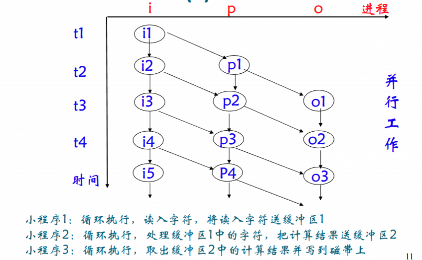

并发程序设计具有以下几个显著特性。

1. 并行性：即多个进程可以在多道程序系统中并发执行，或者在多处理器系统中实现真正的并行执行，这大大提高了计算效率。
2. 共享性：多个进程可以共享系统中的软件资源，比如共享内存、文件等。
3. 交往性：多个进程在并发执行时不可避免地会产生相互制约和协作的关系，这也使得并发程序的设计和实现比顺序程序更加复杂和具有挑战性。

### 1.3 并发进程的制约关系

在并发程序设计中，并发进程可以分为无关的并发进程和交往的并发进程。

#### 无关的并发进程

一组进程分别在不同的变量集合上运行，它们之间没有共享变量，一个进程的执行不会影响其他进程的结果。只要满足这种无关性，进程的执行顺序与时间无关，这种条件也被称为**Bernstein条件**。具体来说，设程序\\(p1\\)和\\(p2\\)分别引用的变量集为\\(R(p1)\\)、\\(R(p2)\\)，改变的变量集为\\(W(p1)\\)、\\(W(p2)\\)，如果满足$$ (R(p1)∩W(p2))∪(R(p2)∩W(p1))∪(W(p1)∩W(p2))= \varnothing $$那么这两个进程的执行就是无关的。

举例：四个进程 S1~S4 中的四条语句
```c
a = x + y // S1
b = z + 1 // S2
c = a - b // S3
w = c + 1 // S4
```
计算得知 S1 和 S2 满足Bernstein条件，是无关的并发进程；其余的均不满足，是交往的并发进程，并发执行时，可能会产生**和时间有关的错误**。

#### 交往的并发进程

交往的并发进程是指**一组进程共享某些变量，一个进程的执行可能会影响其他进程的结果**。这种情况下，进程之间存在直接或间接的制约关系，程序的执行结果与进程的相对执行速度和调度顺序密切相关。如果程序设计不当，交往的并发进程可能会出现**与时间有关的错误**，比如结果错误、进程永远等待等问题。

##### 与时间有关的错误：结果错误

售票的代码：

```c
void T() {
  // 按照旅客要求找到储存余票数量的变量A
  int x = A;
  if (x >= 1){
    x1--;
    A = x;
    // 输出票
  } else {
    // 提示票售完
  }
}
```

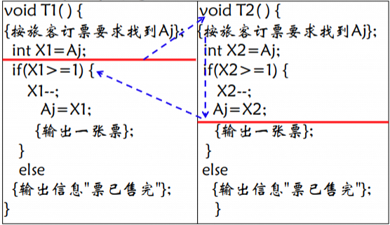
图中用红线和虚线箭头表示进程切换。假设此时 Aj 的初始值为1，那么 T1 和 T2 读取到的 X1 和 X2 都是1，两个线程的判断条件都成立，于是它们都进入 if 分支，各自将 X1 和 X2 减1（变为0），然后分别把0写回 Aj。最终，两张票都被"成功"售出，输出了两次"出票"信息。

##### 与时间有关的错误：永远等待

由于`borrow`和`return`共享代表主存物理资源的临界变量X，对并发执行不加限制会导致错误。

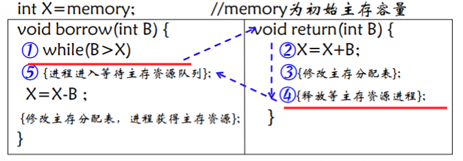

在这段代码中，`borrow(int B)`函数用于申请主存资源，`return(int B)`函数用于归还主存资源。主存总量为`memory`，当前可用主存为`X`。

1. 某进程P1调用`borrow(B)`，执行到`while(B > X)`，发现B大于当前可用主存X，于是**本应进入等待主存资源队列**（图中⑤），但此时P1还没有真正进入等待队列。
2. 就在P1即将进入等待队列之前，另一个进程P2调用了`return(B)`，归还了主存资源。P2在归还时，执行了`X = X + B`，并尝试"释放等主存资源进程"（图中④），但此时**等待队列里还没有P1**，所以没有进程被唤醒。
3. 之后，P1才真正进入等待队列（图中⑤），但此时P2已经归还完主存并离开，等待队列里只有P1自己。
4. 如果此后没有其他进程再归还主存资源，P1就会永远等待，因为**它进入等待队列时，错过了刚刚归还的主存资源的唤醒机会**。

#### 进程的交互：竞争与协作

##### 竞争——互斥

竞争关系是指多个进程争夺同一资源。资源竞争带来了两个经典问题：死锁和饥饿。

死锁是指一组进程因争夺资源而陷入永远等待的状态，**每个进程都持有部分资源并等待其他进程释放资源，最终所有进程都无法继续执行**。

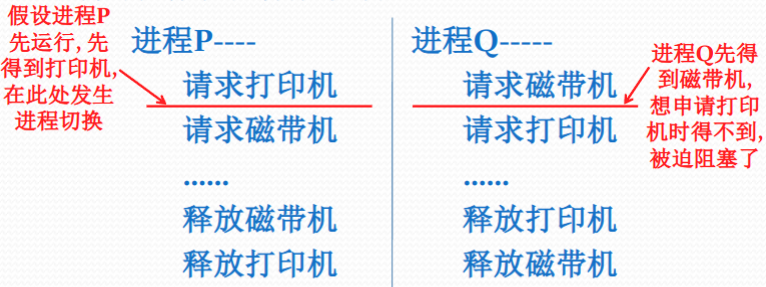

> ⬆️举一个典型的死锁例子：假设系统中有一台打印机和一台磁带机，进程 P 和进程 Q 都需要使用这两台设备。进程 P 先申请并获得了打印机，随后进程切换到 Q，Q 申请磁带机，再切换回 P。随后，P 在申请磁带机时被阻塞，因为此时磁带机已经被进程 Q 占用，而 Q 在申请打印机时也被阻塞，因为打印机已经被进程 P 占用。这样，两个进程都在等待对方释放自己需要的设备，形成了死锁，系统无法继续推进。

饥饿则是指**某个进程由于其他进程总是优先于它而被无限期拖延，迟迟得不到所需资源**。

为了解决竞争引起的问题，提出了**互斥(mutual exclusion, mutex)**。互斥是指当多个进程需要访问同一临界资源时，任何时刻最多只允许一个进程访问该资源，其他进程必须等待，直到资源被释放。

###### 协作——同步

协作关系则是指多个进程为完成同一任务需要分工协作，它们之间需要在某些点上进行协调和通信。由于合作的每一个进程都是独立地以不可预知的速度推进，协作进程需要在特定的同步点等待彼此的信号或消息。合作进程到达同步点时，可能需要阻塞自己，等待其他进程的信号或消息。

同步(Synchronization)则是指两个或多个进程基于某种条件协调各自的活动，一个进程的执行依赖于另一个进程的消息或信号，只有在收到信号后才能继续执行。

实际上，**进程互斥关系是一种特殊的同步关系，是对进程使用共享资源次序上的一种协调**。

## Part2 临界区管理

### 2.1 临界区

在并发程序设计中，**临界资源**是指一次只允许一个进程访问的共享资源，也就是互斥共享变量所代表的资源。例如，某个全局变量、缓冲区、打印机等都可以作为临界资源。由于多个进程可能同时访问这些资源，若不加以限制，就会出现数据不一致或系统错误。

**临界区**（Critical Section）是指并发进程中访问临界资源的那段程序代码——每个进程在执行过程中，只有在进入自己的临界区时，才会访问和操作临界资源，临界区之外的代码则不涉及对临界资源的访问。

多个并发进程访问临界资源时存在竞争制约关系，如果两个进程同时停留在相关的临界区内，就会出现与时间相关的错误。

#### 临界区的描述

- `shared <variable>`: 明确哪些变量或资源是临界资源
- `region <variable> do <statement_list>`: 确定哪些代码段是临界区
  
- 如果两个进程的临界区访问同一个临界资源，这两个临界区就是**相关的临界区**，它们之间必须互斥进入。
- 如果两个临界区访问的临界资源互不相关，则它们可以同时进入，无需互斥。

#### 临界区管理的三大基本要求

为了保证系统的正确性和效率，临界区的管理必须满足以下三个基本要求：

1. Mutual Exclusion：任何时刻，至多只允许一个进程进入相关的临界区。即如果有一个进程在临界区内，其他进程必须等待，直到该进程离开临界区。
2. Bounded Waiting：每个进程在发出进入临界区的请求后、请求被允许前，最多只能有有限个其他进程进入临界区，防止某个进程无限期等待（即无饥饿）。
3. Progress：如果当前没有任何进程在它的临界区内执行，并且有一些进程希望进入它们的临界区，那么只有那些没有在它们的剩余区（remainder section，剩余区是进程的临界区中尚未执行的部分）执行的进程，才有资格参与决定下一个进入临界区的进程是谁，并且这种选择不能被无限期地推迟。
4. 一个进程在临界区内不能无限停留，必须在有限时间内退出临界区。

#### 临界区的错误实现

假设进程进入的代码如下：

```c
bool inside1 = false; // 起初，不在互斥区
void process1() {
  // ...
  // 进入互斥区
  while(inside2 || inside3 || ...);     // 如果竞争进程进入了互斥区，则等待
  inside1 = true;     // 锁定
  // 互斥区的代码……
  inside1 = false;    // 解锁
}
```

只从顺序逻辑来看这时合理的，但是别忘了并发进程可以在任何时候切出当前进程，再切入另一个进程，这样的代码会导致如下图的问题：

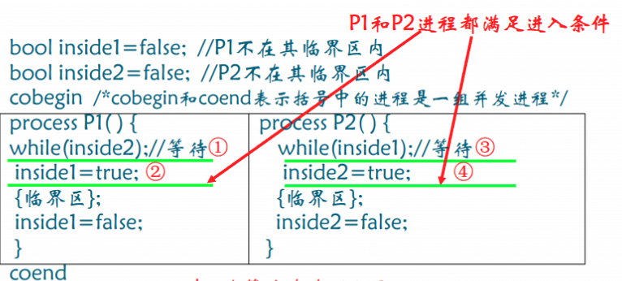

如果代码执行顺序是1->3->4->2，那么进程1和进程2会同时进入临界区，导致数据不一致。

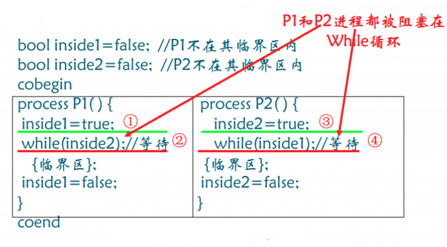

这也是错的，如果代码执行顺序是1->2->3->4，那么进程1和进程2会同时被阻塞。

#### 临界区的正确实现：Peterson算法

```c
bool inside[2] = {false, false};    // 起初，不在互斥区
enum {0, 1} turn;                   // 让权变量：被谦让的进程

void p0() {
  inside[0] = true;
  turn = 1;
  while(inside[1] && turn == 1);
  // 互斥区的代码……
  inside[0] = false;
}

void p1() {
  inside[1] = true;
  turn = 0;
  while(inside[0] && turn == 0);
  // 互斥区的代码……
  inside[1] = false;
}
```

> "让权"，指把进入临界区的权利让给对方。

##### 理解1：怎么判断这个算法谁能进？

算法的意思是，使用`inside`变量表示"意愿声明"，`turn`则是"让权变量"，当对方想进、并且自己让权时，对方才能进入。

来看看这个算法会不会错：

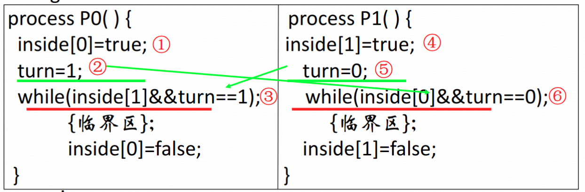
> 忽略又乱又丑的箭头

- 如果执行顺序是 1、2、4、5、6，双方都想进、都让权，但是最后进行让权的是 p1, 所以 p0 先进（6不停循环直到进程切换到3, while 判断为 false，1 进入）
- 如果执行顺序是 1、4、5、6, 双方都想进、p1 让权，~~最终结果就肯定是 p0~~ 不对！仔细逐个语句分析：p1 让权后不停循环、直到切换到 p0, p0 在 2 处又进行了一次让权。由于两个进程都只有一次让权机会，最后让权的是 p0, 那对面的 p1 就占了便宜，p1 会先进入临界区。

##### 理解2：为什么这个算法能保证互斥？

~~我不道啊~~ 这个算法之所以能保证互斥，是因为`turn`这个变量**只能有一个值**，这就意味着，两个进程不可能同时满足`while`条件为假，只有一方能进入临界区，另一方必须等待对方退出并将自己的`inside`标记为`false`后，才能进入。



##### 扩展成多个进程

Peterson 算法本身是为两个进程互斥设计的。如果要扩展到多个（n个）进程互斥，可以采用它的多进程扩展版本，最著名的就是Peterson's n进程算法，也叫过滤锁（Filter Lock）或Peterson's generalization。

扩展的基本思想是：让每个进程依次通过多个"关卡"，每一关都像两人Peterson算法那样和其他进程竞争，只有通过所有关卡的进程才能进入临界区。每一关都保证：如果有多个进程竞争，只有一个能通过，其他必须等待。

```c
int level[n];      // 每个进程当前到达的关卡
int last[n];       // 每一关最后到达的进程编号

// 进程i的入口协议

process(int i) {
  for (int k = 1; k < n; k++) {
      level[i] = k;
      last[k] = i;
      // 等待，直到没有其他进程在同一关或更高关，并且自己不是最后到达的
      while (exists j ≠ i such that level[j] >= k && last[k] == i);
  }
  // 进入临界区
  // 临界区代码……
  // 离开临界区
  level[i] = 0;
}
```



### 2.3 临界区管理：硬件支持

TS 和 SWAP 两个指令通过让操作原子化来避免前面提到过的进程切换问题。

#### 关中断：实现互斥最简单的方法

关中断是实现互斥最简单的方法，在进入临界区之前关中断，在退出临界区之后开中断。

#### 测试并建立（Test-and-Set，测试并置位）指令

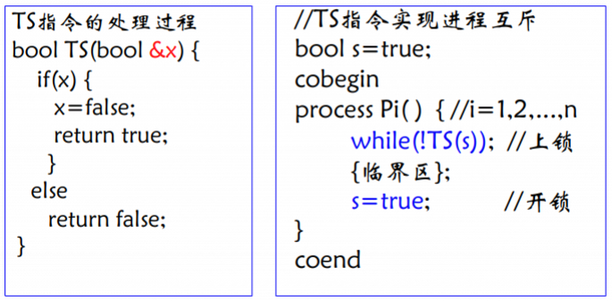

左边的代码是TS指令的处理过程。`TS(bool &x)` 是一个原子操作（即不可分割的操作），它的作用是：如果变量`x`为`true`，就把`x`置为`false`并返回`true`；如果`x`为`false`，就直接返回`false`。这个操作保证了在多进程/多线程环境下，只有一个进程能通过`TS`指令成功把`x`从`true`变成`false`并得到`true`，其他进程只能得到`false`。

右边的代码展示了如何用TS指令实现n个进程的互斥。首先，定义一个共享的布尔变量`s`，初值为`true`，表示"锁是开的"。每个进程`Pi`在进入临界区前，都会执行`while(!TS(s));`，也就是不断尝试用TS指令"上锁"。只有当`s`为`true`时，TS才会返回`true`，进程才能跳出循环进入临界区，并且此时`s`已被置为`false`，其他进程再调用TS时只能得到`false`，只能继续等待。这样就保证了同一时刻只有一个进程能进入临界区，实现了互斥。临界区执行完后，进程将`s`重新置为`true`，相当于"开锁"，允许其他进程进入临界区。

#### 对换指令

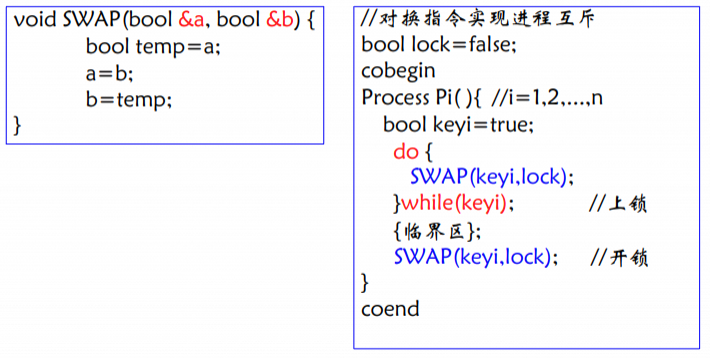

左边的代码定义了SWAP指令的处理过程。`SWAP(bool &a, bool &b)` 是一个原子操作，它的作用是交换变量`a`和`b`的值。这个操作保证了在多进程/多线程环境下，两个变量的值交换是不会被其他进程打断的。

右边的代码展示了如何用SWAP指令实现n个进程的互斥。首先，定义一个共享的布尔变量`lock`，初值为`false`，表示"锁是开的"。每个进程`Pi`在进入临界区前，先定义一个局部变量`keyi`，初值为`true`。然后进程进入一个`do-while`循环，不断执行`SWAP(keyi, lock)`。只有当`lock`为`false`时，`while(keyi)`条件为假，进程跳出循环进入临界区。其他进程如果此时尝试SWAP，由于`lock`已经是`true`，它们的`keyi`会变成`true`，`lock`还是`true`，`while(keyi)`条件为真，只能继续等待。

这样就保证了同一时刻只有一个进程能进入临界区，实现了互斥。临界区执行完后，进程再次执行`SWAP(keyi, lock)`，此时`keyi`为`false`，`lock`为`true`，交换后`lock`变为`false`，释放锁，允许其他进程进入临界区。

#### 总结

TS（Test-and-Set）和SWAP等原子指令虽然能实现多处理器下的互斥，但属于忙等待（自旋锁），即等待进程会不断占用CPU轮询，效率较低，适合临界区极短、竞争不激烈的场景。

临界区代码应尽量短小精悍，减少锁的持有时间，提高系统并发度。

关中断适合内核态、单处理器、临界区极短的场合，不能滥用。

TS、SWAP等硬件原子指令适合实现基本的互斥机制，但忙等待效率低，适用范围有限。

现代操作系统更倾向于用信号量、互斥锁等高级同步机制，结合硬件原语和调度机制，避免忙等待和系统响应降低。

## Part3 信号量与 PV 操作

### 3.1 问题背景

并发程序的设计面临共享资源的冲突，就像火车上的厕所一样。如果两个程序竞争这个资源，那么就要变成互斥关系；如果两个程序需要协作，就要安排同步关系。同步关系和互斥关系都是**等待关系**。诸如前面的关中断/TS/SWAP/Peterson都属于**忙式等待**的方法，这存在以下问题：

1. 不能进入临界区的进程不会立刻切换，而是反复循环（忙式等待），浪费CPU时间；
2. 临界区管理是竞争间的进程完成的——将测试能否进入临界区的责任推给各个竞争的进程会削弱系统的可靠性，加重用户编程负担。

接下来要介绍的信号量与PV操作就是这些缺陷的解决方案。

### 3.2 信号量与PV操作

#### 原理概述与伪代码解析

**信号量**是一种用于管理并发进程访问共享资源的同步机制，其数据结构通常由一个整型变量和一个信号量队列组成。整型变量表示当前可用资源的数量，而信号量队列用于存放等待资源的进程。

```c
typedef struct semaphore {
  int value;          // 信号量值
  struct pcb *list;   // 等待的进程
}
```

**P操作**`P(s)`是对信号量的减1操作，如果结果小于0，调用P操作的进程将被置于等待状态，直到资源可用。

```c
void P(semaphore s) {
  s.value--;
  if (s.value < 0) {
    // sleep(s.list)做的事情：
    // 1. 阻塞自己
    // 2. 被置成等待s的状态，移入s.list
    // 3. 控制转向进程调度程序
    sleep(s.list);
  }
}
```

V操作是对信号量的加1操作，如果结果不大于0，则会唤醒一个等待信号量的进程，使其进入就绪状态。

```c
void V(semaphore s) {
  s.value++;
  if (s.value <= 0) {
    // wakeup(s.list)做的事情：
    // 1. 从信号量 s 队列中释放一个等待信号量 s 的进程，
    // 2. 该进程转换成就绪态
    // 3. 进程继续执行
    wakeup(s.list);
  }
}
```

P和V操作是原子操作，确保在执行过程中不被中断，从而保证操作的安全性和完整性。

在处理器管理中，我们曾提及很多进程的管理模型，如[经典的三态模型](https://hhikr.moe/posts/os-2/#简单三态模型)、[等待队列模型](https://hhikr.moe/posts/os-2/#进程实现的队列模型)等，PV操作和信号量在其中也有应用：

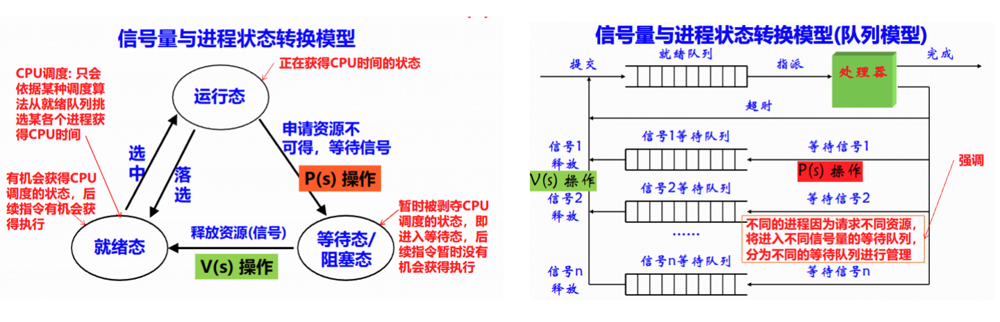

#### 推论

信号量的值有以下推论：

1. `s >= 0`，则`s`表示在阻塞进程之前可以对信号量进行的P操作次数，也等于信号量所代表的实际可用资源数。

2. `s <= 0`，则`s`其绝对值等于在信号量队列中等待的进程数，也就是对信号量进行P操作而被阻塞的进程数。

3. 通常情况下，P操作表示请求一个资源，而V操作表示释放一个资源。在某些条件下，P操作代表阻塞进程的操作，而V操作代表唤醒被阻塞进程的操作。

### 3.3 信号量的应用

#### 如何设计使用信号量的并发程序？

并发程序如果要使用临界区，则用`P(s)`申请进入临界区，用`V(s)`申请退出临界区。

```c
// 设置信号量。在互斥关系中s = 1, 但同步关系中不是这样。
semaphore s = 1;
// ...
// 并发程序代码：
process Pi {
  // other codes...
  P(s);
  /* codes in critical area */
  V(s);
  // other codes...
}
```

#### 使用信号量的并发程序是如何运行的？

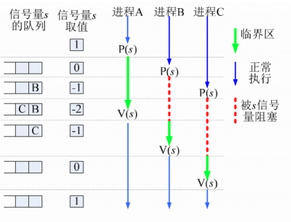

## Part 3.33 求解信号量相关问题

### 互斥：飞机票问题

假设有多个进程需要同时处理航班的机票销售，每个航班的余票数量存储在`A[m]`中。为了防止多个进程同时修改同一个航班的余票数量，导致数据不一致，需要使用信号量来实现互斥访问。

伪代码如下：

```c
int A[m];            // m个航班的余票量
semaphore mutex;     // 信号量
mutex = 1;           // 互斥问题设为1：只能有一个进程同时使用临界区

process Pi {
  int Xi;          // 记录这个进程中，用户需要的票的余票
  while(true) {
    Xi = A[j];
    P(mutex);    // 进入临界区
    if (Xi >= 1) {
      Xi = Xi - 1; 
      A[j] = Xi; // 更新余票
      issue_a_ticket();  
    } else {
      print_sold_out_msg();
    }
    V(mutex);    // 退出临界区，释放信号量
  }
}
```

### 互斥：哲学家就餐

有五个哲学家围坐在一圆桌旁，桌中央有一盘通心面，每人面前有一只空盘子，每两人之间放一把叉子。每个哲学家思考、饥饿、然后吃通心面。为了吃面，每个哲学家必须获得两把叉子，且每人只能直接从自己左边或右边去取叉子。将哲学家看作进程，叉子看作资源，也就是：

五个进程、五个资源，每个进程都有不使用临界区的操作`think()`和使用临界区的操作`eat()`，后者使用两个资源（编号为`i``i+1`），每个资源都属于临界区，要分别被两个进程互斥使用。如何用互斥程序正确模拟这个情景？

#### 错误解法：死锁

尝试像上一个问题一样使用PV操作简单解决：

```c
semaphore fork[5]; // 信号量数 == 临界区资源数
fork[i] = 1 for i in range(0, 5);

process philosopher_i() {
  while(true) {
    think();
    // 取相邻的资源，也就是说，需要分别执行两次P/V操作
    P(fork[i]);
    P(fork[(i + 1) % 5]);
    eat();
    V(fork[i]);
    V(fork[(i + 1) % 5]);
  }
}
```

很明显的能看到问题：P操作是原子的，但是连续进行的两次P操作作为一个整体并不是原子的；P操作不是关中断，P操作成功拿到资源后只是意味着竞争者无法拿到资源（针对互斥`s=1`），而不是其他进程无法抢占cpu。所以两次P操作之间很可能被进程切换打断。这就允许以下最坏情况发生：

- `philosopher0`执行`P(fork[0])`，成功，拿起叉子0；
- 此时进程切换，`philosopher1`执行`P(fork[1])`，成功；
- ……
- 此时进程切换，`philosopher4`执行`P(fork[4])`，成功；
- 进程切换回`philosopher0`，尝试`P(fork[1])`，但fork[1]已被`philosopher1`拿走，信号量为0，`philosopher0`阻塞；
- 进程切换至`philosopher1`，尝试`P(fork[2])`，但`fork[2]`已被`philosopher2`拿走，信号量为0，`philosopher1`阻塞；
- ……
- 进程切换至`philosopher4`，尝试`P(fork[0])`，但`fork[0]`已被`philosopher0`拿走，信号量为0，`philosopher4`阻塞。

五个进程都因为等待其他人持有的资源而永远阻塞下去，形成了死锁。

#### 解法1：C. A. R. Hoare方案

注意到上述最坏情况中，只有五个进程都占用不同资源才会出现问题——那只要限制最多四个进程能占用不同资源不就行了？非常简单粗暴的思路。

怎么实现呢？不妨想象出五个进程公用一个虚拟资源，这个资源最多只能同时四个人使用。具体的实现方式是，**设置一个初值为4的信号量对应虚拟资源`room`，进程在进行真正资源的申请前要先申请这个虚拟资源的使用**。

```c
semaphore fork[5];
fork[i] = 1 for i in range(0, 5);
semaphore room=4;

process philosopher_i() {
  while(true) {
    think( );
    P(room);
    P(fork[i]);
    P(fork[(i+1)%5]) ;
    eat( );
    V(fork[i]);
    V(fork[(i+1)%5]);
    V(room);
}
}
```

#### 解法2: 调换申请资源顺序

观察最坏情况，对资源的申请顺序是（前/后五个申请可以顺序可以混，不影响死锁）：
$$
0|1|2|3|4\rightarrow1|2|3|4|0
$$

第一波申请正好可以形成一种“密铺”，每个竞争进程都能拿到不同的临界区资源，这样才导致了问题。我们尝试调换一下编号基数的进程申请资源的顺序：

$$
0|2|2|4|4
$$

这样就不会一轮下去全占满资源了。

```c
semaphore fork[5]; // 信号量数 == 临界区资源数
fork[i] = 1 for i in range(0, 5);

process philosopher_i() {
  while(true) {
    think();
    // 取相邻的资源，也就是说，需要分别执行两次P/V操作
    if(i % 2 == 0) {
      P(fork[i]);
      P(fork[(i + 1) % 5]);
      eat();
      V(fork[i]);
      V(fork[(i + 1) % 5]);
    } else {
      P(fork[(i + 1) % 5]);
      P(fork[i]);
      eat();
      V(fork[(i + 1) % 5]);
      V(fork[i]);
    }

  }
}
```

> 其实这个方法只调换一个人的次序就够了，比如让第四个进程调换顺序，结果为
> $$
> 0|1|2|3|0
> $$

#### 解法3：AND信号量

之前说两个（多个）P/V操作之前可不是原子的，这导致了哲学家的死锁，那让其原子不就行了！更粗暴的解决方式，这是AND型信号量机制。

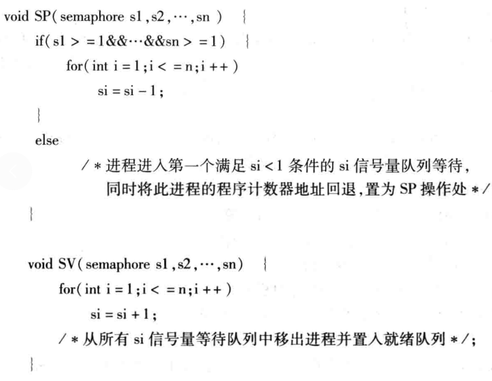

AND信号量机制的最大特点是对多个信号量的操作具有原子性和“全有全无”性。SP操作要求所有信号量都可用时才能一次性全部减1，否则进程会阻塞，等待所有信号量都可用后再同时获得。SV操作则是对一组信号量同时释放（全部加1），并唤醒所有等待这些信号量的进程。这种机制保证了进程对多个资源的“同时占有”或“同时释放”，避免了传统信号量串行P操作时可能出现的死锁和资源分配不一致问题。

AND信号量机制特别适用于需要进程同时获得多种资源才能继续执行的场景。比如数据库系统、操作系统内核、并行计算等领域，某些操作必须在获得一组资源的全部使用权后才能安全进行。如果用普通信号量串行P操作，容易出现“部分获得资源后阻塞”，进而导致死锁。而AND信号量机制通过原子性SP操作，只有在所有资源都可用时才一次性分配，彻底避免了死锁和资源争用问题。

如何解决哲学家问题？把原来的代码中的多次P/V调用换成SP/SV调用即可。

### 同步：生产者与消费者

生产者与消费者问题是操作系统并发与同步中的经典问题。其基本情景是：有`n`个生产者进程`Producer_i`和`m`个消费者`Consumer_j`进程，它们通过一个容量为`k`的有界缓冲区进行数据交换。生产者进程负责不断地生产产品（临界区资源），只要缓冲区没有满，就可以将产品放入缓冲区；消费者进程则不断地从缓冲区取出产品，只要缓冲区不是空的，就可以消费产品。生产者和消费者是并发执行的，彼此之间没有直接通信，所有的交互都通过缓冲区完成。

#### 完全解法：`n > 1, m > 1, k > 1`

```c
int B[k];           // 缓冲区：B[i] == j 表示第 i 个栏位上的资源编号为 j
semaphore sput = k; // 代表缓冲区空余栏位的信号量
semaphore sget = 0; // 代表缓冲区中的可消费资源的信号量
int putptr = 0;     // 指针，指向 producer 生产的空位
int getptr = 0;     // 指针，指向 consumer 获取产品的位置
semaphore s1 = 1;   // 多个生产者互斥进入缓冲区
semaphore s2 = 1;   // 多个消费者互斥进入缓冲区

process producer {
  while(true) {
    Product product = produce_a_product();
    P(sput);
    P(s1);
    B[putptr] = product;
    putptr = (putptr + 1) % k;
    V(s1);
    V(sget);
  }
}

process consumer_j {
  while(true) {
    P(sget);
    P(s2);
    Product product = B[getptr];
    getptr = (getptr + 1) % k;
    V(s2);
    V(sput);
    consume_a_product(product);
  }
}
```

- 注意生产者和消费者进程中`sget`和`sput`信号量P/V操作的时机——二者取值`0~k`，值域中的每一个变化量 \\(\Delta_j = 1 ~~(0 \leq j < k)\\) 代表缓冲区中某个空位`B[j]`被读取(`sget`)或放置(`sput`)的权力。所以
  - 每个`sget`变量要在`consumer`开始进入临界区前申请（表示该缓存区栏位中内容已经获取，`consumer`不能使用），在`producer`离开临界区后释放（表示缓存区中内容已经重新放置了新的资源，消费者又可以使用了）；
  - 每个`sput`变量要在`producer`开始进入临界区前申请（表示该缓存区栏位已经被放置，`producer`不能使用），在`consumer`离开临界区后释放（表示该缓存区栏位已经被获取，`consumer`又可以使用了）。

| 操作         | 操作之后，目标缓存区对 producer 可用性 | 操作之后，目标缓存区对 consumer 可用性 |
|--------------|----------|----------|
| `P(sget)`      | ❌       | ✅       |
| `V(sget)`      | ✅       | ❌       |
| `P(sput)`      | ❌       | ✅       |
| `V(sput)`      | ✅       | ❌       |

其实是可以使用一个锁`s`来代替`s1`和`s2`的，但是这样就导致把生产者与消费者串行运行了，而生产者和消费者进程的互斥关系是**生产者与生产者**、**消费者与消费者**之间的互斥，而不是生产者与消费者之间的互斥，这样不仅不符合逻辑，还会导致串行的效率低问题。

#### 简化解法

当缓冲单元数`k=1`时，`putptr`和`getptr`不需要，`B`是一个值而不是一个数组；当生产者/消费者进程数`n=1`或`m=1`时，`s1`或`s2`不需要，因为该情况下不存在生产者与生产者、消费者与消费者之间的互斥关系。

### 同步：苹果-哦润吉问题

桌上有一只盘子，每次只能放入一只水果。爸爸专向盘子中放苹果(apple)，妈妈专向盘子中放哦润吉(orange)，一个儿子专等吃盘子中的桔子，一个女儿专等吃盘子里的苹果。这是消费者问题的变形，不同的生产者生产不同的资源，消费者等待不同的资源。（而且是挺简单的变形，因为缓存区为1，没有互斥锁）

```c
semaphore apple = 0;    // 苹果信号量
semaphore orange = 0;   // 桔子信号量
semaphore capacity = 1; // 盘子容量信号量

process father {
  while(true) {
    produce_apple();
    P(capacity);
    put_apple();
    V(apple);
  }
}

process daughter {
  while(true) {
    P(apple);
    get_apple();
    V(capacity);
  }
}

process mother {
  while(true) {
    produce_orange();
    P(capacity);
    put_orange();
    V(orange);
  }
}

process son {
  while(true) {
    P(orange);
    get_orange();
    V(capacity);
  }
}
```

### 用信号量实现进程间的前驱关系

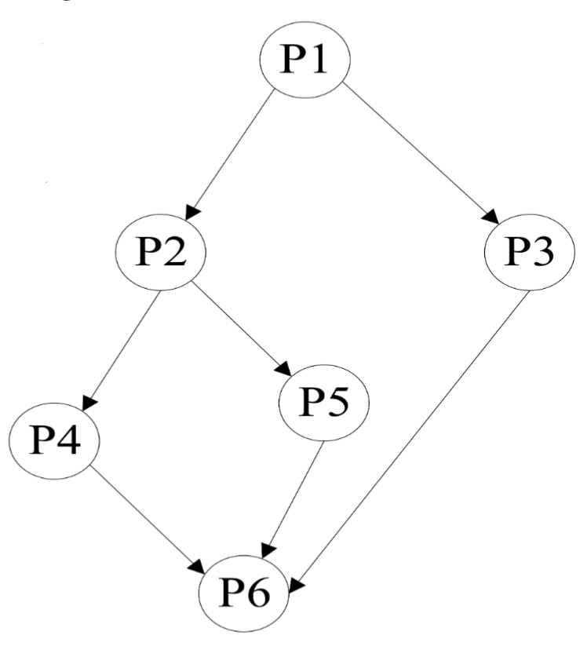

进程间的前驱关系可以用上图表示，每个箭头表示前一个进程结束后，后一个进程才能开始。为了实现这个关系，可以用信号量`si`来代表进程`i`的完成状态，初始值为0。对于一个程序，先观察所有箭头指向它的进程，对这些进程执行P操作；再观察所有它指向的进程，对这些进程执行V操作。如上图中的`P2`:

```C
P2() {
  P(s1);
  // ...
  V(s4);
  V(s5);
}
```

### 读者-写者问题

有两组并发进程：读者和写者，共享一个文件F，要求：

1. 允许多个读者**可同时**对文件执行读操作
1. **只允许一个**写者往文件中写信息
1. 任意写者在完成写操作之前不允许其他读者或写者工作；写者执行写操作前，应让已有的写者和读者全部退出。

#### 初步解法

```c
semaphore rmutex = 1;            // 读者互斥锁，锁定rcount的修改权限
semaphore wmutex = 1;            // 写者互斥锁
semaphore rcount = 0;            // 读者计数器

process reader_i {
  while(true) {
    P(rmutex);                   // rcount可能会被多个读者修改，加锁防止丢失更新
    if (rcount == 0) P(wmutex);  // 开始有读者了，把写者锁住
    rcount++;
    V(rmutex);

    read_file();

    P(rmutex);
    rcount--;
    if (rcount == 0) V(wmutex);  // 没有读者运行，可以写了
    V(rmutex);
  }
}

process writer_i {
  while(true) {
    P(wmutex);
    write_file();
    V(wmutex);
  }
}
```

这种方法没有原则上的严重错误，但是会导致“读者优先”——在这个算法中，只要有新的读者不断到来，写者就会一直被阻塞，迟迟得不到写文件的机会，写者永远无法获得`wmutex`锁，导致写操作被无限推迟甚至“饿死”。

#### 改进解法

饥饿问题解决方案的本质是，让读者和写者竞争一个仅限一个进程的“门”，用一个信号量`S`表示。如果读者先锁住了`wmutex`，写者占用`S`后等待，这样就算有新的读者到来，这个读者也必须等待（因为`S`被写者占用），直到`reader`读完释放`wmutex`、写者写完释放`S`锁。

具体实现也很简单，把读者进行准备（锁定`wmutex`、更新`rcount`）的操作和写者的写操作都用`S`锁住，然后写者写完释放`S`锁，读者完成读前准备后读完释放`S`锁。

```C
semaphore rmutex = 1;
semaphore wmutex = 1;
semaphore rcount = 0;
semaphore S = 1;

process reader_i {
  while(true) {
    P(S);
    P(rmutex);
    rcount++;
    if (rcount == 1) P(wmutex);
    V(rmutex);
    V(S);

    read_file();

    P(rmutex);
    rcount--;
    if (rcount == 0) V(wmutex);
    V(rmutex);
  }
}

process writer_i {
  while(true) {
    P(S);
    P(wmutex);
    write_file();
    V(wmutex);
    V(S);
  }
}
```

> 互斥锁（S）只锁住读者的“准备阶段”（也就是修改`rcount`和判断是否需要锁定`wmutex`的那一小段代码），而不是整个读文件的过程，主要是为了**提高并发性和系统效率**。
>
> 如果把互斥锁加在整个读文件的过程上，那么同一时刻只能有一个读者在读文件，这样就失去了“多个读者可以并发读”的优势，系统的并发能力大大降低。而实际上，读者之间只需要在修改`rcount`和判断是否是第一个/最后一个读者时互斥，保证计数和加锁/解锁的正确性就可以了。只要这些关键操作是安全的，读者们在真正读文件时是可以同时进行的，不会互相影响。

### 睡眠的理发师

理发店理有一位理发师、一把理发椅和n把供等候理发的顾客坐的椅子。如果没有顾客，理发师便在理发椅上睡觉。一个顾客到来时，它必须叫醒理发师。如果理发师正在理发时又有顾客来到，则如果有空椅子可坐，就坐下来等待，否则就离开。

#### 解决思路

首先，要**明确系统中的关键资源和状态变量**。在理发师问题中，关键资源包括等候椅和理发师本身，状态变量有等待的顾客数（waiting）和椅子数（chairs）。

其次，要**分析进程之间的同步关系和互斥需求**——

1. 理发师和顾客之间需要同步：顾客到来时要叫醒理发师，理发师要等有顾客时才工作；
2. 多个顾客之间要互斥地修改waiting变量，防止数据竞争。

然后，**选择合适的同步原语**（如信号量、互斥锁、条件变量等）来实现这些同步和互斥需求。理发师问题中用信号量customers和barbers来同步顾客和理发师的动作，用mutex保护waiting变量的互斥访问。

最后，要**合理安排同步原语的P/V操作顺序**，确保不会出现死锁、饥饿或资源浪费。比如在理发师问题中，顾客先`P(mutex)`检查椅子，再`V(customers)`唤醒理发师进程，最后`P(barbers)`等待理发师准备好。理发师则先`P(customers)`等待顾客，再`P(mutex)`修改`waiting`，最后`V(barbers)`通知顾客可以理发。这样既保证了同步，又避免了死锁。

```C
int waiting = 0;         // 等待理发的顾客数
int chairs = n;          // 空椅子数
semaphore mutex = 1;     // 互斥锁，保护waiting变量
semaphore customers = 0; // 顾客信号量
semaphore barbers = 0;   // 理发师信号量

process customer_i {
  P(mutex);
  if (waiting < chairs) {
    waiting++;
    V(customers);
    V(mutex);
    P(barbers);
    get_haircut();
  } else {
    V(mutex);
    leave();
  }
}

process barber {
  while(true) {
    P(customers);
    P(mutex);
    waiting--;
    V(barbers);
    V(mutex);
    cut_hair();
  }
}
```

### 农夫猎人问题

有一个铁笼子，每次只能放入一个动物。猎手向笼中放入老虎，农夫向笼中放入羊；动物园等待取笼中的老虎，饭店等待取笼中的羊。

[唉唉，换皮怪。](http://hhikr.moe/posts/os-6/#%E5%90%8C%E6%AD%A5%E8%8B%B9%E6%9E%9C-%E5%93%A6%E6%B6%A6%E5%90%89%E9%97%AE%E9%A2%98)

### 银行业务问题

某大型银行办理人民币储蓄业务，由`n`个储蓄员负责。每个顾客进入银行后先至取号机取一个号，且在等待区找到空沙发坐下等着叫号。取号机给出的号码依次递增，并假定有足够多的空沙发容纳顾客。当一个储蓄员空闲下来，就叫下一个号。

```C
semaphore customers = 0; // 顾客信号量
semaphore servers = 0;   // 储蓄员信号量
semaphore mutex = 1;    // 互斥锁

process customer_i {
  take_a_number();
  P(mutex);
  sit_in_waiting_area();
  V(mutex);
  V(customers);
  P(servers);
}

process server_i {
  while(true) {
    P(customers);
    P(mutex);
    get_next_customer();
    V(mutex);
    serve_customer();
    V(servers);
  }
}
```

### 缓冲区管理

有`n`个进程将字符逐个读入到一个容量为`80`的缓冲区中(n>1)，当缓冲区满后，由输出进程`Q`负责一次性取走这`80`个字符。这种过程循环往复，请用信号量和P、V操作写出`n`个读入进程`(P1，P2，…Pn)`和输出进程`Q`能正确工作的动作序列。

```C
semaphore empty = 80; // 缓冲区空闲位置
semaphore full = 0;   // 缓冲区占用位置
semaphore mutex = 1;  // 互斥锁
char buffer[80];      // 缓冲区
int count = 0;        // 缓冲区中字符数
int in = 0;           // 写入位置

process Pi() {
  while(true) {
    char x = read_a_char();
    P(empty);
    P(mutex);
    buffer[in] = x;
    in = (in + 1) % 80;
    if (count == 80) {
      count = 0;
      V(mutex);
      V(full);
    } else {
      V(mutex);
    }
  }
}

process Q() {
  while(true) {
    P(full);
    P(mutex);
    for (int i = 0; i < 80; i++)
      write_a_char(buffer[i]);
    in = 0;
    V(mutex);
    for (int i = 0; i < 80; i++)
      V(empty);
  }
}
```

### 售票问题

汽车司机与售票员之间必须协同工作，一方面只有售票员把车门关好了司机才能开车，因此，售票员关好门应通知司机开车，然后售票员进行售票。另一方面，只有当汽车已经停下，售票员才能开门上下客，故司机停车后应该通知售票员。假定某辆公共汽车上有一名司机与两名售票员，汽车当前正在始发站停车上客，试用信号量与P、V操作写出他们的同步算法。

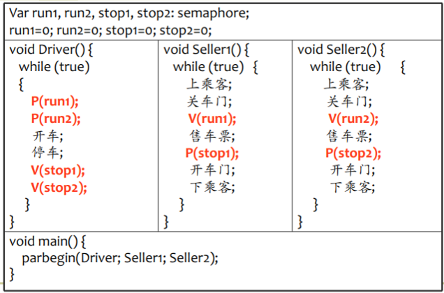


### 吸烟者问题

3个吸烟者在一个房间内，还有一个香烟供应者。为了制造并抽掉香烟，每个吸烟者需要3样东西：烟草、纸和火柴，供应者有丰富货物提供。3个吸烟者中，第一个有自己的烟草，第二个有自己的纸和第三个有自己的火柴。供应者随机地将两样东西放在桌子上，允许一个吸烟者进行（对健康不利的）吸烟。当吸烟者完成吸烟后唤醒供应者，供应者再把两样东西放在桌子上，唤醒另一个吸烟者。

```C
semaphore sput = 1;
smaphore sget[3] = {0, 0, 0};

process smoker_i {
  while(true) {
    P(sget[k]);
    take_one_from_table();
    take_another_from_table();
    V(sput);
    smoke();
  }
}

process supplier {
  while(true) {
    i = random(3);
    j = random(3);
    if (i == j) continue;

    P(sput);
    put_one_on_table(i);
    put_one_on_table(j);
    switch (i, j) {
      case (0, 1):
        V(sget[2]);
        break;
      case (0, 2):
        V(sget[1]);
        break;
      case (1, 2):
        V(sget[0]);
        break;
    }
  }
}
```

### 独木桥问题

#### 基础情景

东西向汽车过独木桥，为了保证安全，只要桥上无车，则允许一方的汽车过桥，待一方的车全部过完后，另一方的车才允许过桥。

```C
semaphore mutex1 = 1;
semaphore mutex2 = 1;
semaphore wait = 1;

process car_1 {
  while(true) {
    P(mutex1);
    count_1++;
    if (count_1 == 1) P(wait);
    V(mutex1);

    cross_bridge();

    P(mutex1);
    count_1--;
    if (count_1 == 0) V(wait);
    V(mutex1);
  }
}

process car_2 {
  while(true) {
    P(mutex2);
    count_2++;
    if (count_2 == 1) P(wait);
    V(mutex2);

    cross_bridge();

    P(mutex2);
    count_2--;
    if (count_2 == 0) V(wait);
    V(mutex2);
  }
}
```

#### 扩展情景

在基础情景中，限制桥面上最多可以有`k`辆汽车通过。

```C
semaphore mutex1 = 1;
semaphore mutex2 = 1;
semaphore bridge = k;
semaphore wait = 1;

process car_1 {
  P(mutex1);
  count_1++;
  if (count_1 == 1) P(wait);
  V(mutex1);

  P(bridge);
  cross_bridge();
  V(bridge);

  P(mutex1);
  count_1--;
  if (count_1 == 0) V(wait);
  V(mutex1);
}

process car_2 {
  P(mutex2);
  count_2++;
  if (count_2 == 1) P(wait);
  V(mutex2);

  P(bridge);
  cross_bridge();
  V(bridge);

  P(mutex2);
  count_2--;
  if (count_2 == 0) V(wait);
  V(mutex2);
}
```

#### 扩展情景2

在基础情景中，以3辆汽车为一组，要求保证桥的双向行车都以组为单位交替通过汽车。

```C
semaphore mutex1 = 1;
semaphore mutex2 = 1;
semaphore wait = 1;

semaphore S1 = 3;
semaphore S2 = 0;

int count_1 = 0;
int count_2 = 0;

int count_up1 = 0;
int count_down1 = 0;
int count_up2 = 0;
int count_down2 = 0;


process car_1 {
  while(true) {
    P(S1);
    P(mutex1);
    count_up1++;
    if (count_up1 == 1 && count_down1 == 0) P(wait);
    V(mutex1);

    cross_bridge();

    V(S2);
    P(mutex1);
    count_up1--, count_down1++;
    if (count_up1 == 0 && count_down1 == 3) {
      count_down1 = 0;
      V(wait);
    }
    V(mutex1);
  }
}

process car_2 {
  while(true) {
    P(S2);
    P(mutex2);
    count_up2++;
    if (count_up2 == 1 && count_down2 == 0) P(wait);
    V(mutex2);

    cross_bridge();

    V(S1);
    P(mutex2);
    count_up2--, count_down2++;
    if (count_up2 == 0 && count_down2 == 3) {
      count_down2 = 0;
      V(wait);
    }
    V(mutex2);
  }
}
```

### 扩展情景3

在基础情景中，要求各方向的汽车串行过桥——当另一方提出过桥时，应能阻止对方未上桥的后继车辆，待桥面上的汽车过完桥后，另一方的汽车开始过桥。

```C
semaphore mutex1 = 1;
semaphore mutex2 = 1;
semaphore stop = 1;
semaphore wait = 1;

int count_1 = 0;
int count_2 = 0;

process car_1 {
  P(stop);
    P(mutex1);
      count_1++;
      if (count_1 == 1) P(wait);
    V(mutex1);
  V(stop);

  cross_bridge();

  P(mutex1);
    count_1--;
    if (count_1 == 0) V(wait);
  V(mutex1);
}

process car_2 {
  P(stop);
    P(mutex2);
      count_2++;
      if (count_2 == 1) P(wait);
    V(mutex2);
  V(stop);

  cross_bridge();

  P(mutex2);
    count_2--;
    if (count_2 == 0) V(wait);
  V(mutex2);
}
```

